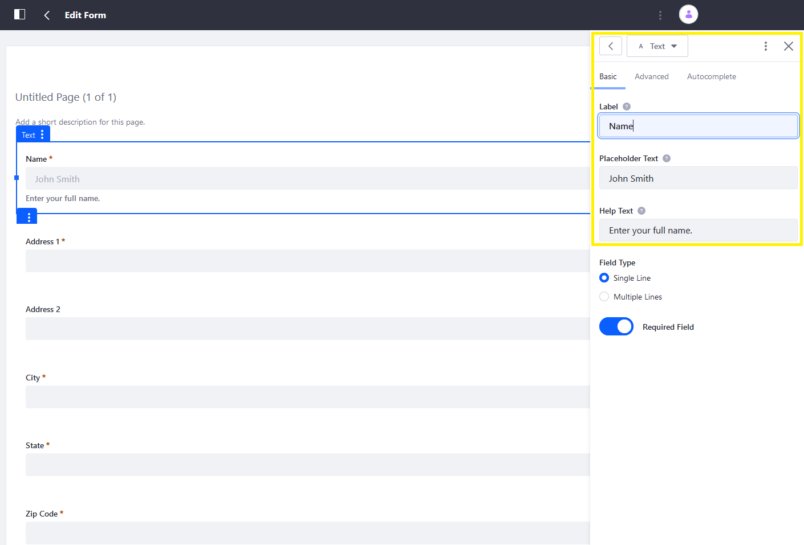
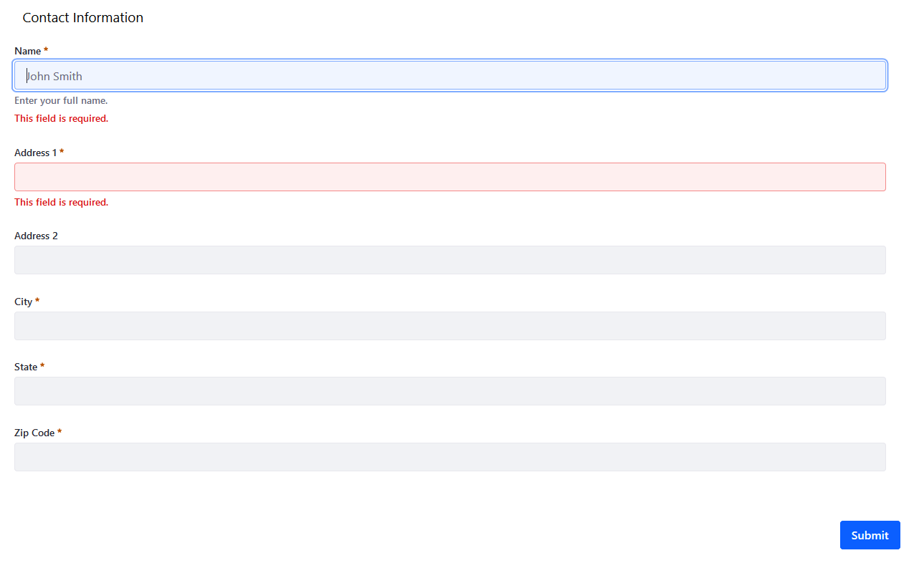

# Providing Predefined Values for a Form

Form fields can have help text, placeholder text, and predefined values.

* **Help Text:** Text that appears as a sub-heading to the field label, but does not appear in the field entry area. Enter help text in the Basic tab of the field's sidebar menu.

* **Placeholder Text:** Text in the field entry area that is not submitted if the field is left untouched by the user.

* **Predefined Value:** Text in the field entry area that is submitted if the field is left untouched by the user.

All form field types can have help text, and all form field types that accept user input can have predefined values. Only text and numeric fields can have placeholder text.

To enter placeholder text or predefined values:

1. Open a field's sidebar menu.
1. Click the _Basic_ tab.

    

1. Enter the desired the placeholder text or predefined values.
1. Click _Save Form_.

The form now has placeholder values.



```important::
   Placeholder values are not submitted if the field is left blank.
```
