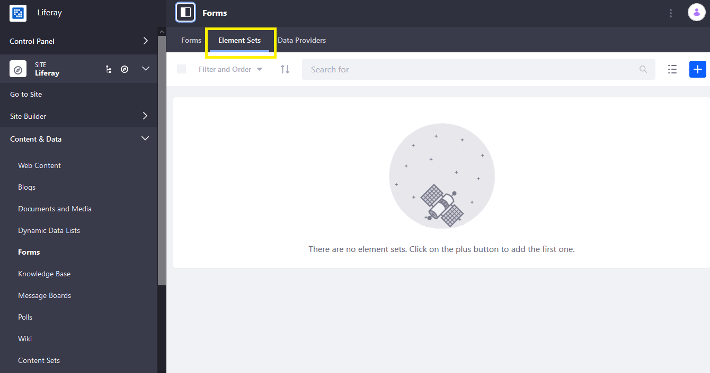
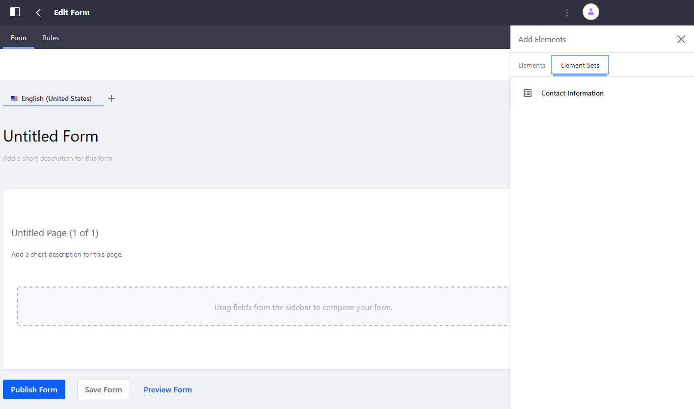
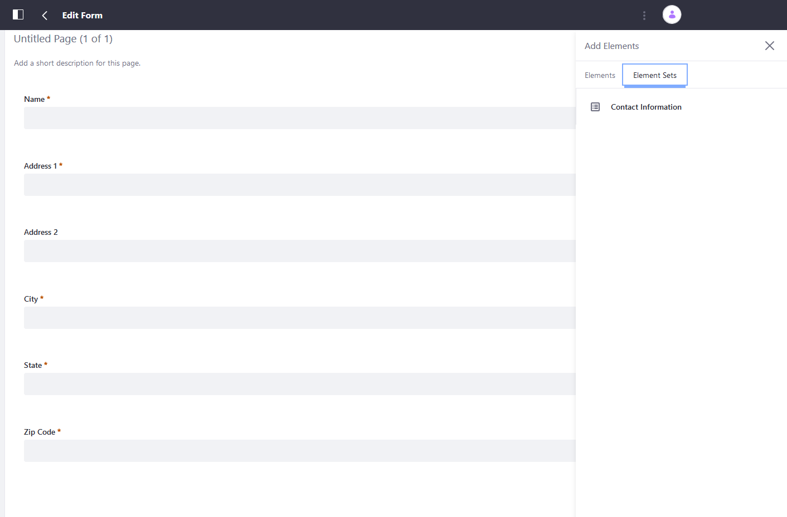

# Reusing Sets of Form Elements

Forms often request the same sets of information, such as name, birthday, and address. Rather than adding these fields for every new form, these elements can be grouped as a set and reused. Element Sets include the layout and configuration of the fields.

```note::
   Forms created using an Element Set *do not* inherit changes that are made later to an Element set.
```

## Creating Element Sets

To create an Element Set:

1. Open the _Product Menu_ () then click the compass icon () on the _Site Administration_ menu.
1. Select the site where the form will be created.
1. Click _Content & Data_  &rarr; _Forms_.
1. Click the _Element Sets_ tab.

     

1. Click the _Add_ button ().

The steps to create an Element Set are the same as [creating a form](../creating-forms.md). For demonstration, create an Element Set for users to submit their contact information.

1. Enter the following:

    **Name**: Contact Information
    **Description**: Contact Information Element Set

1. Click the _Add Element_ button ().
1. Drag and drop the desired Text and Numeric Fields and configure the labels accordingly.
1. Click _Save_ when finished.

The Element Set has been created and is ready for use.

```tip::
   You can use Element Sets to create Element Sets.
```

## Using Element Sets

To use an Element Set in a Form:

1. Open the Form Builder.
1. Open the Elements sidebar by clicking the _Add_ button ().
1. Click _Element Sets_.

    

1. Drag the Element Set onto the Form Builder, just like you would any single Form Element.

    

    Once the Element Set has been added to a form, the layout and individual elements can be configured and updated without affecting the base Element Set.

1. Click _Publish Form_ button when finished.

## Additional Information

* [Creating Forms](../creating-forms.md)
