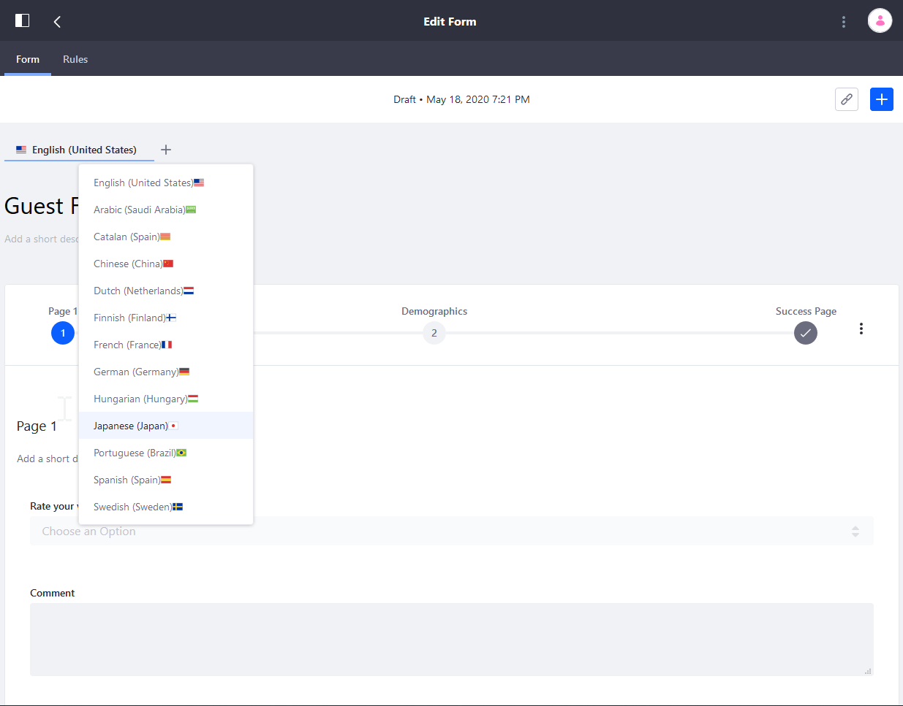
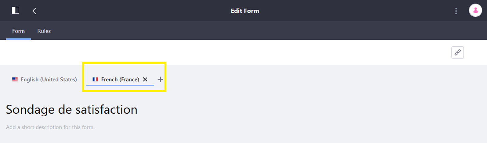
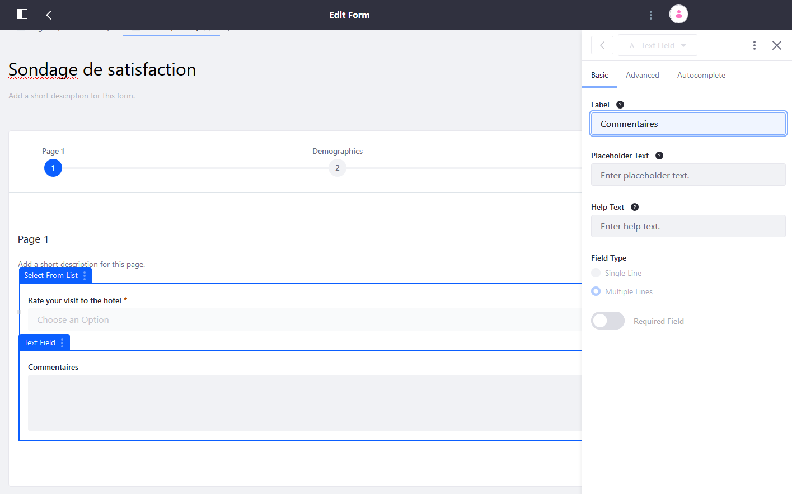
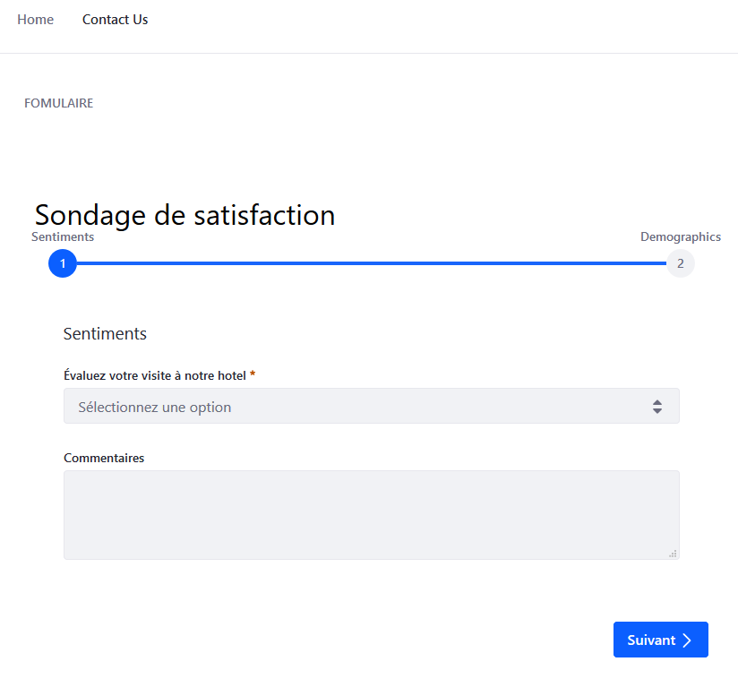

# Translating Forms

Forms can be be translated and presented in any language that is currently enabled on the current site.

To add a translation:

1. Open the _Product Menu_ () then click the compass icon () on the _Site Administration_ menu.
1. Select the site where the form has been created.
1. Navigate to _Content & Data_ &rarr; _Forms_.
1. Click on the existing Form (_Guest Feedback Survey_) to be translated.
1. Click the (+) sign next to the language dropdown menu.
1. Select the desired language.

    

1. This opens a new tab inside the Form. Entering new values will not override those in the default language. Users can navigate back and forth.

    

1. Enter a new title.
1. To modify a field's label, click on the field. This opens the side navigation.

    

1. Enter the translation.
1. Continue until all the desired fields have been translated.
1. Click _Save Form_ when finished.

## Viewing Translated Forms

If an authenticated user accesses the form and a translation is available in the user’s language, the user sees the translated form by default.

If accessed in the [Form widget on a Liferay DXP page](../sharing-forms.md), the Form is displayed in the User’s language automatically. If there’s no translation available for the User’s language, the default language of the Form is displayed.

## Additional Information

* [Forms Field Types Reference](../forms-field-types-reference.md)
