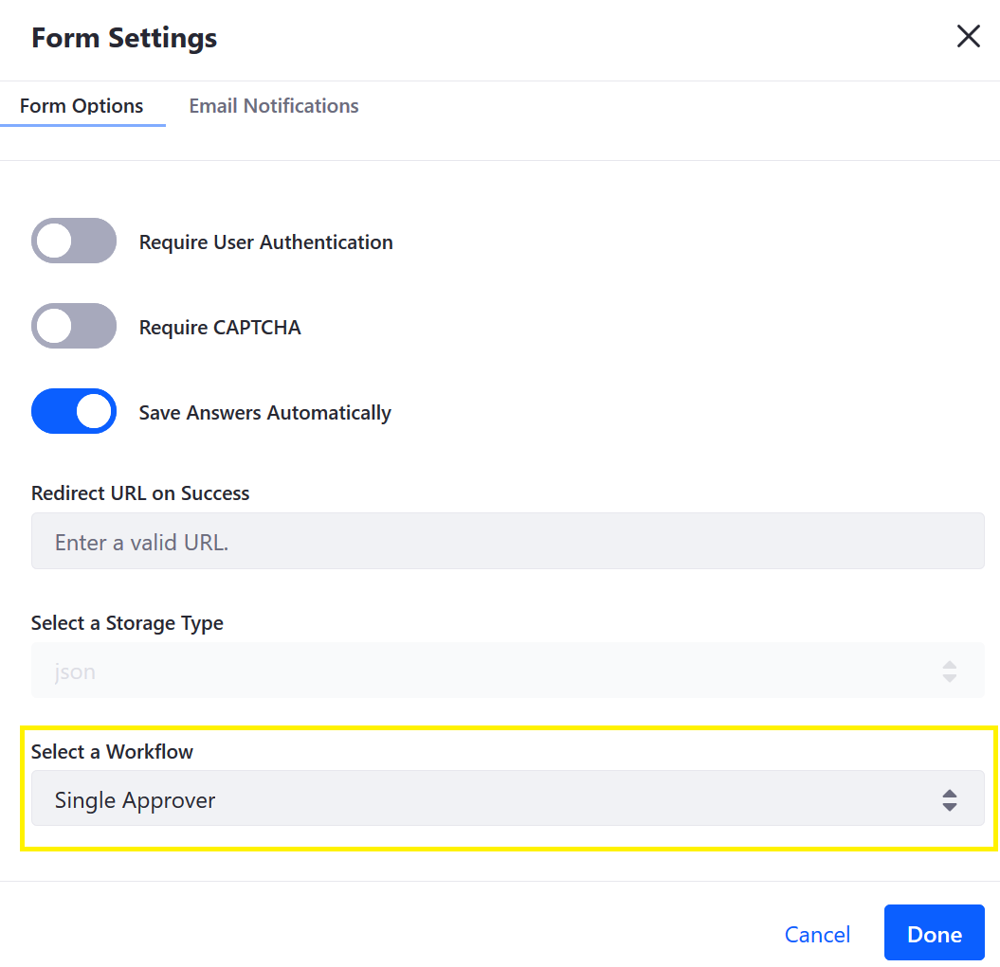
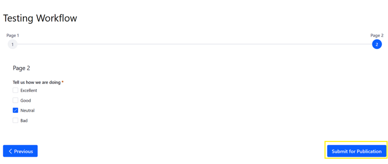
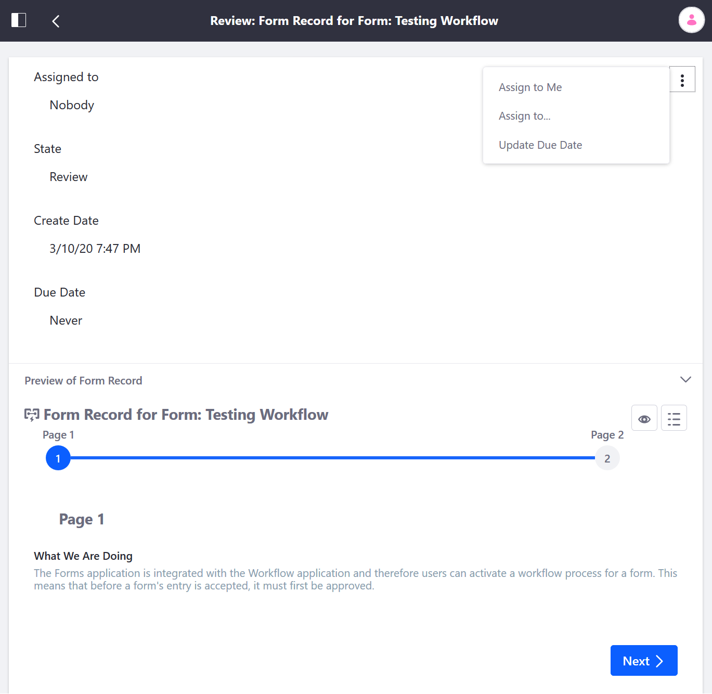
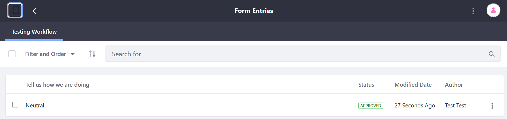

# Using Forms with a Workflow

The _Forms_ application is integrated with the _Workflow_ application and therefore users can activate a workflow process for a form. This means that before a form's entry is accepted, it must first be approved. To enable a workflow process for a Form, see [Activating Workflow for Forms](../../../workflow/user-guide/activating-workflow.md#forms) for more information.

Once workflow has enabled, the _Submit_ button is replaced by _Submit for Publication_.

When a user has submitted a form, all reviewers are notified that a Form Record is ready for review.

To learn more about how to approve or reject submissions, see [Reviewing Assets](../../../workflow/user-guide/reviewing-assets.md).

Once a Form Record has been approved, it appears in the same Form Entries menu with the _Approved_ status.

1. Navigate to _Site Adminstration_ &rarr; _Content & Data_ &rarr; _Forms_.
1. Click the _Actions_ () button next to the selected form and select _View Entries_.

## Additional Information

* [Managing Form Entries](../managing-form-entries.md)
* [Reviewing Assets](../../../workflow/user-guide/reviewing-assets.md)
