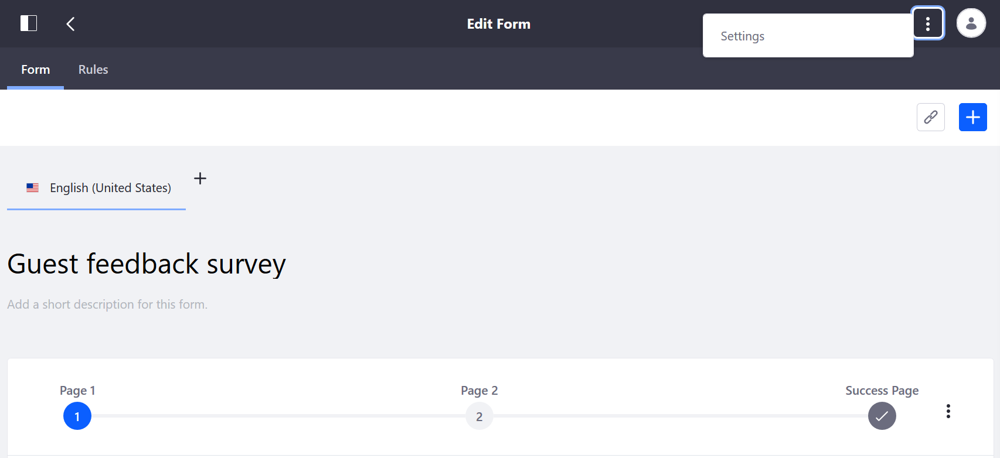

# Configuring Form Notifications

You can configure the Forms app to send a notification email each time a form entry is submitted. If you have [enabled workflow for the form](./advanced-forms-usage/using-forms-with-a-workflow.md), you may not need to configure the Forms app to generate a notification.

To configure Form email notifications:

1. Open the _Product Menu_ () then click the compass icon () on the _Site Administration_ menu. Select the site that the form is associated with.
1. Click _Content & Data_  &rarr; _Forms_.
1. Select a form (for example, _Guest Survey Form_).
1. Open the form's _Form Settings_ section by clicking the _Options_ button () and selecting _Settings_.

    

1. Click the _Email Notifications_ tab.
1. Enable the option _Send an Email Notification for Each Entry_.

    

1. Enter the following:

    **From Name:** The sender's name. This could be the Site name, the form name, or anything else informative to the recipient.

    **From Address:** The sender's email address. You can use `noreply@example.com`, so that recipients don't try to reply.

    **To Address:** The recipient's email address (e.g., `test@example.com`).

    **Subject:** The email's subject.

1. Click _Done_ then close the dialog window.

## Additional Information

* [Using Forms with a Workflow](./advanced-forms-usage/using-forms-with-a-workflow.md)
* [Connecting to a Mail Server](../../../installation-and-upgrades/setting-up-liferay-dxp/configuring-mail/connecting-to-a-mail-server.md)
