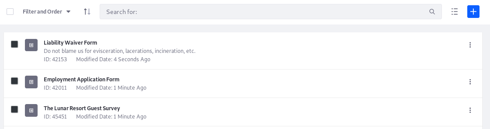
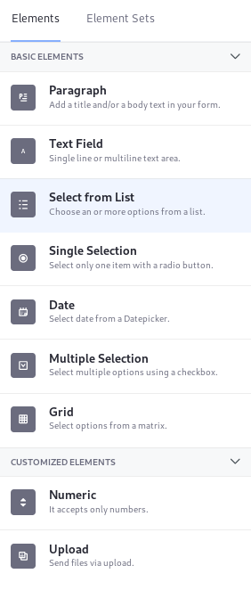
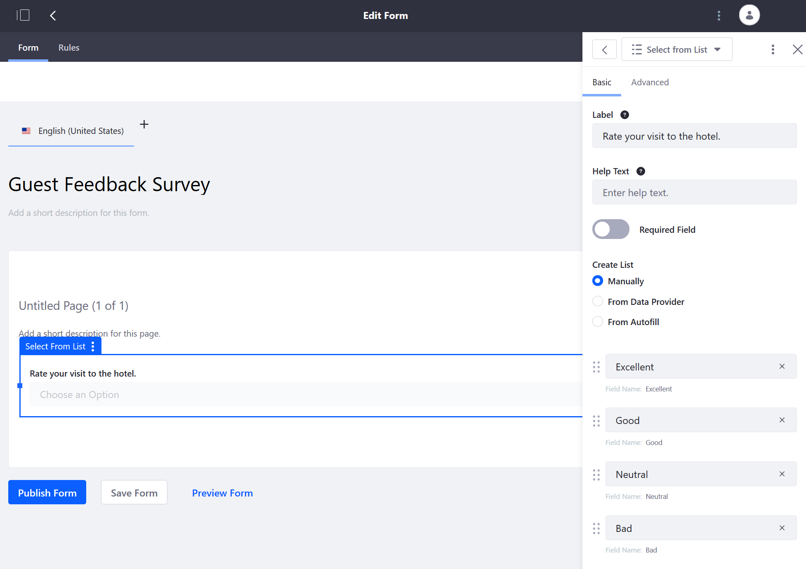
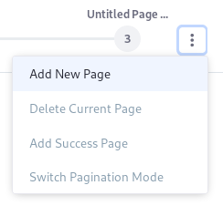
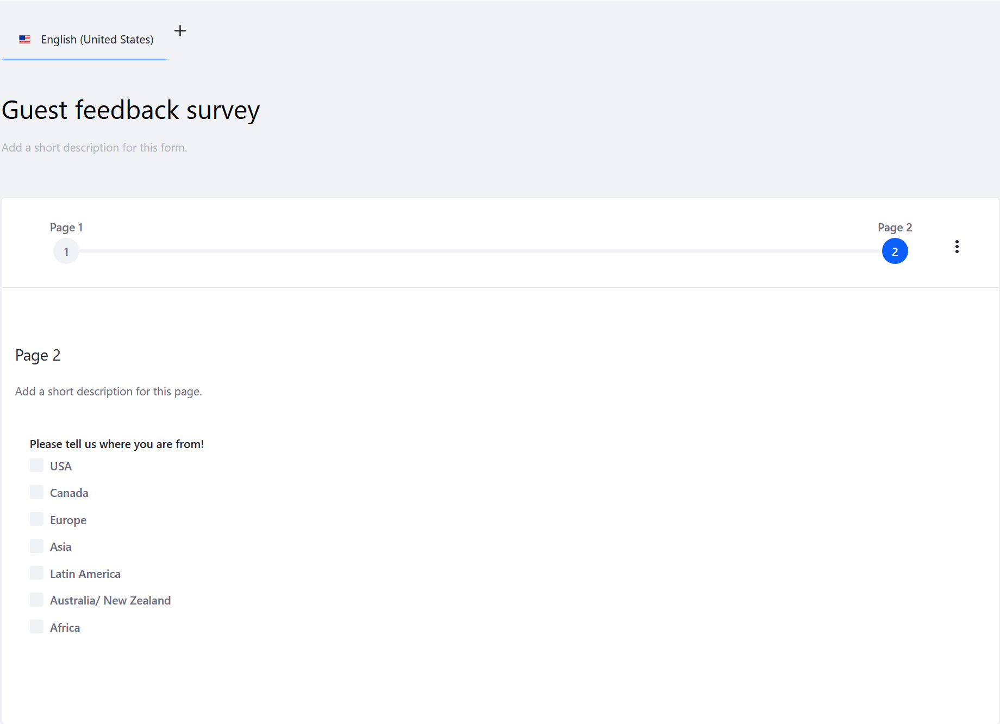
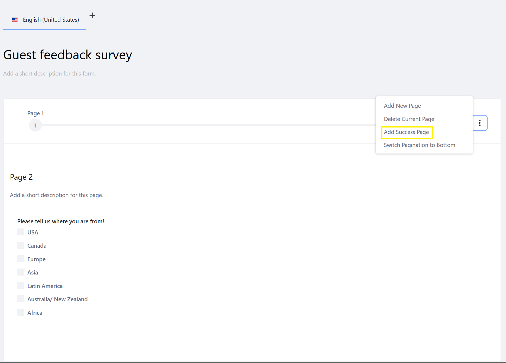
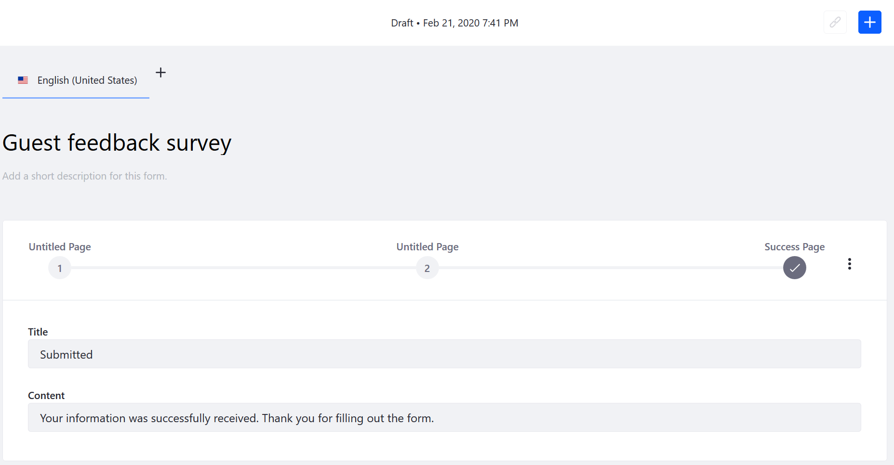
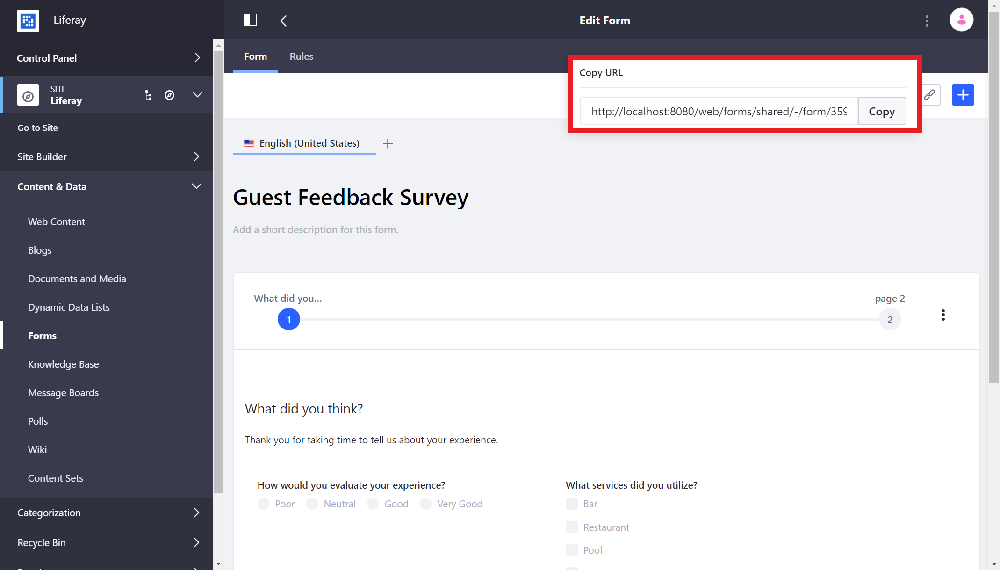
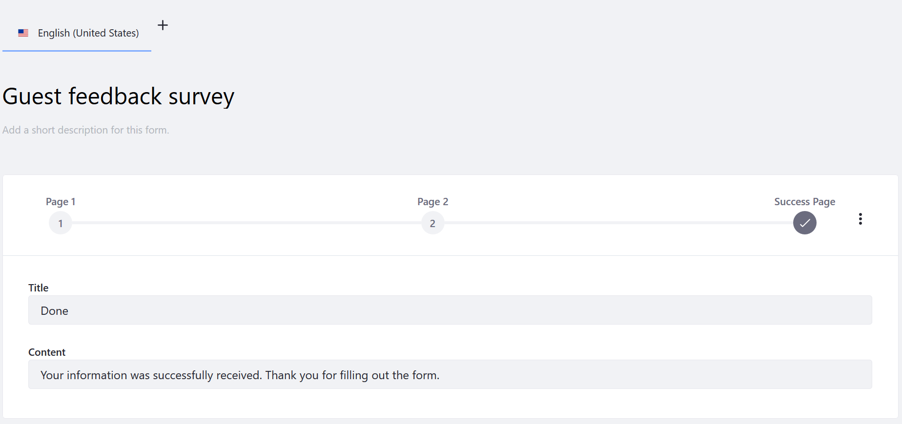
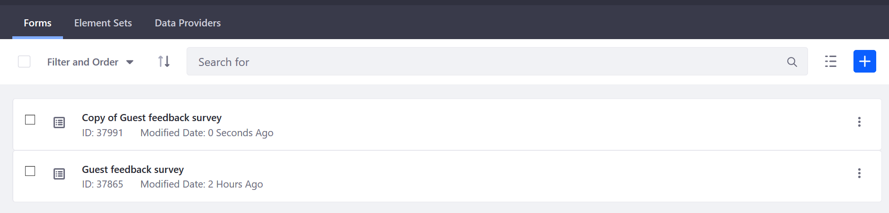

# Creating Forms

The _Forms_ application allows users to create multi-field forms. Only authenticated users with the requisite [Process Automation Permissions](./forms-permissions-reference.md) have the ability to create forms. (At minimum, they should have the ability to access the _Site Administration_ menu and the _Forms_ application.) To learn more about DXP Roles and Permissions in general, see [Roles and Permissions](https://help.liferay.com/hc/articles/360017895212-Roles-and-Permissions).



## Building a Form

The sample below is a hotel guest feedback survey form.

1. Open the _Product Menu_ () then click the compass icon () on the _Site Administration_ menu. Select the site where the form will be created.
1. Click _Content & Data_  &rarr; _Forms_.
1. Click the _Add_ button (). The form builder view appears.
1. Enter a name for the form: **Guest Feedback Survey**.
1. Enter a short description.
1. Enter a page name. Otherwise it will use the default value: _Untitled Page (1 of X)_.
1. Click the _Add_ button () to display the _Add Elements_ sidebar (if it is not already opened).

    

1. Drag a _Select from List_ field onto the form builder.
1. Enter the following values:

    * **Label**: _Rate your visit to the hotel._
    * **Help Text**: Leave this blank for now. If you want a subheading for your field to provide additional guidance, this would be useful.
    * Switch the Toggle to _YES_ in the **Required Field** selector.
    * Leave the manual option checked for creating-forms the list of selections. To learn about populating the field with a data provider, read the [Data Providers](./data-providers.md) article.

1. In the _Options_ section, enter the values for the survey question:

    * **Excellent**
    * **Good**
    * **Neutral**
    * **Bad**

    ```note::
       Typing in one of the fields automatically adds another blank selection line. Just leave the last one blank when you're done.
    ```

    

1. To add additional elements such as a text field, drag and drop the _Text Field_ element underneath the _Select from List_ element.
1. In the _Text Field_'s _Basic_ tab, enter the following:

    * **Label**: *Comments*
    * **Help Text**: Leave this blank.
    * **Field Type**: Click the _Multiple Lines_ radio button to allow longer comments.
    * **Required Field:** Leave the toggle to _NO_.

1. Close the sidebar.
1. Click _Save Form_ to save the form as a draft.

### Adding Additional Pages

If you decide multiple pages are appropriate for your form, Liferay _Forms_ supports multi-page forms.

To add a subsequent page to the form:

1. Navigate to the form builder view.
1. Click the _Actions_ button () at the top-right corner of the form.
1. Click _Add New Page_.

    

1. Click the page number.
1. Once on that new page, enter a page name (for example, _Page 2_). Otherwise, it stays as _Untitled Page (2 of 2)_.
1. Drag and drop additional elements.

    

### Adding a Success Page

One very useful page is the _Success Page_ which lets the user know they have reached the end of form and that the form has been successfully submitted.

To add a _Success Page_:

1. Click the _Actions_ button () at the top-right corner of the form.
1. Click _Add Success Page_.

    

1. Modify the default the _Title_ and _Content_ fields with your values. Note that you cannot rename the _Success Page_.

    

### Publishing a Form

Once you have completed your form, you must publish it before users can begin submitting responses. Click the _Publish Form_ to publish.

When you publish a form, a URL is generated that can be sent to users to fill out the form.



See [Sharing Forms](./sharing-forms.md) to learn more.

## Duplicating a Form

Forms can be duplicated in order to create similar forms without having to create one from scratch. To duplicate a form follow these steps:

1. Navigate to _Site Administration_ &rarr; _Content & Data_ &rarr; _Forms_.
1. Click the _Actions_ button () next to the original form.

    

1. Click _Duplicate_.

This generates a copy of the original survey form. Users can begin modifying the duplicate form.



## What's Next

* [Displaying a Form on a Page](./displaying-forms.md)
* [Managing Form Entries](./managing-form-entries.md)
