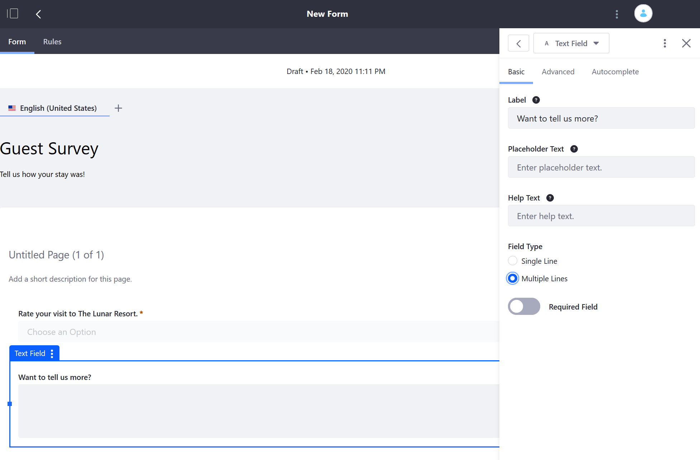

# Creating Forms

The _Forms_ application allows users to create multi-field forms. Only authenticated users with the requisite [Process Automation Permissions](./process-automation-permissions.md) have the ability to create forms. (At minimum, they should have the ability to access the _Site Administration_ menu and the _Forms_ application.) To learn more about DXP Roles and Permissions in general, see [Roles and Permissions](https://help.liferay.com/hc/articles/360017895212-Roles-and-Permissions).


## Building a Form

The sample below is a hotel guest feedback survey form.

1. Open the _Product Menu_ () then click the compass icon () on the _Site Administration_ menu. Select the site where the form will be created.
1. Click _Content & Data_  &rarr; _Forms_.
1. Click the _Add_ button (). The form builder view appears.
1. Enter a name for the form: **Guest Survey**.
1. Enter a short description.
1. Click the _Add_ button () to display the _Add Elements_ sidebar (if it is not already opened).

    

1. Drag a *Select from List* field onto the form builder.
1. Enter the following values:

    * **Label**: _Rate your visit to The Lunar Resort._
    * **Help Text**: Leave this blank for now. If you want a subheading for your field to provide additional guidance, this would be useful.
    * Switch the Toggle to _YES_ in the **Required Field** selector.
    * Leave the manual option checked for creating-forms the list of selections. To learn about populating the field with a data provider, read the [Data Providers](./data-providers.md) article.

1. In the _Options_ section, enter the values for the survey question:

    * **It was out of this world!**
    * **I had a good time.**
    * **I'd rather go to the beach.**
    * **I'll never come back.**

    ```note::
       Typing in one of the fields automatically adds another blank selection line. Just leave the last one blank when you're done.
    ```

    

1. To add additional elements such as a text field, drag and drop the _Text Field_ element underneath the _Select from List_ element.
1. In the _Text Field_'s _Basic_ tab, enter the following:

    * **Label**: *Want to tell us more?*
    * **Help Text**: Leave this blank.
    * **Field Type**: Click the _Multiple Lines_ radio button to allow longer comments.
    * **Required Field:** Leave the toggle to _NO_.

    

1. Close the sidebar.
1. In the form builder, you can see the way the fields are laid out on the form page.

    

1. Click _Save Form_ to save the form as a draft. Otherwise, click _Publish Form_.

A dedicated URL to the form is generated; users can add the form to a page. Alternately, the link can be provided as an email to the page where the form is located.

## What's Next

* [Displaying a Form on a Page](./displaying-forms.md)
* [Managing Form Entries](./managing-form-entries.md)
