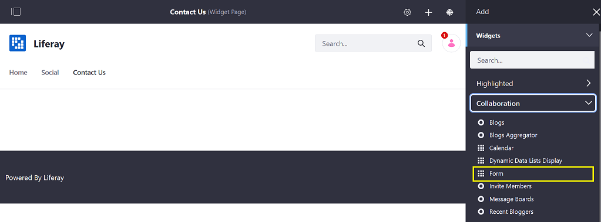
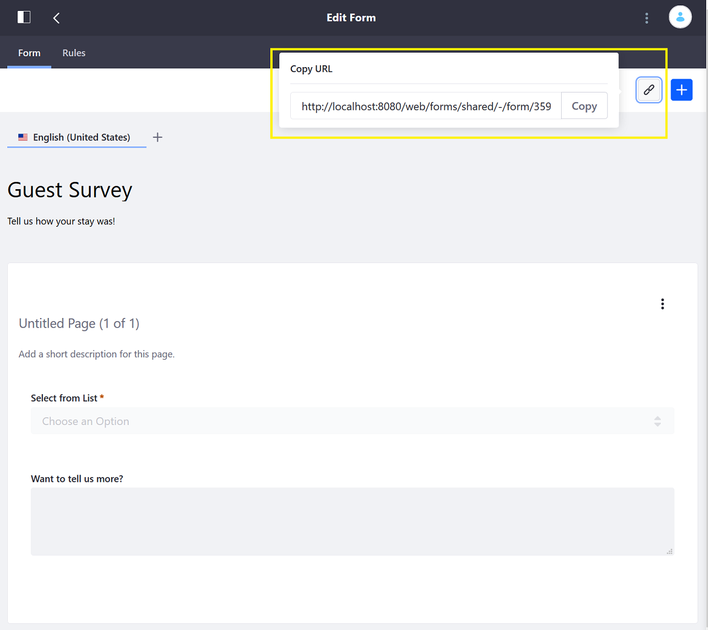
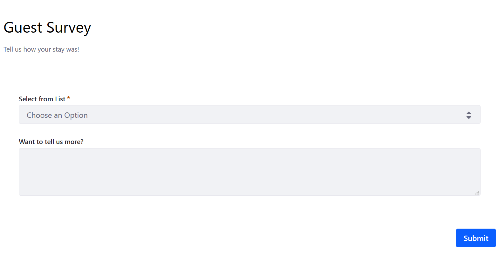

# Displaying Forms

Once the form has been [created](./creating-forms.md), there are two options for getting the published form to targeted users:

* Place the _Form_ widget on a site page. This approach lets users navigate to the page in the site.
* Copy the dedicated form URL and provide it to users (for example, via email). This limits access to the form to only those users who have the direct link.

## Displaying the Form on a Site Page

1. Navigate to the site page (for example, _Contact Us_).
1. Click the _Add_ button.
1. Click _Widgets_ then _Collaboration_ to expand the menu.

    

1. Add the _Form_ widget to the page. (If you had used a full page application template to create the page, use the page configuration to choose _Form_ from the _Full Page Application_ dropdown.)

    

1. Once the _Form widget_ is on the page, click _Select Form_.
1. Choose the _Guest Survey_ form and click _Save_.
1. Close the _Form Configuration_ window.

    

## Obtaining the Form Using Its URL

You must first publish a form before you can get a shareable link. Otherwise, you might see this warning message:

Once the form has been published, you can get the link by clicking the _Copy URL_ button.

The link is available while still viewing the _Form Builder_ in the top right.

Once you have the URL, embed the URL in an email or other notification types. Users who click on the link receive direct access to just the form.

## What's Next

* [Managing Form Entries](./managing-form-entries.md)
