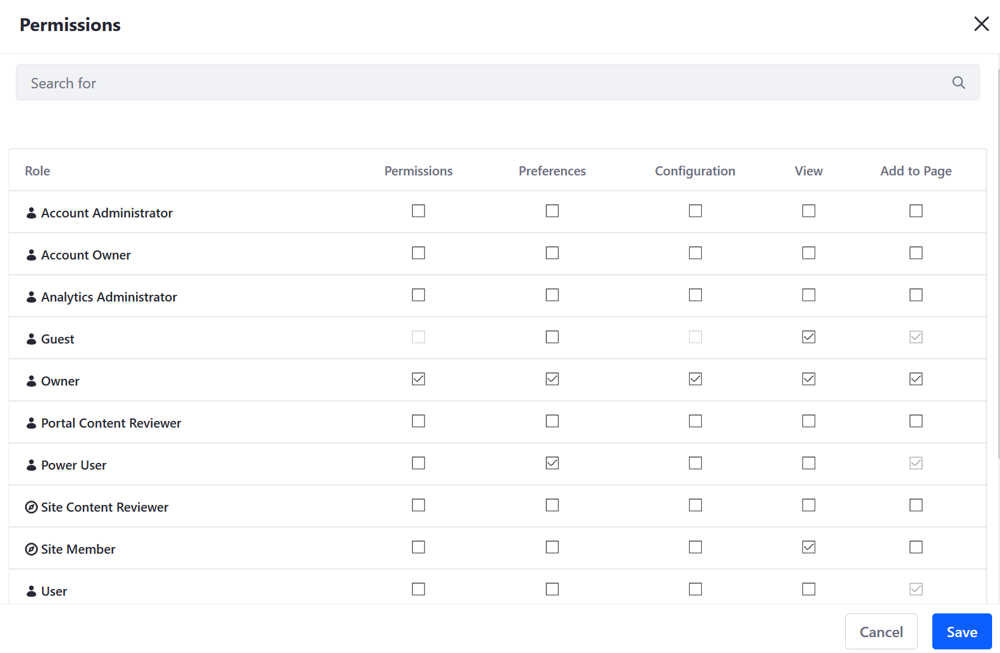
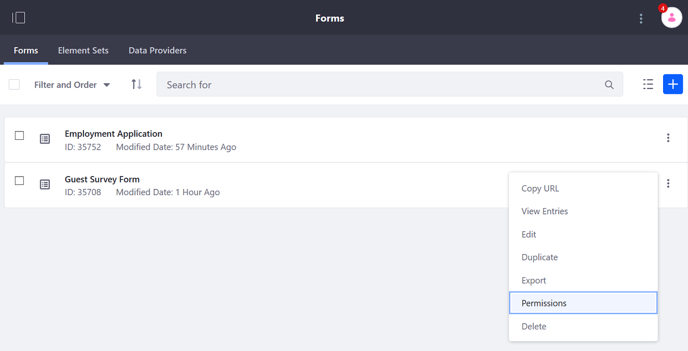
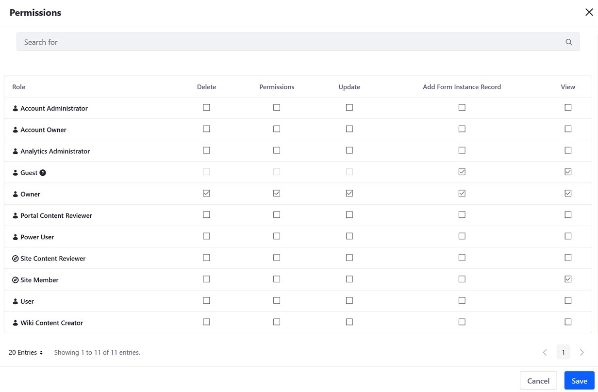

# Forms Permissions Reference

This article serves as a guide for all permissions associated with the Forms application.

## Form Widget Permissions

Navigate to the site page where the _Form_ widget has been deployed. Click the Options icon () next to the widget name then _Permissions_.

| Permission | Description |
| --- | --- |
| Permissions | Grants the ability to view and widget permissions for other users |
| Preferences | Grants the ability to view and set widget preferences |
| Configuration | Grants the ability to configure the widget; can select which form is displayed  |
| View | Grants the ability to view the _Form_ widget |
| Add to Page | Grants the ability to add the _Form_ widget to a site page |

## Forms Permissions

1. Open the _Product Menu_ () then click the compass icon () on the _Site Administration_ menu. Select the site that contains the form.
1. Click _Content & Data_  &rarr; _Forms_.
1. Click the _Actions_ button () next to the form.

    

1. Click _Permissions_.

| Permission | Description |
| --- | --- |
| Delete | Grants the ability to delete the form |
| Permissions | Grants the ability to view and set the form's permissions |
| Update | Grants the ability to make changes to the form |
| Add Form Instance Record | Grants the ability to add an entry |
| View | Grants the ability to view the form |
