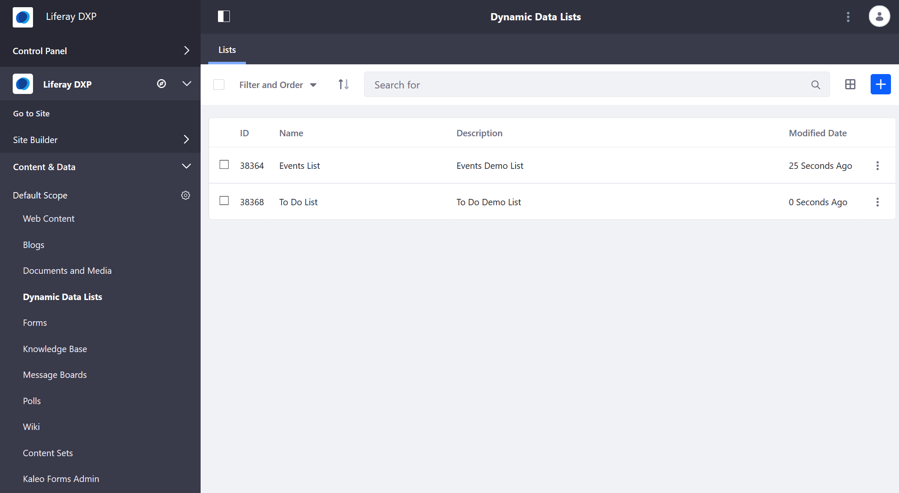

# Introduction to Forms

Liferay Forms gives you robust form building capability so you can gather user data that you need (for example, customer feedback, a job application). The application can be used for the simplest one or two question survey to the most complex, multi-page, homeowners insurance application containing rules and lists populated by a REST data provider. You can build a form quickly and then share that form to targeted users.

## Form Fundamentals

Here are some features when building a basic form:

* Ability to drag and drop fields onto the form layout.
* Adding extra pages to the form.
* Redirecting users to a success page after form submission
* Duplicating a form instead of starting a similar form from scratch.

See the [Form Fields Type](./form-field-types.md) article to learn about the different form fields.

## Enhancing Your Forms

Once you have built a form, here are some advanced features:

* Populate a Select or Radio field with a [REST Data Provider](./data-providers.md)
* Make a field appear based on the value of another field
* Enable CAPTCHA for a form
* Store results in JSON
* Auto-saving a form
* Enable [workflow](../../workflow/user-guide/introduction-to-workflow.md) for the form
* Redirect to a different URL after a successful form submission
* Send an email notification to administrators whenever a form is submitted
* Provide a default value (entered if left alone by the user) or a placeholder value (not entered if left alone by user) for each field - Validate fields using a number of different criteria
* Define Form Rules to create dynamic form behavior (for example, show or hide a field based on input in another field).
* Translate form text into any supported languages.
* Create partial forms (with fields and other elements and specific configurations) and save them for reuse.

## Advanced Forms and Lists

* **Kaleo Forms:** If you're a DXP subscriber, there is another form building tool called [Kaleo Forms](https://help.liferay.com/hc/en-us/articles/360028821952-Kaleo-Forms). It integrates form building with workflow to create form-based business processes, like a Conference Room Checkout Form, or a Support Ticket Process so support tickets go through the proper channels on their way to resolution. Read more about Kaleo Forms in the workflow [section](https://help.liferay.com/hc/articles/360028821952-Kaleo-Forms).

### Using Dynamic Data Lists

[Dynamic Data Lists (DDL)](./dynamic-data-lists/getting-started-with-dynamic-data-lists.md) provide a user interface tool for building reusable form- and list-based applications intended for display on pages, using [templates](./other-form-building-tools/dynamic-data-lists/using-templates-to-display-forms-and-lists.md).

* Dynamic Data Lists (DDL) offers a way for users to enter data, *and* you need to display the data in the user interface.
* DDL allows you to style your lists and forms with templates.
* DDL has field types that might not be included (yet) in Liferay Forms.

## Next Steps

* [Create a form](./creating-forms.md)
* [Sharing a form](./sharing-forms.md)
