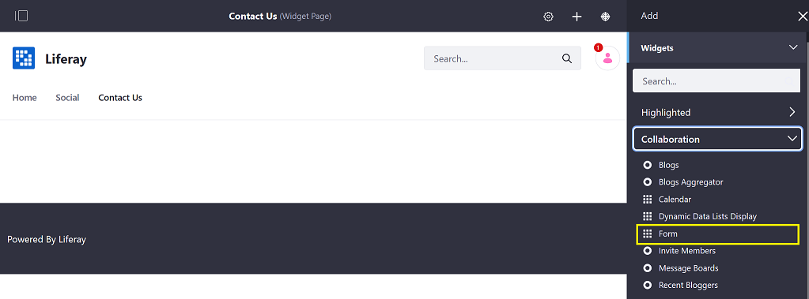
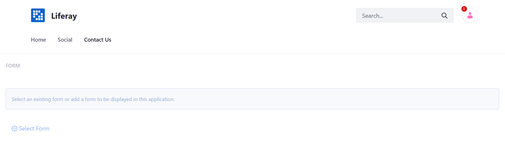
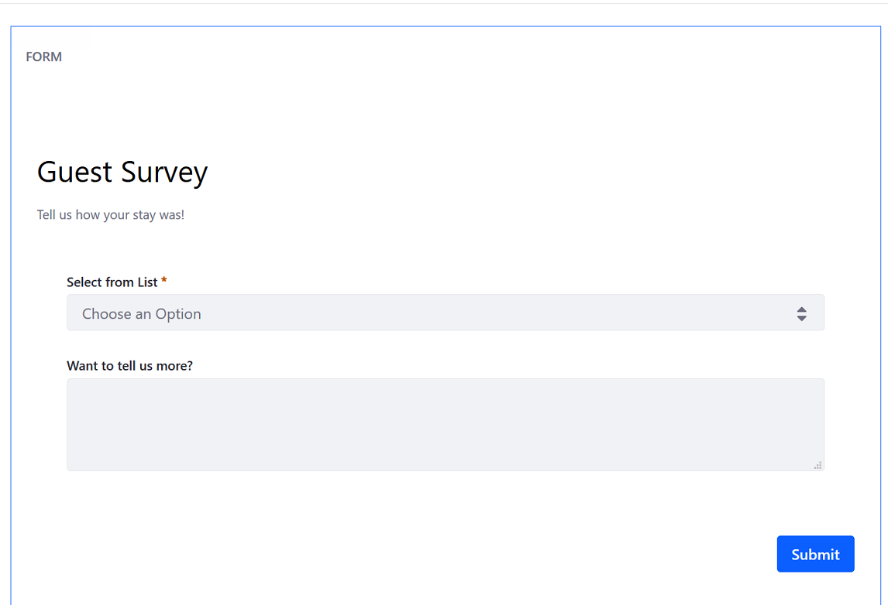
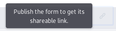
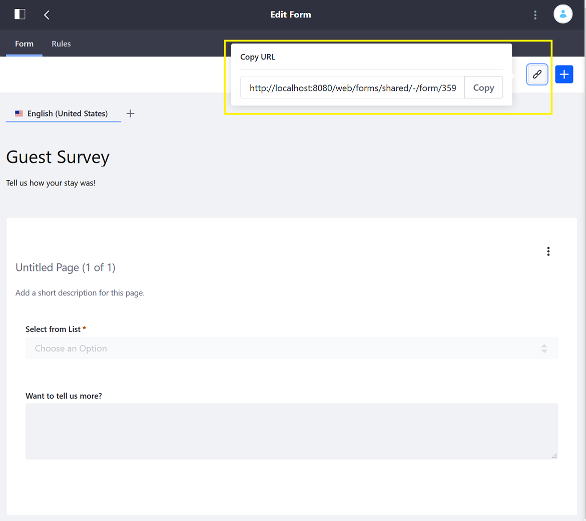

# Sharing Forms

There are two ways to share a form:

* Placing the _Form_ widget on a site page and configuring the widget to display the particular form. This allows the form to be seen and submitted by any user who has access to the [site page](../../../site-building/creating-pages/understanding-pages.md).
* Sharing the dedicated form URL directly with users. This limits access to the form to only those users who have the direct link.

## Displaying a Form on a Site Page

1. Navigate to the site page (for example, _Contact Us_).
1. Click the _Add_ button.
1. Click _Widgets_ then _Collaboration_ to expand the menu.

    

1. Add the _Form_ widget to the page.

    

1. Once the _Form widget_ is on the page, click _Select Form_.
1. Choose the _Guest Survey_ form and click _Save_.
1. Close the _Form Configuration_ window.

    

## Getting the Direct URL to a Form

You must first publish a form before you can get a shareable link. Otherwise, you might see this warning message:

Once the form has been published, you can get the link by clicking the _Copy URL_ button.

The link is available while still viewing the _Form Builder_ in the top right.

Once you have the URL, embed the URL in an email or other notification types. Users who click on the link receive direct access to just the form.

## What's Next

* [Managing Form Entries](./managing-form-entries.md)
