# Activating Workflow

You can activate a workflow process for an asset type either across the DXP instance or only on a specific site. When a workflow process is activated across the instance for a particular asset type such as _Wiki Pages_, all _Wiki Page_ submitted for publication must go through the review process regardless of which Site the _Wiki Page_ is created on.

Alternately, you can choose to enable or disable workflow on individual sites. By default, workflows are disabled on a site. Lastly, there are some workflows which must be enabled inside the respective applications (see below).

## Activating Workflow Across a DXP Instance

1. Open the _Product Menu_ () and click _Control Panel_.
1. Click _Workflow_ then _Process Builder_.
1. Click the _Configurations_ tab.

    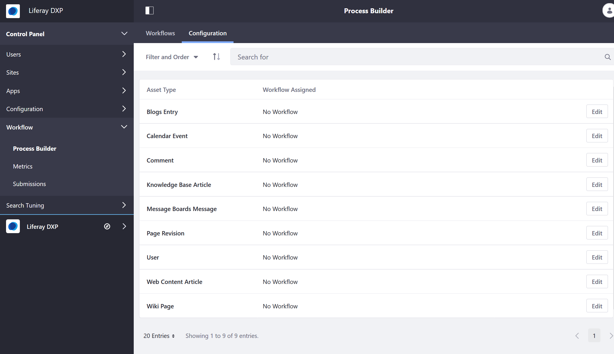

1. Click _Edit_ next to the Asset Type which will go through the workflow process (for example, _Knowledge Base Article_).

    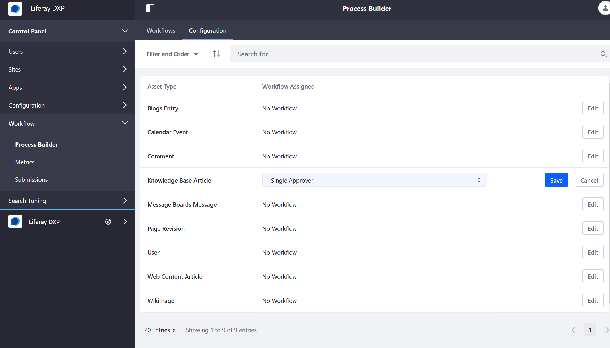

1. Select the workflow desired for this asset type (_Single Approver_ is available out of the box).
1. Click _Save_.
1. Repeat for all the other asset types which require workflow.

## Activating Workflow on a Site

When a workflow process is enabled on a site, other sites on the same instances remain disabled. To enable a workflow process for each asset type per site:

1. Open the _Product Menu_ () then click the compass icon () on the _Site Administration_ menu.
1. Select the site where the form will be created (for example, _Community Site_).
1. In the _Site Administration_ menu, click _Configuration_ &rarr; _Workflow_.
1. Click _Edit_ next to the Asset Type which will go through the workflow process.
1. Select the workflow desired for this asset type.

    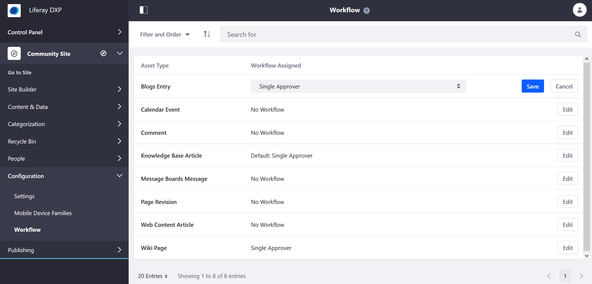

1. Click _Save_.
1. Repeat for all the other asset types which require workflow.

Once enabled, the selected asset types always require a review process before publication on this site. If you have previously activated workflow for a particular asset type, those settings are reflected here.

```tip::
   You can always disable workflow for an asset type on a site even if it was enabled instance wide.
```

## Activating Workflow in Specific Applications

There are several assets types where workflow is enabled in their respective applications.

### Web Content Folders

To activate a workflow for a _Web Content Folder_:

1. Navigate to the _Site Administration_ menu for your site.
1. Click _Content & Data_ &rarr; _Web Content_.
1. Click () then _Edit_ next to the desired folder.

    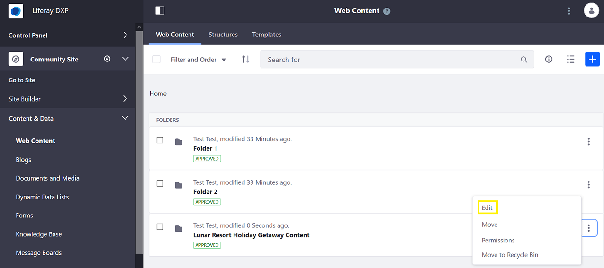

1. Expand the _Structure Restrictions and Workflow_ menu.
1. Click the radio button for _Default Workflow for This Folder (Lunar Resort Holiday Getaway Content)_.

    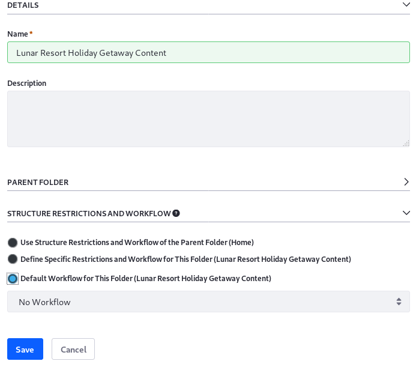

1. Select the workflow definition ( for example, _Single Approver_).
1. Click the _Save_ button.

### Document and Media Folders

Workflow can be enabled for the entire _Documents and Media_ application in the _Root_ folder or for individual folders.

To activate a workflow for a _Documents and Media Folder_:

1. Navigate to the _Site Administration_ menu for your site.
1. Click _Content & Data_ &rarr; _Documents and Media_.
1. Click () then _Edit_ next to the desired folder.

    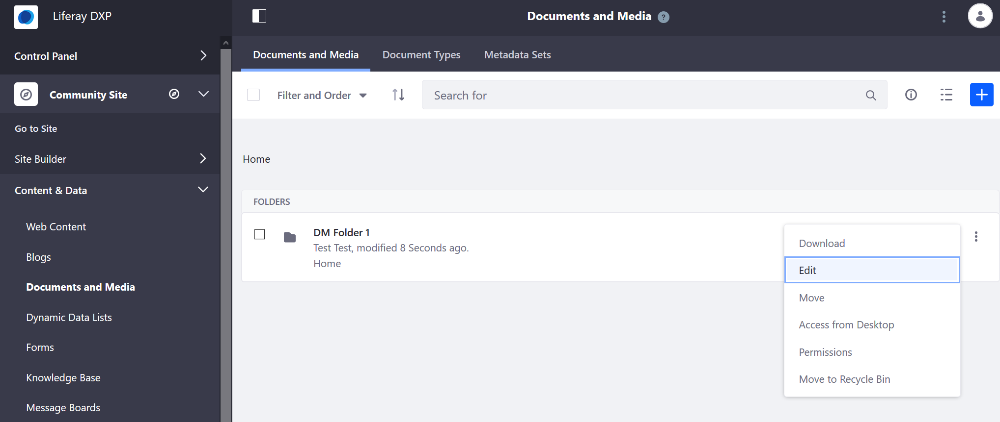

1. Expand the _Document Type Restrictions and Workflow_ menu.
1. Click the radio button for _Default Workflow for This Folder (DM Folder 1)_.

    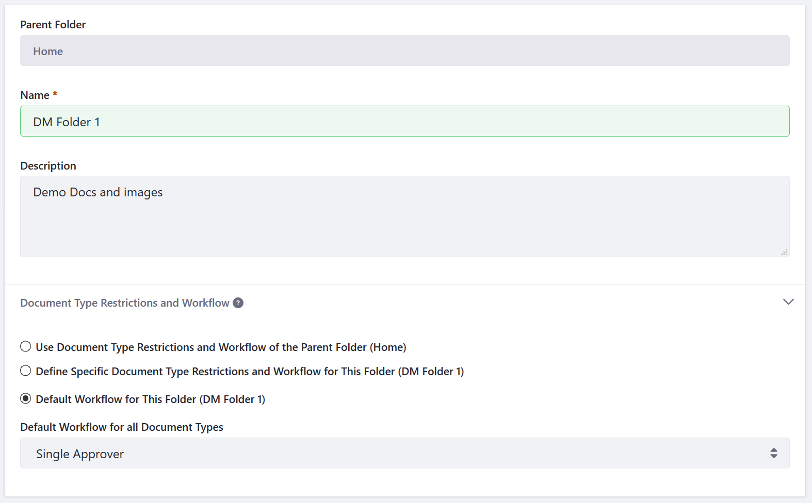

1. Select the workflow definition ( for example, _Single Approver_).
1. Click the _Save_ button.

### Dynamic Data Lists

To activate a workflow for a _DDL Form_:

1. Navigate to the _Site Administration_ menu for your site.
1. Click _Content & Data_ &rarr; _Dynamic Data Lists_.
1. Click () to add a new form.
1. Enter a name for the DDL form.
1. Click _Select_ to choose a Data Definition associated with this form.
1. Select the Data Definition (_Contacts_).
1. Under _Workflow_, select the desired workflow (_Single Approver_).

    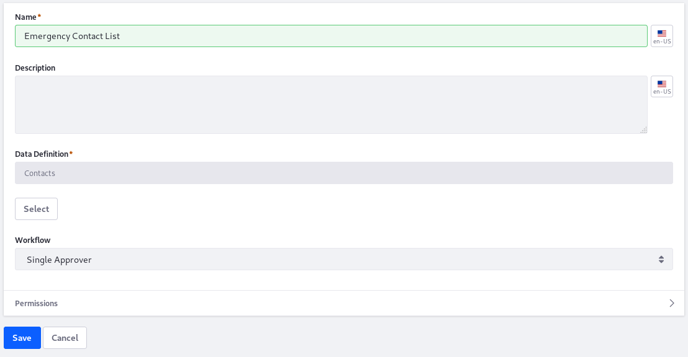

1. Click _Save_.

This particular DDL form now goes through the submission process.

### Forms

To activate workflow for each individual form's entries

1. Navigate to the _Site Administration_ menu for your site.
1. Click _Content & Data_ &rarr; _Forms_.
1. In the _Form Builder_ view (it does not matter whether this is a new form or an existing one), click _Options_ () then _Settings_.

    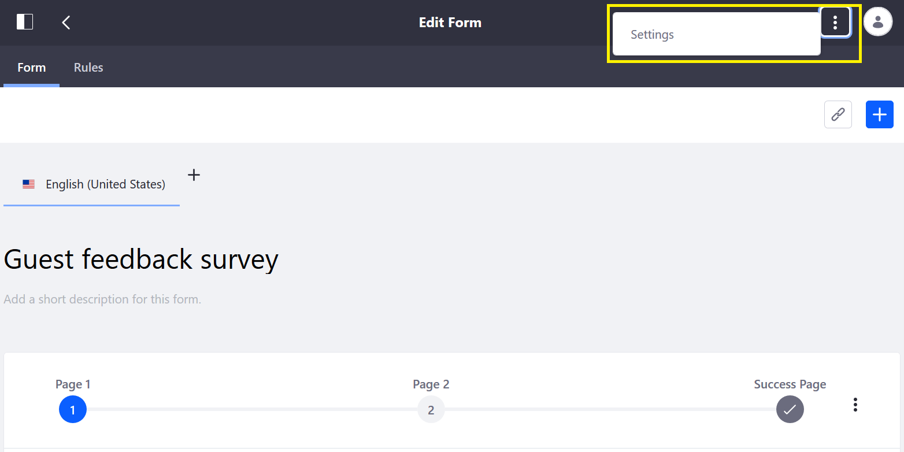

1. Under _Select a workflow_, select the desired workflow (_Single Approver_).

    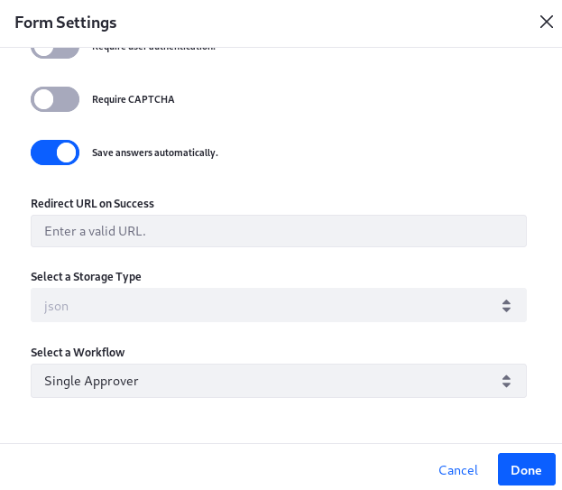

1. Click _Done_ then close the dialog window.

The form now requires approval before the information is submitted.

<!--
## Page Variations

In a [staged environment](https://help.liferay.com/hc/en-us/articles/360029041851-Staging-Content), you can activate workflow for _Page Variations_.

As a prerequisite, [Staging](https://help.liferay.com/hc/articles/360029041811-Enabling-Staging) **and** [Page Versioning](https://help.liferay.com/hc/articles/360028721532-Enabling-Page-Versioning-and-Staged-Content) have been enabled.

When a Page Variation or Site Page Variation is created, its creator must click _Submit for Publication_ at the top of the page, and the variation must be approved in the workflow before it can be published to the live Site.

To enable a workflow for Page Variations:

1. Navigate to the _Site Administration_ menu for your site.
1. Verify that the Staging has been enabled for this site.

    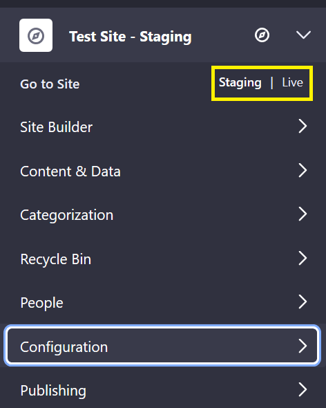

1. Click _Configuration_ &rarr; _Workflow_.
1. Select the workflow desired for _Page Revision_.

    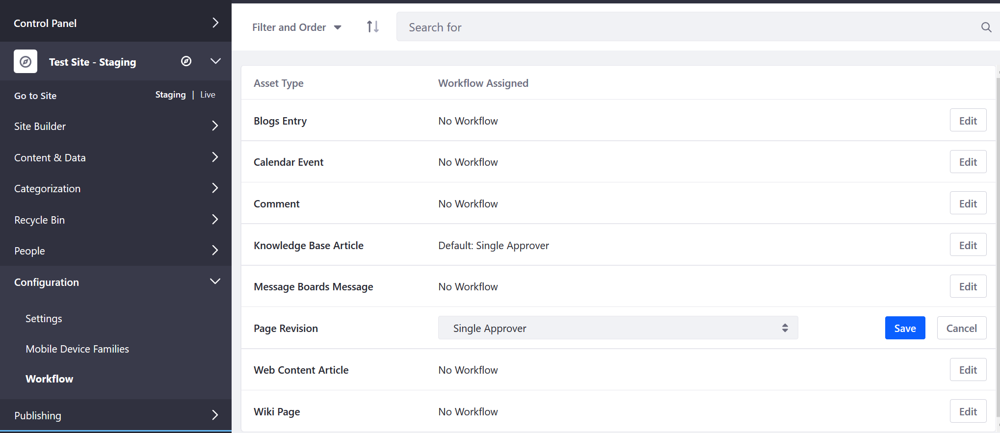

1. Click _Save_.

Page revisions now have to go through the workflow process.


-->
