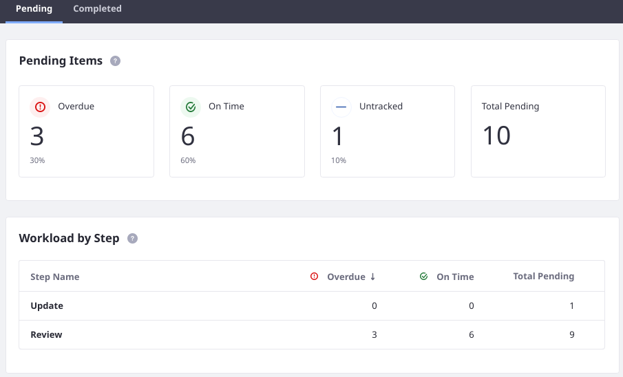

# Introduction to Workflow

Liferay DXP ships with a workflow engine that allows users to review and approve content such as Blogs, Web Content, Wikis before they are published. The Workflow application makes it possible to define any number of business processes/workflows, deploy them, and manage them through a portal interface. Workflow processes are written in `XML` format and several sample workflow processes are available for reference. Lastly, workflow processes can integrate with Users, Groups, and Roles as reviewers and approvers. After you defined your review process, you can select which types of content require a review process before publication.

## Activating Workflow

When a workflow is activated for a particular asset, the _Publish_ button is replaced by a _Submit for Publication_ button, and instead of instant publication, the asset's status is set as _Pending_. It must proceed through the workflow before publication.

The out-of-the-box workflow process is called _Single Approver_; that means one person is required to review and approve submissions before publication.

To learn more, see the [Activating Workflow](./activating-workflow.md) and [sending assets through review](./reviewing-assets.md) articles.

## Building a Workflow

Workflow allows users to build more complex workflows that can have multiple reviewers and approvers. Learn how to build an effective workflow:

* [Crafting Review Processes in XML](https://help.liferay.com/hc/articles/360029147791-Introduction-to-Crafting-XML-Workflow-Definitions)
* [Visually Designing Review Processes](https://help.liferay.com/hc/articles/360028821892-Workflow-Designer) (Subscriber)
* [Uploading Workflow Definitions](./managing-workflows.md#uploading-a-new-workflow-definitions)
* [Managing Workflow Definitions](./managing-workflows.md)

To start building your own workflows, see [Building Workflows](./building-workflows.md).

### Using Workflow Metrics to Implement SLAs

> Subscription

The _Metrics_ function can be used to measure Service Level Agreements (SLAs) performance in a workflow process. SLAs define the deadlines on a workflow process's events. They can be formally agreed-upon deadlines between you and your customers, or informally created to meet internal goals, tracking events such as:

* Total time to resolution
* Time to complete a specific workflow task

Once an SLA is set, workflow submissions that trigger the SLA timer are automatically reported on by the workflow metrics framework, and given the status _on time_ or _overdue_.

See the [Using Workflow Metrics](./using-workflow-metrics.md) article to learn how to add SLAs into your workflows.

## What's Next

* [Activating Workflow](./activating-workflow.md)
* [Managing Workflows](./managing-workflows.md)
* [Building Workflows](./building-workflows.md)
