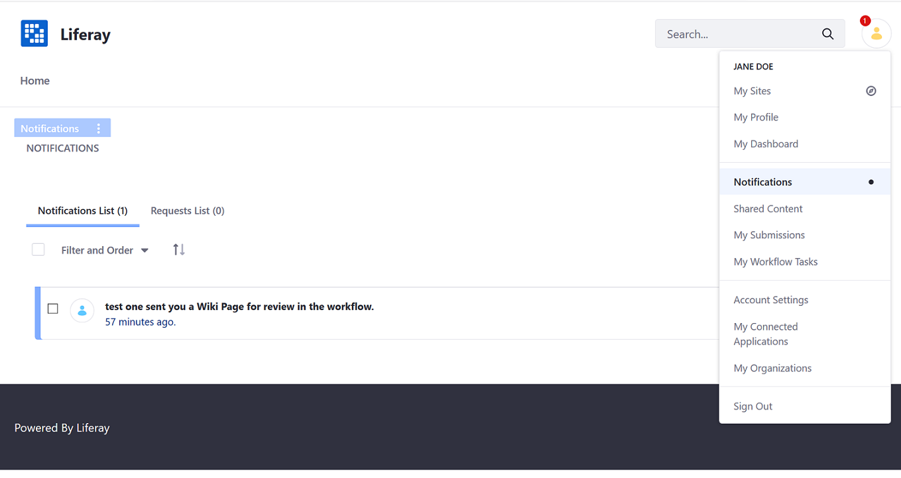
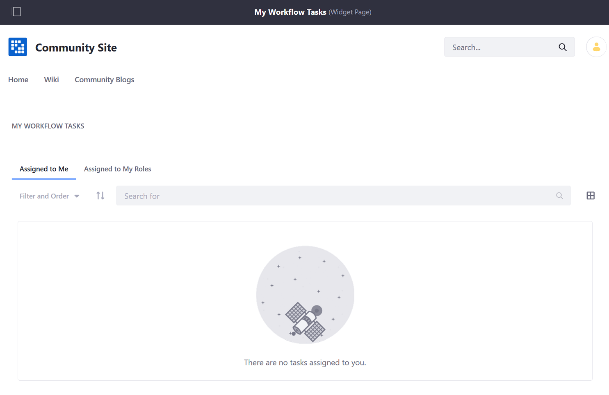
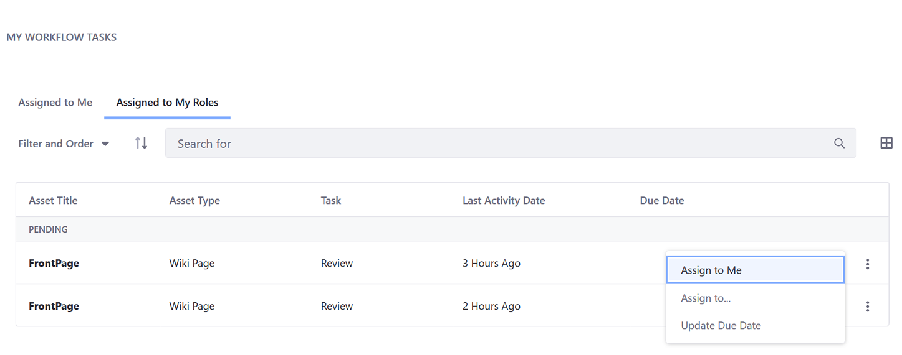
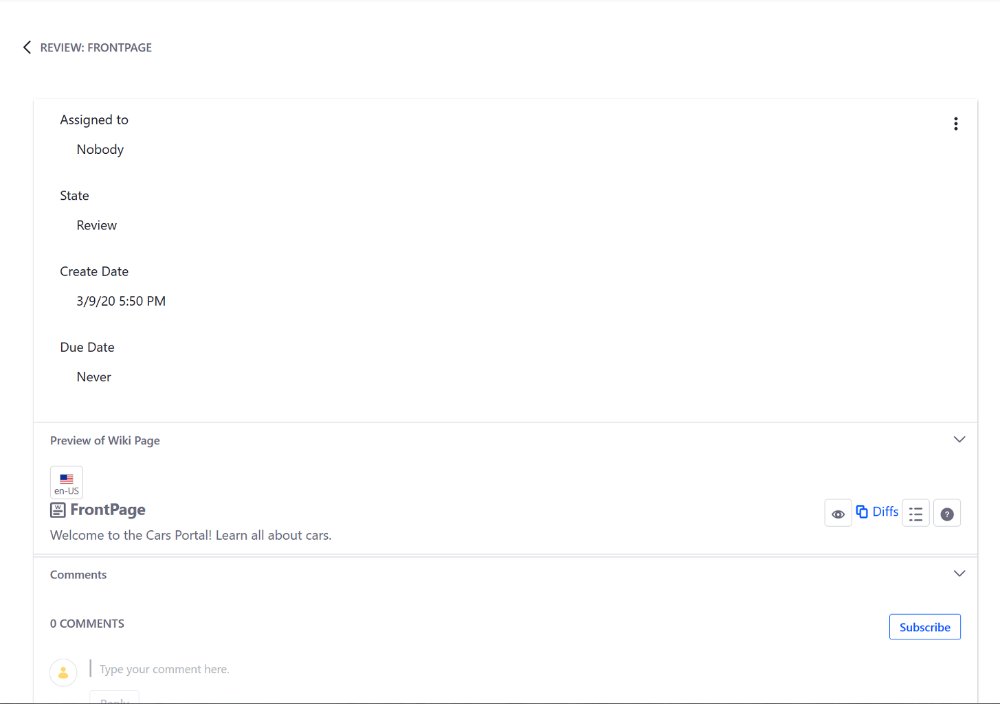
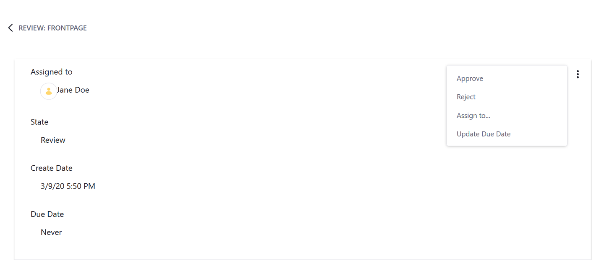

# Reviewing Assets

When an asset's workflow has been [activated](./activating-workflow.md), one or more users have to review it before publication. Workflow review processes can be assigned to specific users or to a particular Role (for example: Portal or Site Content Reviewer). In the latter case, anyone assigned to that Role may approve or reject the submission. For example, if you are using the out-of-the-box _Single Approver_ process, the workflow tasks are assigned to a Portal or Site Content Reviewer or anyone with administrator rights.

Once an asset has been submitted, the _Workflow_ application sends a notification to all the potential reviewers who have been assigned to that Role. To access notifications, click your avatar and select _Notifications_.

## Reviewing an Asset

Because the _Single Approver_ workflow process is assigned tasks to Roles, you have to assign the task to yourself.

### Assigning the Review Task

1. Click your avatar and select _My Workflow Tasks_.
1. All workflow tasks assigned directly to a user are listed in the My Workflow Task widget's _Assigned to Me_ tab.

    

1. To claim a task, click the _Assigned to My Roles_ tab.

    

1. Click the asset's _Actions_ button () and select _Assign to Me_.

    

1. Enter an optional comment in the _Comment_ text field.
1. Click _Done_.

### Approving or Rejecting a Task

Once you have assigned to task to yourself, you can approve or reject the submission.

1. Click the name of the asset to review the asset. Here, there is a preview of the asset (a _Wiki Page_) and the review status.

    

1. Click the _Actions_ button () and select _Approve_ or _Reject_.

     

1. Enter an optional comment and click _Done_.

Once a task is complete, one of several things happens:

* If the submission is rejected, then the asset is not published. The asset exits the workflow process. On the User's _Notifications_, the original author is notified that the submission was rejected and needs to be modified before resubmitted. It is marked as _Update_ in _My Workflow Tasks_.
* If there are more than one reviewers, the task is advanced to the next reviewer in the chain.
* If the submission is approved and there is only one reviewer, then the task is moved to the _Completed_ section on the _Assigned to Me_ tab. The asset is published.

The approved asset (the Wiki Page) is now published in the widget.

## Additional Information

* [Managing Notifications and Requests](../../../collaboration-and-social/notifications-and-requests/user-guide/managing-notifications-and-requests.md)
* [Workflow Task Nodes](https://help.liferay.com/hc/articles/360028834732-Workflow-Task-Nodes#assignments)
* [Workflow Notifications](https://help.liferay.com/hc/articles/360028834772-Workflow-Notifications)
