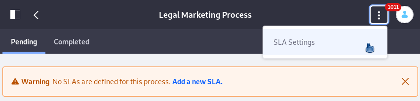
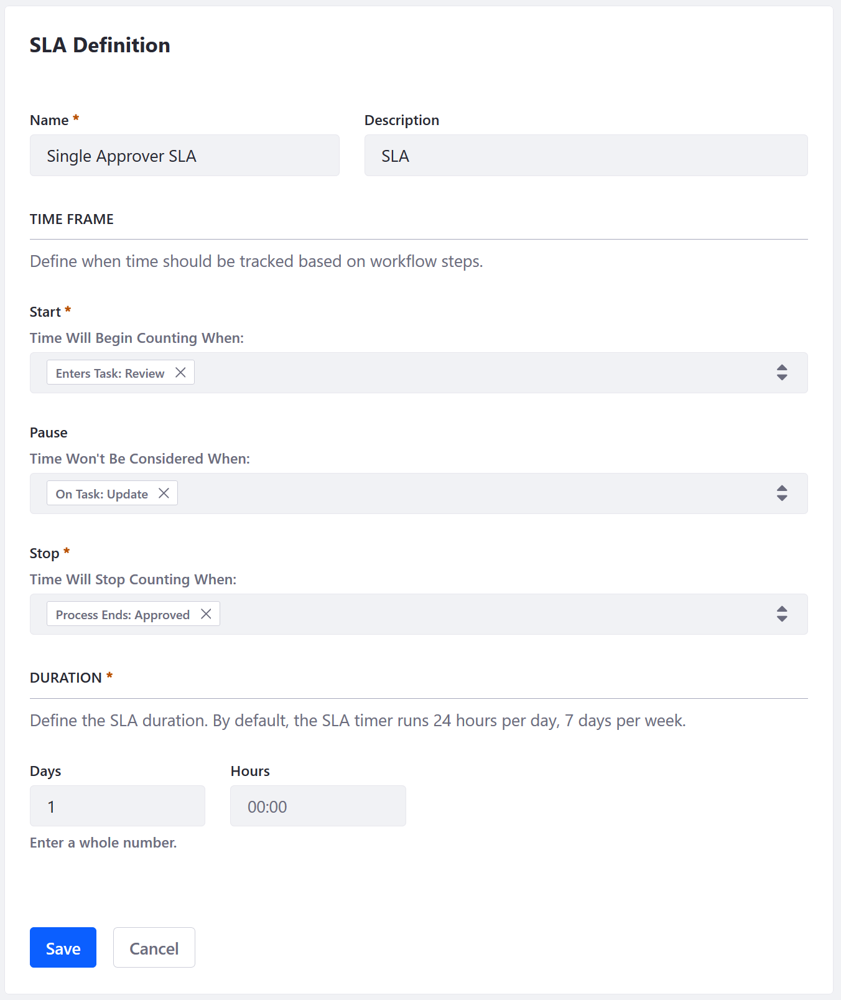

# Using Workflow Metrics

_Workflow Metrics_ gives insights into the time certain workflow events take to complete. To use it, set up deadlines on a workflow process's events. These deadline configurations are referred to as SLAs (Service Level Agreements). Once defined, Workflow Reports measure compliance with the SLAs. SLAs define the deadlines on a workflow process's events. They're like a contract between the workflow participants and Users submitting workflow items. _Workflow Reports_ shows data for all processes with SLAs, including each workflow item's SLA status: on time or overdue.

* **Editing a Workflow with SLAs:** Editing a workflow (e.g., removing nodes, editing a task name) with SLAs defined on it may invalidate the SLA for items already in the workflow/SLA pipeline.

* **Creating or Editing SLAs for Active Processes:** Editing an SLA's duration or defining a new SLA while items are already in the workflow process causes a recalculation for all instances currently in the workflow. Completed workflow instances are not recalculated.

## Prerequisites

To use _Workflow Metrics_, you must be using Elasticsearch to index your DXP data. To learn more, read the [Installing Elasticsearch](https://help.liferay.com/hc/en-us/articles/360028711132-Installing-Elasticsearch) article.

## Adding SLAs

1. Navigate to the _Control Panel_ &rarr; _Workflow_ &rarr; _Metrics_.
1. Click on the title of the Process.
1. If there's no SLA for the process, a warning message stating as much appears. Click the _Add a new SLA_ link from the warning to access the New SLA form directly.

    Alternatively, click the Options () menu and select _SLA Settings_.

    

1. On the SLAs screen, click the _Add_ button ().
1. In the New SLA form, give the SLA a Name and Description.
1. Define the time frame for the SLA, specifying three things:

    * Start: When the item makes it to the event defined here, the SLA timer begins counting.
    * Pause: If there's an event in the workflow when time should stop counting, enter it here. For the Single Approver workflow, you might choose to pause the SLA timer when the item is in the Update task.
    * Stop: Choose when the SLA is completed. If the item makes it to the Stop event before the defined SLA duration (the deadline), it's _On Time_ according to the SLA. If it fails to make it to the Stop event in the specified duration, it's _Overdue_.

1. Define the duration (i.e., the deadline) for the SLA. Fill out at least one of the two time boxes.

    * **Days:** Enter a whole number of days.
    * **Hours:** Enter hours and minutes in the format HH:MM

    

1. Click _Save_.

### Valid Start and Stop Events

Any workflow task can be used as a start or end parameter for the SLA.

When defining the tasks to act as the SLA's Start Events, choose between three events:

* The start node
* Entry into a task
* Exit from a task

When defining the tasks to act as the SLA's Stop Events, choose between three events:

* Entry into a task
* Exit from a task
* The end node

The SLA can be paused at any task that falls between the start node and the end node, and it's defined by setting the node(s) when the SLA should be paused. _The SLA timer is paused the entire time a workflow item is in the specified node_.

### Durations

Durations must be entered in the following format:

Example Duration: 1 day / 24 hours

* **Valid configuration**: Days: _1_
* **Invalid**: Hours: _24:00_. The _Hours_ box must not exceed _23:59_.

Example Duration: 36 hours

* **Valid**: Days: _1_, Hours: _12:00_
* **Invalid**: Days: _1.5_. Only whole numbers are accepted.

Example Duration: 6.5 hours

* **Valid** --- Hours: _06:30_
