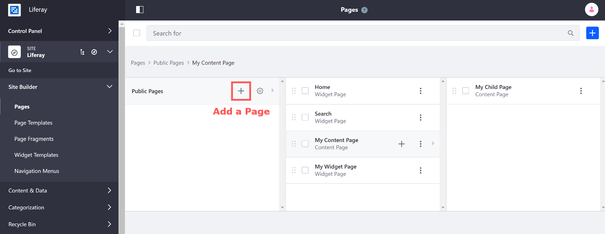
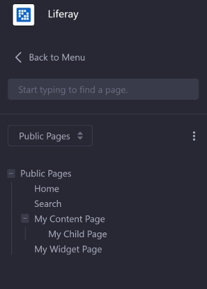

# Adding a Page to a Site

The steps below describe how to add a new page to your Site and configure the general options. To learn how to configure the remaining page settings, see [Configuring Individual Pages](./06-configuring-individual-pages.md), or see [Configuring Page Sets](./05-configuring-page-sets.md) to configure options for the [Page Set](./01-understanding-pages.md#page-sets).

<!-- I'd remove this information and refer to it via a link to Page Set information in "Understanding Pages" -- A page can belong to one of two Page Sets:

* **Public Pages:**

  * Can be accessed by anyone, including Users who haven't logged in

  * Has URLs different from Private Pages and can have unique content, applications, themes, and layouts

* **Private Pages:**

  * Can only be accessed by Site members

  * Has URLs different from Public Pages and can have unique content, applications, themes, and layouts -->

## Adding a New Page

Follow these steps to add a page:

1. Navigate to your desired Site by using the [Site Menu](../../getting-started/navigating-dxp.md#site-menu).

1. Go to *Site Builder* &rarr; *Pages* under the Site Menu.

     <!-- This picture also should show the Site Menu. This image has too many annotations - I'd opt to just have one or TWO things at most to highlight to minimize cognitive overload for new users.-->

    ```tip::
       Alternatively, since Liferay DXP 7.3, you can click the () icon next to the Site name to open the Page Tree Menu. You can use the Page Tree Menu to quickly find a page by keyword in the search bar, navigate to a page by selecting it, or even add pages through the Actions Menu.
    ```

    <!-- Screenshot of new method described above -->

1. On the Pages page, click the *Add* button () to create a top-level page. <!-- Way too many alternative methods presented here -- Take some of this material and put it in the ##Adding a Child Page header. -->

<!-- or click the *Add* button () next to an existing page to create a child page below the page you've selected. You can also click the *Add* button () in the top right of the Pages page to create a top-level page. Likewise, open the Actions menu next to a Page Set in the Page Tree Menu and select *Add Page* to create a top-level page, or select *Add Child Page* from the Actions Menu next to an existing page to create a nested child page for it. You can nest pages as deep as you like. -->

1. Choose a [page type](./01-understanding-pages.md#page-types) under *Basic Pages* or Page Template under the *Global Template* menu. <!-- or another Page Template collection underneath the Collections heading to create a page from a [Page Template](./07-creating-a-page-template). After selecting a page type, a category selector is displayed below the page Name field if a vocabulary is [required](TODO-targeted-vocabularies). --> <!-- ^ Targeted Vocabularies seems like a pretty particular feature to highlight in our hopefully our initial "Adding a Page to a Site" article. Is there are more advanced section we can put that in? -->

    

1. Enter a Name and configure the remaining settings for the page. <!-- Are the instructions that follow part of configuring settings for the page OR are we providing the instructions as a Next Step for the reader? --> <!-- Follow the instructions in [Configuring Content Pages](./04-building-content-pages.md) if you're adding a Content Page. -->

1. Click *Save* to create the page.

    ```tip::
       Creating a page by default also adds it to any Navigation Menus that are configured to have new pages added to them. Learn more about `Configuring Site Navigation <../04-site-navigation/README.md>`_.
    ```

<!--
This content should probably be moved out to being part of Managing / Configuring Site Navigation / Changing Site Navigation Order and Hierarchy or something like that.

Creating a page by default also adds it to any Navigation Menus that are configured to have new pages added to them. You can drag and drop pages to reorder their position in the page hierarchy (and subsequently the default navigation that users see). Drag a page on top of an existing page to create a child page.

If you don't want a new page added to a specific Navigation Menu that is listed during page creation, uncheck the box for that menu. Pages are as flexible as pages you'd create manually without Liferay Portal. Using an intuitive interface, you can define your Site any way you want. You can create and remove pages, export and import them, set their layouts, define how they are indexed by search engines, and more. -->

<!-- Move to the "Understanding Pages" article. -- After you've added a page, it may be difficult to track what kind of page you're currently viewing. The page type appears at the top of the page to help you determine the administration options you have and where you need to go to configure the page.

 -->

## Adding a Child Page

1.
1.
1.

## Additional Information

* Understanding Pages
* Content Page Elements
* Other Articles
