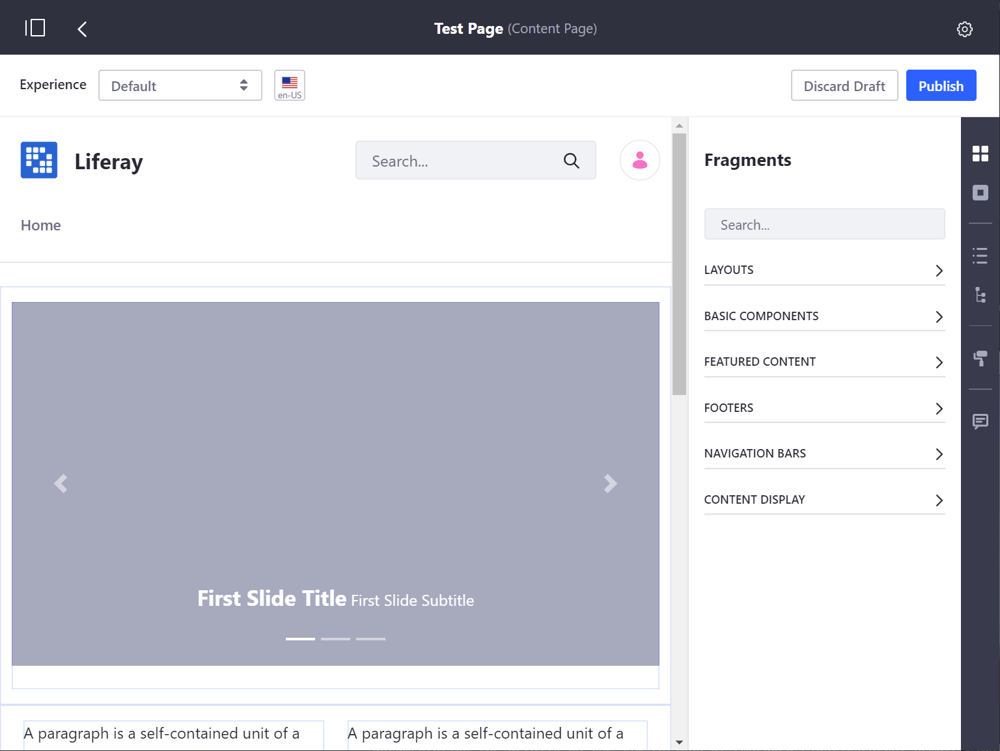
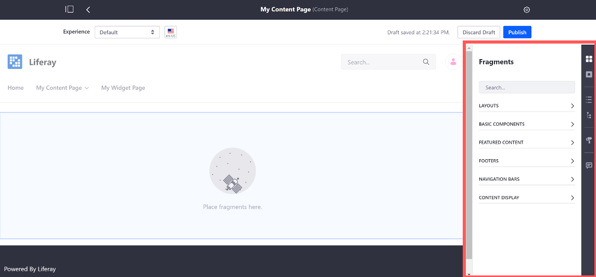

<!-- Recommended restructuring of this article:
# Content Pages Overview

The default type of page used in Liferay DXP is a Content Page. The Content Pages Editing UI provides access to many different drag-and-drop elements that are available for use immediately with minimal configuration.



The Content Page sidebar gives access to the following elements and tools:

* Fragments
* Widgets
* Contents
* Page Structure
* Look and Feel
* Comments

## Fragments

Fragments can be easily drag-and-dropped to a page. Most fragments can be easily customized by editing them or mapping them to content that you have already created or uploaded to your Liferay DXP instance. See [Editing and Mapping Content to Fragments]() to learn more. Continue reading to learn more about the types of fragments available in Liferay DXP.

### Layouts

### Basic Components

### Featured Content

### Footers

### Navigation Bars

## Widgets

Widgets are x. Click [Using Widgets on a Content Page](), to learn more.

## Contents

## Page Structure

## Look and Feel

## Comments

Comments are x and enable y. See [Enabling and Using Comments for Fragments]() to learn more.

-->


# Content Pages Overview

The default type of page used in Liferay DXP is a Content Page. The Content Page's editing UI provides access to many different drag-and-drop elements (Fragments) that are available for use immediately with minimal configuration. Continue reading to get an overview of the Content Pages UI. See [Building Content Pages](./04-building-content-pages.md) to jump directly in to building a Content Page.




The Content Page sidebar contains these elements and tools for Content Pages:

* [Fragments](#fragments)
* [Widgets](#widgets)
* [Contents](#contents)
* [Page Structure](#page-structure)
* [Look and Feel](#look-and-feel)
* [Comments](#comments)

Liferay Portal ships with several Layouts, Fragments, and Widgets that you can use to build pages. Developers can [create their own Fragments](TODO) to add to these.

## Fragments

```note::
   Available in Liferay DXP 7.3+. This section was previously divided between the *Sections* and *Section Builder* panels.
```

You can drag-and-drop Fragments on a page. Fragments can have editable elements, such as [text](./building-content-pages.md#modify-editable-text), an [image](./building-content-pages.md#modify-editable-images), or a [link](./building-content-pages.md#modify-editable-links), that you can click and replace with custom content. You can also [map these elements](./building-content-pages.md#mapping-elements) to content. For more information on developing these elements, see [Fragment Specific Tags](TODO). Continue reading to learn more about the types of fragments available in Liferay DXP.


### Layouts

Layouts provide a space where you can add Fragments or Widgets. Each Layout you add fills the width of the page. You can add any number of layouts to the page.


### Basic Components

Basic Components are small design elements or pieces that add functionality to the page. A Component might be an image with formatting or a block of text with styling pre-applied. While Sections should be complete by themselves, Components work together to build pages piece by piece.


### Featured Content

The Featured Content panel contains complete Fragments (composed of multiple components) that can be immediately used and customized as soon as they are added to a page. A large banner image with a text overlay is an example of a Fragment that is ready for immediate use.


### Footers

```note::
   Available in Liferay DXP 7.3+. These Fragments were previously included in the *Sections* panel.
```

The *Footers* panel includes Fragments that you can add as the Footer of the page. See [Master Pages](TODO) for their use in Liferay DXP 7.3.

### Navigation Bars

```note::
   Available in Liferay DXP 7.3+. These Fragments were previously included in the *Sections* panel.
```

The *Navigation Bars* panel includes Fragments that you can add as the Header of the page. See [Master Pages](TODO) for their use in Liferay DXP 7.3.

### Content Display

```note::
   Available in Liferay DXP 7.3+.
```

The *Content Display* section lets you add the Content Display Fragment to display a single existing web content, blog entry, or document. See [Using the Content Display Fragment](TODO#using-the-content-display-fragment) for more information.<!--Including this doc in the Page Fragments section-->

## Widgets

The Widgets section functions just like the *Add* menu on a Widget Page. The full list of available widgets is displayed, and you can add them to the page. The main difference is that only the main configuration options for Widgets on Content Pages. Various other configurations like *Look and Feel* are only available for Widgets on Widget Pages.


## Contents

```note::
   Available in Liferay DXP 7.3+
```

The Contents section provides a list of the web content that's used on the page. This includes content displayed in a widget and content mapped to content fields. Click the *Contents* button () to open the Contents panel. From this section, you can perform a variety of actions to edit and manage web content. See [Managing Web Content on Content Pages](./managing-web-content-on-content-pages.md) for more information.

## Page Structure

Page Structure provides a high level view of every Fragment and every field within each Fragment on the page. Click on a field in the page structure to highlight it on the page and quickly locate it amongst all the other elements.


## Look and Feel

Click the *Look and Feel* icon () to change the Theme or manage other options for the page. These options are fully documented in [Configuring Individual Pages](./06-configuring-individual-pages.md#look-and-feel).

## Comments

You can comment on a Page Fragment to discuss changes and collaborate. Comments are disabled by default in Liferay DXP 7.2, but Administrators can enable them. See [Using Fragment Comments](./using-fragment-comments.md) for more information.

## Next Steps

* [Building Content Pages](./building-content-pages.md)
* [Page Fragments](TODO)
* [Using Fragment Comments](./using-fragment-comments.md)
