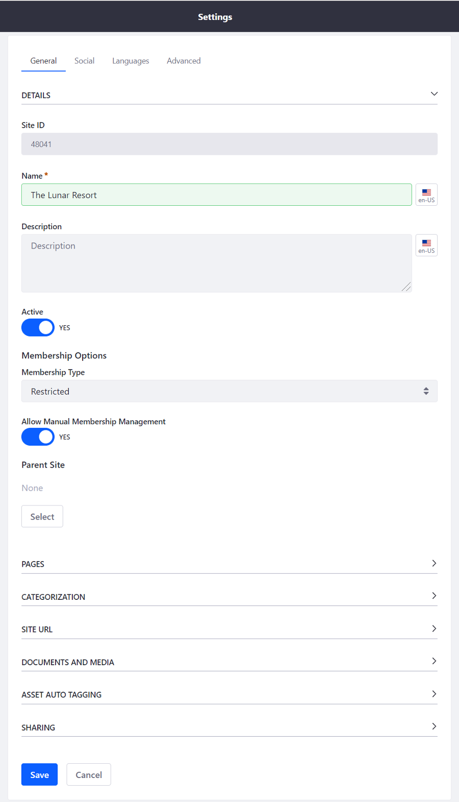

# Adding a Site

To add a new Site to your Liferay Portal instance:

1. Open the [Product Menu](../../getting-started/navigating-dxp.md) and navigate to the Control Panel and select *Sites* &rarr; *Sites*.

    

1. Click the Add icon () at the top right of the page.
1. Select a Site Template. See [Site Templates](./building-sites-with-site-templates.md) for more information on creating Site Templates.
1. Enter a Name for the Site and optionally provide a description.
1. Set the *Membership Type*. These membership types are available: <!-- What does it mean for a user to be a member of a site? What abilities/permissions does that typically confer? To answer that question it probably doesn't make sense here, but should link to another article, potentially, "Understanding Site Membership" -->

    * **Open:** Users can become members of the Site at any time.
    * **Restricted:** Users can request Site membership but Site Administrators must approve requests for users to become members.
    * **Private:** Users cannot join the Site or request Site membership. Site Administrators must manually select users and assign them as Site members.

1. Configure the remaining settings and click *Save*.

    

```note::
   In order to view a newly created *blank site*, you must first create a page for it. See `Adding a Page to a Site <../02-creating-pages/README.md>`_ for more information.
```

The new Site is selected when you open the Product Menu. See [Site Settings](../06-site-settings/README.md) for an overview of all of the available Site settings.

## Additional Information

* [Introduction to Site Building](../introduction-to-site-building.md)
* [Building Sites with Site Templates](./building-sites-with-site-templates.md)
* [Adding Members to Sites](./adding-members-to-sites.md)

<!-- ### The Default Site

@Michael Williams - This information feels out of place here.

When you first start and configure your Liferay Portal instance, a default Site is included. This Site doesn't have its own name but rather takes the name of the instance. By default the instance name is *Liferay*, but this value can be changed through the configuration of the setup wizard or through the Instance Configuration in the Control Panel. See [Configuring the Virtual Instance](TODO) for more information. -->
