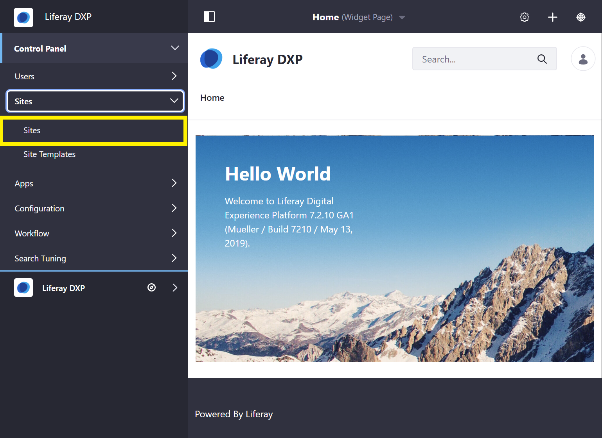
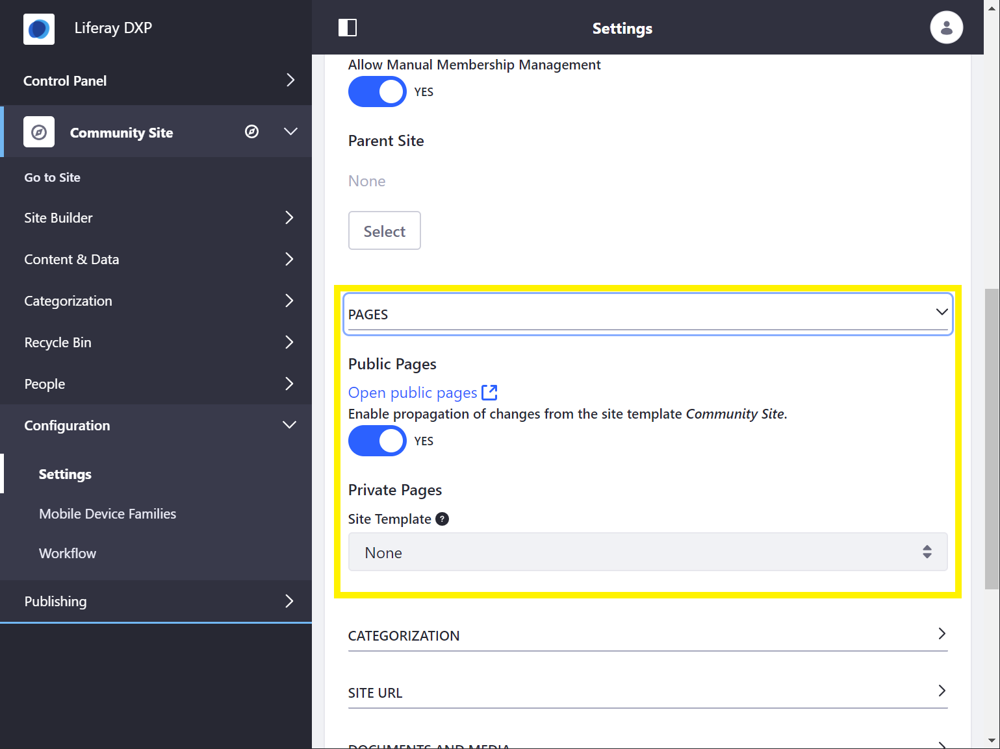

# Building Sites with Site Templates

Site Templates define a preconfigured structure for a Site, which includes the pages, theme, content, layouts, page templates, applications and app configurations defined for each page. Changes made to a Site Template are automatically propagated to the sites that use it, unless specified otherwise.

Three Site Templates are provided out-of-the-box:

* **Blank Site:** Creates a Site that doesn't contain any pages or content.

* **Community Site:** Creates a preconfigured Site with the Message Boards, Search, Polls, Activities, and Wiki applications pre-deployed to site pages.

* **Intranet Site:** Creates a preconfigured Site for an intranet. The Home page displays the activities of the members of the Site, Search, a language selector, and a list of the recent content created in the intranet. It also provides two additional pages for Documents and Media and external News obtained through public feeds.

## Creating a Site from a Site Template

To create a site using a Site Template, follow these steps:

1. Open the Product Menu and go to *Control Panel* &rarr; *Sites* &rarr; *Sites*.

    

1. Click the *Add* icon () and select your Site Template from the menu.
1. Enter a name for the Site.

    * Checking *Create default pages as private (available only to members).* will prevent guest users from viewing site pages.
    
1. Click *Save*.
1. Configure your [site settings](../06-site-settings/README.md).
1. Open the *Pages* panel below the form.

    

    ```note::
       *Enable propagation of changes from the Site template* enables the Site to receive updates if the Site Template is modified. If changes are made directly to a Site created from a Site Template, the Site will no longer receive updates from the Site Template. See `Merging Site Template Changes <./merging-site-template-changes.md>`_ for more information.
    ```

1. Click *Save* to create your Site.
1. Open the Product Menu and go to *Sites* &rarr; *Sites* under the Control Panel.
1. Click *Actions* and select *Go to Public Pages* or *Go to Private Pages* next to your new Site to view it.

    ```tip::
       In order to view a newly created *blank site*, you must first create a page for it. See `Adding a Page to a Site <../02-creating-pages/README.md>`_ for more information.
    ```

## Additional Information

* [Introduction to Site Building](../introduction-to-site-building.md)
* Creating a Site Template
* [Adding Members to Sites](./adding-members-to-sites.md)
