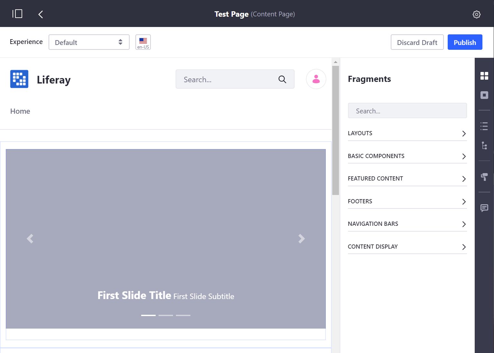
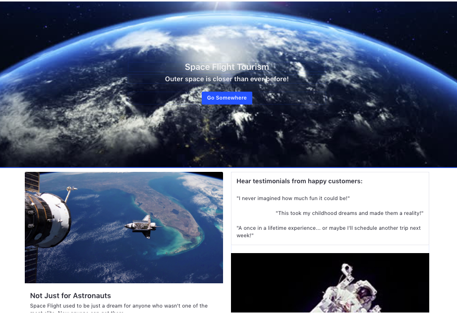
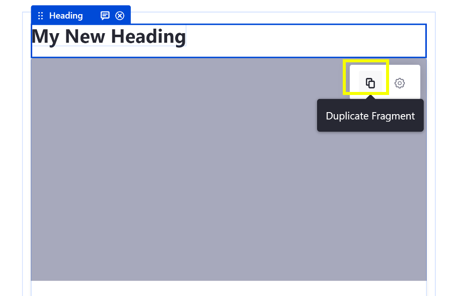
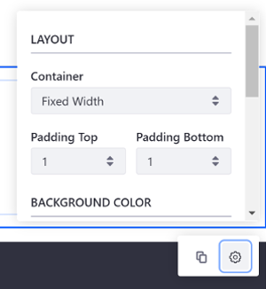
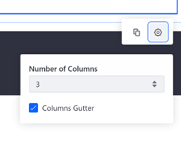
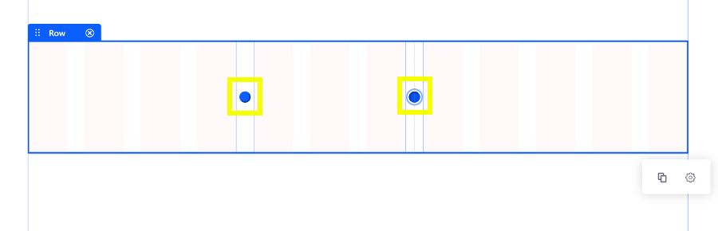

# Building Content Pages

Once you've [added a Content Page](../adding-pages/adding-a-page-to-a-site.md) you may begin building your page by adding and configuring the various [Content Page elements](./content-pages-overview.md).

## Adding Elements to a Content Page

To begin building a Content Page:

1. Enter the Site Builder view for your Content Page. Open the Product Menu and go to *Site Builder* &rarr; *Pages* under your Site's Menu.

    

    

    ```note::
       New Content Pages start empty and in a *Draft* status. The page is not visible until it is published.
    ```

1. Open the Content Page sidebar and begin adding Page Fragment elements.

    

1. Configure the editable portions of the Page Fragments to customize the look of your Content Page. Elements can be configured in some of these ways:

    * [Setting a Background Color](#setting-a-background-color)
    * [Using a Background Image](#using-a-background-image)
    * [Editing Text](#editing-text)
    * [Editing a Hyperlink](#editing-a-hyperlink)
    * [Editing an Image](#editing-an-image)
    * [Copying a Fragment](#copying-a-fragment)
    * [Adjusting Spacing](#adjusting-spacing)
    * [General Configuration](#general-configuration)
    * [Mapping Content](#mapping-content)

    

    ```tip::
       In progress work on a Content Page is automatically saved.
    ```

1. Click the *Publish* button in the top right to make the updates available to the live page.

## Configuring Elements on a Content Page

Many elements that can be added to a content page can be configured and customized. Clicking on an element provides a management toolbar with access to available configurations for the selected element.

### Setting a Background Color

You can set the background color of a Layout. Follow these steps:

1. Click the Layout to select it.
1. Click the () icon to select a color.


```note::
   The available color palette can be configured by the Fragment developer. See Fragment Configuration Types for more information.
```

### Using a Background Image

You can configure a background image for a Layout. Follow these steps:

1. Click on the Layout to select it.
1. Select *Layout Background Image*, and choose the image to display.

    

    ```note::
       Mapping a Layout background image is available in Liferay DXP 7.2 SP1+ and Liferay Portal 7.2 GA2+.
    ```

### Editing Text

1. Click on the text that you want to edit.
1. Replace the text if Plain text or use the inline text editor to update the Rich text styles, typographical emphasis, alignment, and list formatting.


### Editing a Hyperlink

1. Click on the link, button, or image that you want to edit.
1. Click on () to edit the link text, () to edit the link properties, or () to edit the link mapping (described earlier).

    From the Link Properties popup, you can define these link options:

    *Manual:* defines a manual link or maps it to an existing content field

    * *URL:* set the link's URL
    * *Target:* set the link's behavior

    *From Content Field:*

    * *Content:* set the content type
    * *Field:* set the field to display for the selected content

    A list of some of the available content fields is shown below:

    * Categories
    * Tags
    * Display Page URL
    * Description
    * Publish Date
    * Summary
    * Title
    * Last Editor Name
    * Author Name
    * Basic Web Content


### Editing an Image

1.  Click on the image you want to replace.
1.  Click the () icon.

    

1. Click *Select* to upload an image from Docs and Media or define an image URL. Click *Clear* to reset the image. You can also specify an
image description.

You can also [specify a background image for a layout](#using-a-background-image) and [provide a link for your image](#editing-a-hyperlink).

### Copying a Fragment

You can duplicate a Fragment on the page (Component, Section, Row, etc.) to save time. Follow these steps:

1. Hover over the Fragment you want to copy.
1. Click the Fragment to select it.
1. Click the Duplicate Fragment button in the context menu that appears.


```note::
  Duplicated Sections and Rows appear directly below the Section or Row that is duplicated. The Fragments, mappings, and customizations are duplicated as well.
```

```warning::
  Layouts (Sections or Rows) containing instanceable Widgets cannot be duplicated. In this case, a message will appear, indicating the Widget preventing the duplication.
```

### Adjusting Spacing

You can adjust the spacing for Sections and Rows through the Fragment's Configuration Menu.

#### Configuring Section Width and Padding

To configure the Section, follow these steps:

1. Click the Section to select it.
1. Click the () to open the Section's Configuration Menu.
1. Update the Section's *Container* setting to adjust the width styling (*Fixed Width* or *Fluid*), and update the *Padding Top* and *Padding Bottom* setting to adjust the padding for the Section container.



You can also configure a background image and color for a layout Section. See 
[Using a Background Image](#using-a-background-image) for more information.

#### Configuring a Row's Columns

To configure a Row, follow these steps:

1. Click the Row to select it.
1. Click the () to open the Row's Configuration Menu.
1. Update the *Number of Columns* setting (from 1 to 6) to specify the number of columns for the Row, and disable/enable the *Columns Gutter* setting to remove/add padding between columns.



You can adjust the width of the columns to create a more custom layout. Follow these steps:

1. Click on the Row to select it. A blue dot appears between each of the columns, indicating that they can be resized.
1. Click one of the blue dots and drag to the left or right to adjust the size of the column.



### General Configuration

Available for some out-of-the-box fragments. This menu option presents context specific fragment configurations. For a reference on these configurations, see Basic Component Configuration Reference.

### Mapping Content

You can also map these elements to content. You can set the *Content* for the element (web content article, document, or blog) and choose its applicable *Field* to display (e.g., title, author name, tags, etc.). You can configure this by selecting the element's *Map* button ().

```note::
   Many mapping improvements were released in Liferay DXP 7.2 SP1+ and Liferay Portal 7.2 GA2+. For example, mapping editable elements to text/URL fields of existing content and mapping Fragment background images to image fields of existing content. You can also map custom fields.
```

When you create Content Pages, you can create different **Experiences** for users based on User Segments. You can create a unique Experience on any Content Page for any existing User Segment. For more information, see the [Content Page Personalization guide](../../personalizing-site-experience/README.md).

## Related Information

* Developing a Page Fragment
* [Using Master Pages](../defining-headers-and-footers/master-page-templates.md)
* [Changing Content Pages Look and Feel](./content-pages-overview.md#look-and-feel)
