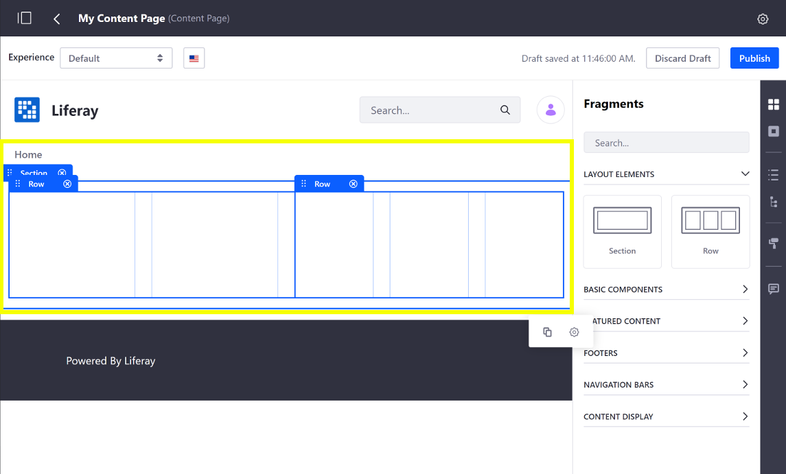
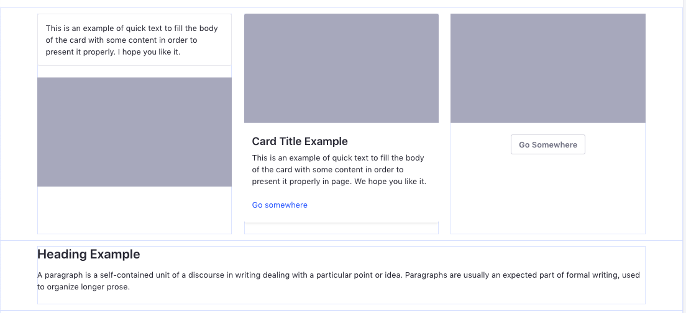
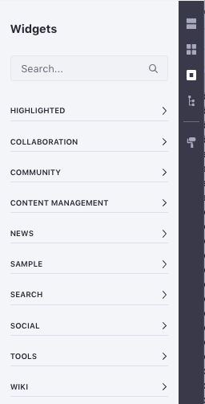

# Content Pages Overview

The default type of page used in Liferay DXP is a Content Page. The Content Page editing UI provides access to many different drag-and-drop elements (Fragments) that are available for immediate use with minimal configuration. Continue reading to get an overview of the Content Pages UI. See [Building Content Pages](./building-content-pages.md) to jump directly in to building a Content Page.


The Content Page sidebar contains these elements and tools for Content Pages:

* [Fragments](#fragments)
* [Widgets](#widgets)
* [Contents](#contents)
* [Page Structure](#page-structure)
* [Look and Feel](#look-and-feel)
* [Comments](#comments)

Liferay Portal ships with several Layouts, Fragments, and Widgets that you can use to build pages. Developers can [create their own Fragments](./README.md#dev-guide) to add to these.

## Fragments

```note::
   Available in Liferay DXP 7.3+. This section was previously divided between the *Sections* and *Section Builder* panels.
```

You can drag-and-drop Fragments on a page. Fragments can have editable elements, such as [text](./building-content-pages.md#editing-text), [images](./building-content-pages.md#editing-an-image), or [links](./building-content-pages.md#editing-a-hyperlink), that you can replace with custom content. You can also [map these elements](./building-content-pages.md#mapping-content) to content that is already available on the site itself. For more information on developing these elements, see [Fragment Specific Tags](./README.md#using-fragments).

### Layout Elements

```note::
  In Liferay Portal CE 7.3 GA2+ this section is called Layout Elements. Previously this section was called Layouts and contained layout options with preconfigured sections and rows.
```

The Layout Elements section contains two Fragments:

* Section: A container Fragment that can contain Rows. Each Section you add fills the width of the page. A Section can contain multiple Rows stacked.
* Row: A Fragment containing a set of columns that you can add Fragments or Widgets to. A Row can be nested inside another Row to create more complex layouts. You can [adjust the spacing](./building-content-pages.md#configuring-a-row-s-columns) of a Row's columns to create new designs.



### Basic Components

Basic Components are small design elements or pieces that add functionality to the page. A Component might be an image with formatting or a block of text with styling pre-applied. Components work together to build pages piece by piece.



### Featured Content

The Featured Content panel contains complete Fragments (composed of multiple components) that can be immediately used and customized as soon as they are added to a page. A large banner image with a text overlay and customizable CTA (Call to Action) is an example of a Fragment that is ready for immediate use.
<!-- An image with better text contrast would probably be a better example here - to help the image / text / CTA button stand out from one another more. -->


### Footers

```note::
   Available in Liferay DXP 7.3+. These Fragments were previously included in the *Sections* panel.
```

The *Footers* panel includes Fragments that you can add as the Footer of the page. See [Master Pages](../defining-headers-and-footers/master-page-templates.md) for their use in Liferay DXP 7.3.

### Navigation Bars

```note::
   Available in Liferay DXP 7.3+. These Fragments were previously included in the *Sections* panel.
```

The *Navigation Bars* panel includes Fragments that you can add as the Header of the page. See [Master Pages](../defining-headers-and-footers/master-page-templates.md) for their use in Liferay DXP 7.3.

### Content Display

```note::
   Available in Liferay DXP 7.3+.
```

The *Content Display* section lets you add the Content Display Fragment to display a single existing web content, blog entry, or document. See [Using the Content Display Fragment](./README.md#using-fragments) for more information.<!--Including this doc in the Page Fragments section-->

## Widgets

The Widgets section list the applications and tools available out-of-the-box that you can add to the page. There are some limitations to using Widgets on Content Pages. See [Using Widgets on Content Pages](./using-widgets-on-content-pages.md) for more information.



```note::
  While portlets are rendered according to `render-weight <https://docs.liferay.com/ce/portal/7.3-latest/definitions/liferay-portlet-app_7_3_0.dtd.html#render-weight>`_ on Widget Pages, that is not true for Content Pages. Portlets are rendered in the order they appear on the page on Content Pages (i.e. left to right, top to bottom).
```

## Contents

```note::
   Available in Liferay DXP 7.3+
```

The Contents section provides a list of the web content that's used on the page. This includes content displayed in a widget and content mapped to content fields. Click the *Contents* button () to open the Contents panel. From this section, you can perform a variety of actions to edit and manage web content. See [Managing Web Content on Content Pages](./managing-web-content-on-content-pages.md) for more information.

## Page Structure

Page Structure provides a hierarchical view of every Fragment and field within each Fragment on the page. Click on a field in the page structure to highlight it on the page and quickly locate it amongst other elements.


## Look and Feel

Click the *Look and Feel* icon () to change the Theme or manage other options for the page. These options are further explored in [Configuring Individual Pages](../page-settings/configuring-individual-pages.md#look-and-feel).

## Comments

You can comment on a Page Fragment to discuss changes and collaborate. Comments are disabled by default in Liferay DXP 7.2+, but Administrators can enable them. See [Using Fragment Comments](./using-fragment-comments.md) for more information.

## Related Information

* [Building Content Pages](./building-content-pages.md)
* [Page Fragments](./README.md#using-fragments)
* [Using Fragment Comments](./using-fragment-comments.md)
