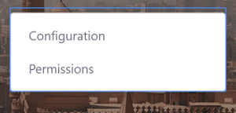
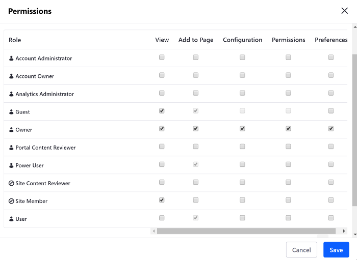

# Using Widgets on Content Pages

The Widgets section functions just like the [*Add* menu on a Widget Page](../using-widget-pages/adding-widgets-to-a-page.md). The full list of available widgets is displayed, and you can add them to the page. The main difference is that only the main configuration options for Widgets are available on Content Pages.

## Adding Widgets on Content Pages 

Follow these steps to add a widget to a Content Page:

1. While [building the Content Page](./building-content-pages.md), open the [Widgets section](./content-pages-overview.md#widgets) and either browse through the categories of available widgets until you find the one you want, or you can search for widgets by name.
1. Drag the widget to the column and row of the layout where you want to place it.

A widget can be a wiki display or a dynamic publishing tool like the Asset Publisher. The content you display with widgets can be long-form text or an image gallery, or anything in between.

## Configuring Widgets on Content Pages

Follow these steps to configure a Widget on a Content Page:

1. Hover over the widget.
1. Open the Options Menu () and select *Configuration*. From here, you have several options, depending on the widget.
1. Click *Save* to apply the changes.



```note::
  Since Liferay Portal CE 7.3 GA2, you also configure permissions for the widget by selecting *Permissions* from the widget's Options Menu.
```

## Configuring Widget Permissions on Content Pages

> Available since Liferay Portal CE 7.3 GA2 and Liferay DXP 7.3

Follow these steps to configure a Widget on a Content Page:

1. Hover over the widget.
1. Open the Options Menu () and select *Permissions*. 
1. Check/uncheck the permissions for the Roles in the new window that appears.
1. Click *Save* to apply the changes.



```note::
  When you create a page based on a `page template <../adding-pages/creating-a-page-template.md>`_, the permissions are copied too. Permissions for a Master Page are set in the `Master Page <../../defining-headers-and-footers/managing-master-pages.md>`_, not in the pages.
```

## Content Page Limitations for Widgets

Although you can still access basic configuration options and permissions (since Liferay CE GA2) for widgets on Content Pages, there are still some options that are only available for Widgets on Widget Pages:

* *Nested applications*: Nested applications (widgets within widgets) are only supported on Widget Pages.
* *Widget Look & Feel*: On Widget Pages you can access the Look and Feel menu through the  widget's Configuration Menu, offering fine-grained control over its CSS. This is not available for widgets on Content Pages, since the look and feel of your content is defined in the Theme or by using Fragments.
* *Configuration Templates*: Configuration Templates that save the widget's configuration settings to a template are only available on Widget Pages.
* *Export/Import*: You can only export/import application data for widgets on Widget Pages.