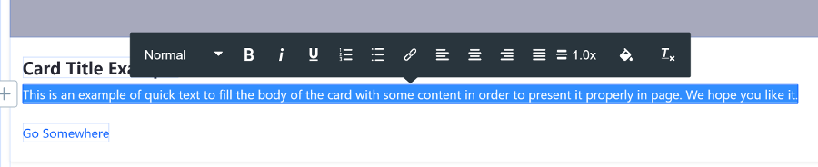
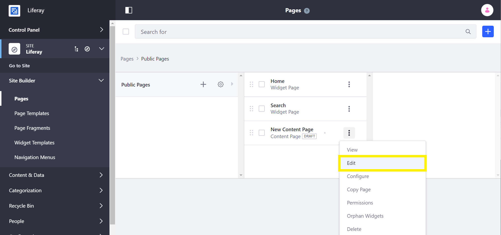
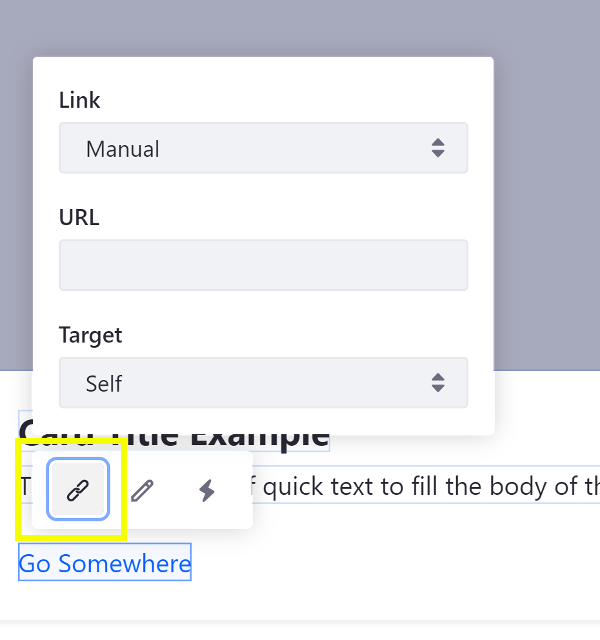
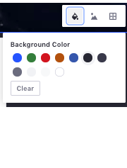
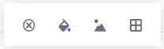

# Building Content Pages

Once you've [added a Content Page](./adding-a-page-to-a-site.md) you may begin building your page by adding and configuring the various [Content Page elements](./content-pages-overview.md).

## Adding Elements to a Content Page

To begin building a Content Page:

1. Enter the Site Builder view for your Content Page. Open the Product Menu and go to *Site Builder* &rarr; *Pages* under your Site's Menu.

    

    

    ```note::
       New Content Pages start empty and in a *Draft* status. The page is not visible until it is published.
    ```

1. Open the Content Page sidebar and begin adding Page Fragment elements.

    

1. Configure the editable portions of the Page Fragments to customize the look of your Content Page. Elements can be configured in some of the following ways:

    * Changing a Background Color
    * Using a Background Image
    * Editing Text
    * Adding a Hyperlink
    * Copying a Fragment
    * Adjusting Spacing
    * General Configuration
    * Mapping Content

    

    ```tip::
       In progress work on a Content Page is automatically saved.
    ```

1. Click the *Publish* button in the top right to make the updates available to the live page.

## Configuring Elements on a Content Page

Many elements that can be added to a content page can be configured and customized. Clicking on an element provides a management toolbar with access to available configurations.

### Changing a Background Color

### Using a Background Image

### Editing Text

### Adding a Hyperlink

### Copying a Fragment

### Adjusting Spacing

### General Configuration

Available for some out-of-the-box fragments. This menu option presents context specific fragment configurations. For a reference on these configurations, see Basic Component Configuration Reference.

### Mapping Content

## Additional Information

* Developing a Page Fragment
* Using Master Pages
* Changing Content Pages Look and Feel

<!-- ### Changing Layout Background Color

Edit a layout's background color by clicking ().

```note::
   The available color palette can be configured by the Fragment developer.
```

### Using a Background Image with a Layout

### Adjusting Layout Column Width

1. Optionally edit the Section's background color (), background image, and spacing.

## Add a Layout

1. Open the *Fragments* Menu and open the *Layouts* panel.

1. Drag the Layout onto the page, above or below an existing Layout or Section.

1. Optionally resize the Layout's columns. Click inside the Section containing the Layout and drag one of the blue handles that appear left or right to adjust the column widths.

1. Optionally specify a background image for a Layout from Section Builder. Click the Layout, select *Layout Background Image*, and define the image to display.

  

  ```note::
    Mapping a Layout background image is available in Liferay DXP 7.2 SP1+ and Liferay Portal 7.2 GA2+.
  ```

1. [Complete the remaining steps to build the Content Page](#building-the-content-page).

## Add a Component

1. Open the *Section Builder* Menu and open the Collection that the Component belongs to. By default, only the *Basic Components* Collection is available.

1. Drag a Component to a column of an existing Layout, or add it outside an existing Layout to automatically place it in a one column Layout. While Sections should be complete by themselves, Components work together to build pages piece by piece. Repeat this step to add as many Components as you need. Multiple Components can be added to one column.

1. Optionally modify the basic styling of the Component. Click the Component and select the Fragment Configuration Cog icon. Any changes you make are applied live. You can remove, duplicate, and configure the Components you add to the page.

  

1. [Complete the remaining steps to build the Content Page](#building-the-content-page).

## Add a Widget

1. Open the *Widgets* Menu and click the category that contains the Widget.

1. Drag the Widget to a column of an existing Layout, or add it outside an existing Layout to automatically place it in a one column Layout.

1. [Complete the remaining steps to build the Content Page](#building-the-content-page).

## Modify Editable Images

1. Click on the image Component that you want to replace.

1. Click ().

1. Click *Select* to upload an image from Docs and Media or define an image URL. Click *Clear* to reset the image. You can also specify an image description.

  ```note::
    Mapping a Layout background image is available in Liferay DXP 7.2 SP1+ and Liferay Portal 7.2 GA2+.
  ```

  For more information on developing editable images, see [Making Images Editable](TODO).

1. [Complete the remaining steps to build the Content Page](#building-the-content-page).

## Modify Editable Links

1. Click on the link or button that you want to edit.

1. Click on () to edit the link text, () to edit the link properties, or () to edit the link mapping (described earlier).

  From the Link Properties popup, you can define these link options:

  *Manual:* defines a manual link or maps it to an existing content field.

  * *URL:* sets the link's URL.
  * *Target:* set the link's behavior.

  *From Content Field:*

  * *Content:* sets the content type.
  * *Field:* sets the field to display for the selected content.

  A list of some of the available content fields is shown below:

  * Categories
  * Tags
  * Display Page URL
  * Description
  * Publish Date
  * Summary
  * Title
  * Last Editor Name
  * Author Name
  * Basic Web Content

1. [Complete the remaining steps to build the Content Page](#building-the-content-page).

For more information on developing editable links, see [Creating Editable Links](TODO).

## Modify Editable Text

1. Click on the text that you want to edit.

1. Replace the text if Plain text or use the inline text editor to update the Rich text styles, typographical emphasis, alignment, and list formatting.

1. [Complete the remaining steps to build the Content Page](#building-the-content-page).

## Mapping Existing Content to Elements on a Content Page

You can also map these elements to content. You can set the *Content* for the element (web content article, document, or blog) and choose its applicable *Field* to display (e.g., title, author name, tags, etc.). You can configure this by selecting the element's *Map* button ().

```note::
  Many mapping improvements were released in Liferay DXP 7.2 SP1+ and Liferay Portal 7.2 GA2+. For example, mapping editable elements to text/URL fields of existing content and mapping Fragment background images to image fields of existing content. You can also map [custom fields](TODO). To ensure you leverage the latest editable element mapping features, upgrade to these versions.
```

When you create Content Pages, you can create different **Experiences** for users based on User Segments. You can create a unique Experience on any Content Page for any existing User Segment. For more information, see the [Content Page Personalization guide](../11-experience-personalization/02-content-page-personalization.md).

## Additional Information

* [Developing a Page Fragment](TODO).
-->
