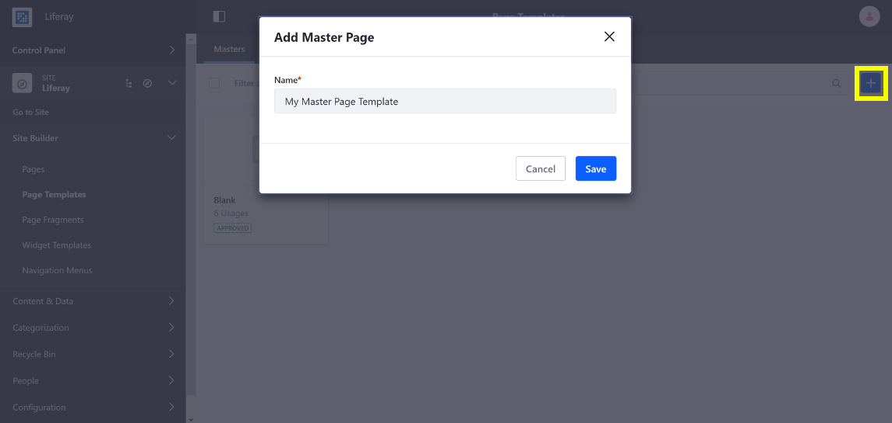
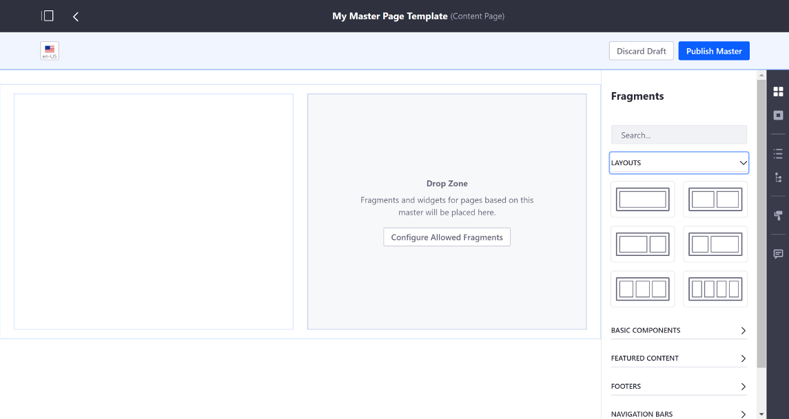

# Creating a Master Page Template

```note::
  Master Page Templates are available since Liferay DXP 7.3.
```

Custom Master Page Templates provide common elements, such as a Header and Footer Fragment, that were once defined in the Theme. Follow these steps to create a Master Page Template:

1. Open Product Menu and go to *Site Builder* &rarr; *Page Templates*  under your Site's menu.
1. Under the *Masters* tab, click the add button to create a new Master Page Template.
   
    

1. [Add Page Fragments](adding-page-fragments) for the common elements, above and below the drop zone and make any edits to them that you require.

    

1. Optionally specify which Page Fragments can be added to the Drop Zone by clicking the *Configure Allowed Fragments* button. Check the boxes for the Page Fragments you want to allow. Check the box for *Allow New Fragments* to allow new Page Fragments to be added to the Drop Zone. click *Save* to apply the changes.

    

1. Click Publish to create the Master Page Template.

```note::
  If a custom Master Page Template is used for a page, the Theme for the page is defined through the Master Page Template and can't be changed through the page's settings. See [Changing a Master Page Template's Theme](./managing-a-master-page-template.md#changing-a-master-page-templates-theme) for more information.
```