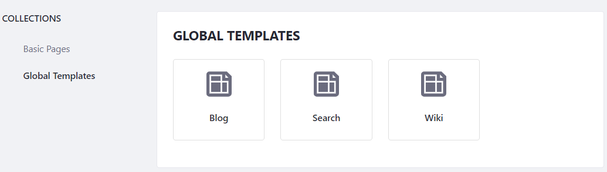
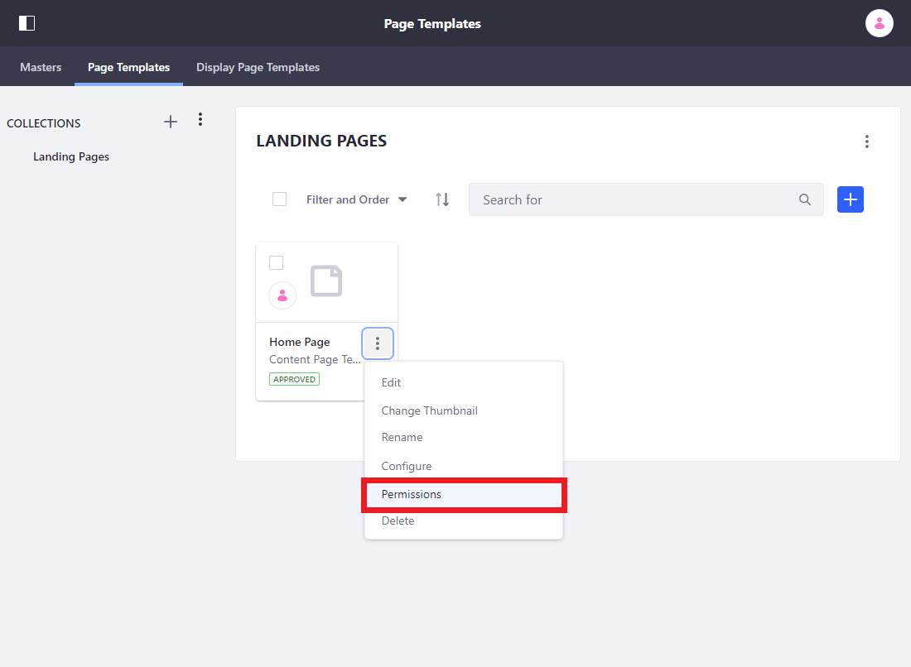

# Creating a Page Template

Page Templates help you efficiently create pages based on predefined layouts and content. There are several basic page templates available out-of-the-box.



You may also create your own Page Templates:

* [Content Page](./building-content-pages.md) Templates
* [Widget Page](./understanding-pages.md#widget-pages) Templates

## Creating a New Page Template

The steps below show how to create and use Widget and Content Page Templates.

1. Open the Product Menu and go to *Site Builder* &rarr; *Pages*.

1. Select the *Page Templates* tab.

1. Click *New* and create a new collection to organize your Page Templates.

    

1. Click the *Add* icon () and select either *Widget Page Template* or *Content Page Template*. You can return to the Page Template's configuration at any time by clicking the *Actions* icon () next to the Page Template in the Collection and selecting *Configure*.

1. Enter a Name.

1. Click *Save*.

1. You're automatically transported to the new Page Template. Follow the instructions in [Widget Pages](./understanding-pages.md#widget-pages) to create your Widget Page Template. Likewise, see [Building Content Pages](./building-content-pages.md) to configure your Content Page Template.

## Sharing a New Page Template

By default, only the creator of the Page Template can use it.

To give other users access to a newly created page template follow these steps:

1. Select *Permissions* from the Page Template's Actions menu.
1. Check the *View* permission for the Roles that you want to have access to the Page Template. If you want any user who can create a page to be able to use the Page Template, check the *View* permission for the *User* Role.

    

1. Click *Save*.

Users with the roles specified now have access to the page template.

## Additional Information

### Propagating Changes for Widget Pages

When creating a page from a Widget Page Template, changes are inherited from the Page Template by default, so future changes are *automatically* propagated to the pages that use the Page Template. Site Administrators can disable this behavior through the [settings for the individual page](./06-configuring-individual-pages.md#general).

### Propagating Changes for Content Pages

Changes for Content Pages **are not automatically propagated** when created using a Content Page Template. Changes to Fragments used on a Content Page can be propagated. See [Propagating Fragment Changes](TODO) for more information.

### Sharing Page Templates With Other Sites

You can share your Page Templates with other sites using the same process as you would for pages. Follow the instructions in [Importing and Exporting Pages and Content](../building-sites/importing-exporting-pages-and-content.md) to learn how.

### Staging and Page Templates

```important::
   Staging functionality has been deprecated as of 7.3+.
```

If staging has been enabled, changes to the Widget Page Template are automatically propagated to the *staged* page. These changes must still be approved before the page is published to the live site. For this reason, the automatic propagation of Widget Page Template changes to the staged page cannot be turned off and the *Inherit Changes* selector does not appear.
