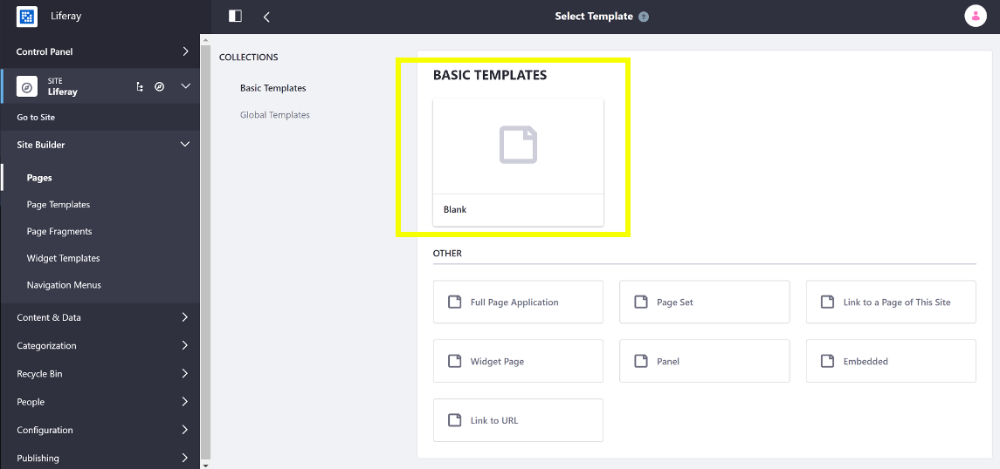
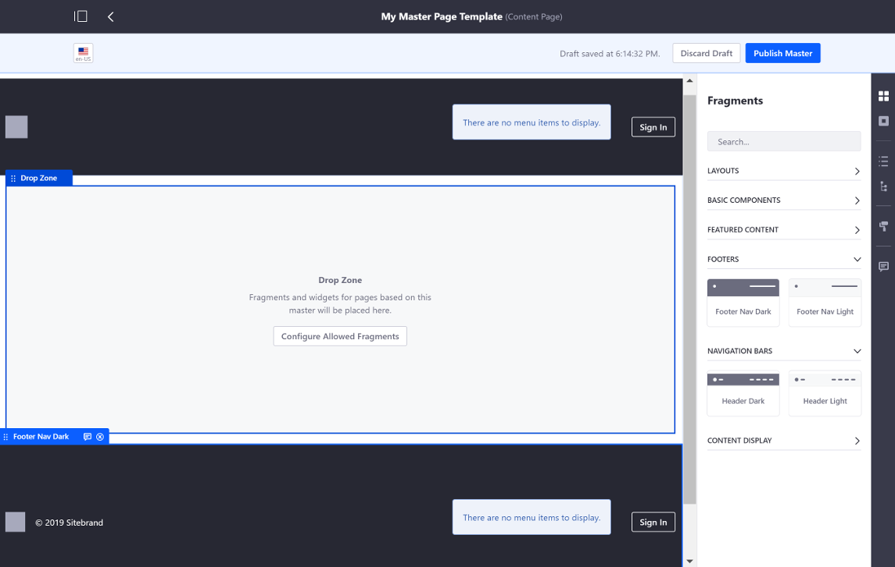

# Master Page Templates

```note::
  Master Page Templates are available since Liferay DXP 7.3.
```

A Master page Template provides the common elements for a page (Headers, Footers, etc.), while the Theme provides the overall look and feel for the Site's pages. Prior to Liferay DXP 7.3, these common elements were provided by the Theme, which means that any changes that needed to be made required an update to the Theme. Providing the common elements through a Theme poses a few limitations:

* Only users with System Administrator permissions can apply changes, since they must deploy the Theme.

* Themes are available for all virtual instances and Sites, so you can't make a Theme available to certain customers, while hiding it from others.

* Common Theme element (Headers, Footers, etc.) customization options are limited to what the Theme developer provides (i.e. color schemes, theme settings, etc.).

Master Page Templates solve all these limitations by letting you create common elements that are unique per Site. The remainder of the page is left editable and is built like any other [Content Page](./04-building-content-pages.md). Each Page and Page Template must have an associated Master Page Template. By default, this is the "Blank" Master, which doesn't provide any common elements.



```note::
    In Liferay DXP 7.3+, Page Templates and Display Page Templates have been moved out of "Pages" and into their own separate application called "Page Templates" under "Site Builder".
```

## Master Page Elements

A Master Page Template can contain any number of Page Fragments, like a Content Page. However, a Master Page Template differs in that it has one key area defined, called a *Drop Zone*, that specifies where you can place Page Fragments. This area can't be removed, but it can be drag and dropped somewhere else in the page layout. You can also define which Page Fragments can be added to the Drop Zone. A typical use case for a Master Page Template is to have a Header, a Footer, and a Drop Zone. See [Creating Custom Master Pages](./creating-a-master-page-template.md) for more information.

