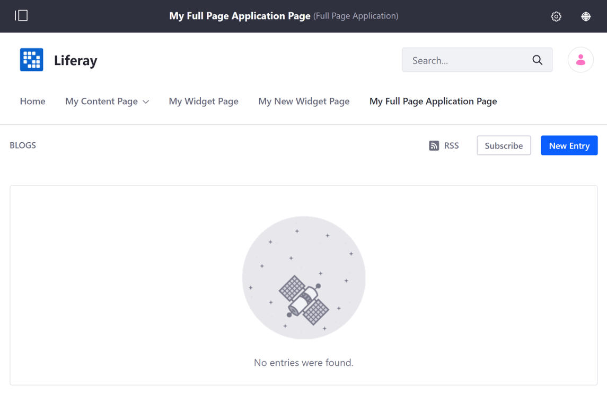
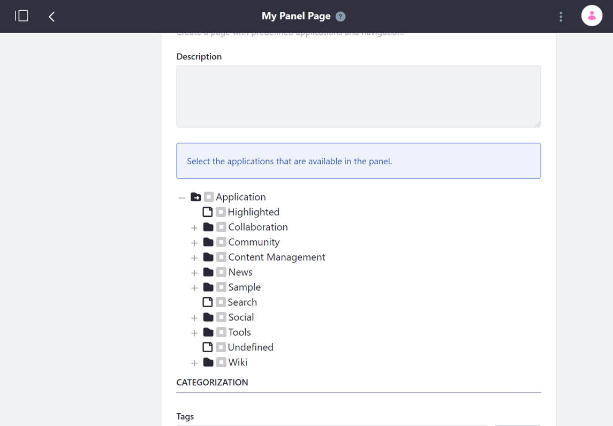

# Other Page Types

[Content Pages](../building-and-managing-content-pages/content-pages-overview.md) are the most commonly used page type, but other page types are available for certain use cases.

## Full Page Application

The *Full Page Application* page type creates a page that displays a single application that fills the entire page. See [Using the Full Page Application Page](./using-the-full-page-application-page.md) for more information.

## Page Set

The *Page Set* option creates a container for subpages that is not actually a page itself.

## Link to a Page

The *Link to a Page of this Site* option links to a page within the same Site. This is often used to make a page available in multiple parts of a Sites hierarchy.

### Panel

The *Panel* option creates a page containing any number of applications as selected by an Administrator, but only one is displayed at a time. Users select the widget they want to display from a menu on the left side of the page. The selected application takes up the entire page.

## Embedded

The *Embedded* option displays content from another website inside your instance in an iframe. The website appears in context and within the navigation of your Liferay DXP instance.

### Link to URL

The *Link to URL* option adds a link to the provided URL. This can be an external page or a link across Sites in the same Liferay Portal instance.
