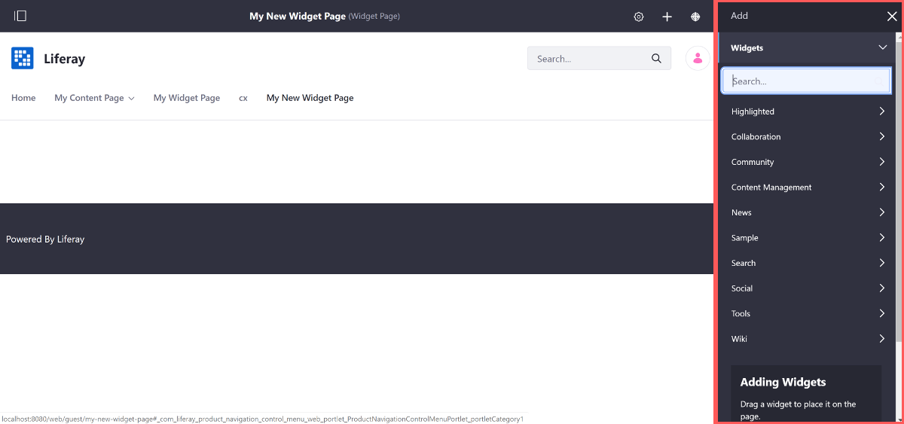

# Adding Widgets to a Page

Follow these steps to add a widget to a Widget Page:

1. Click the *Add* button () in the Control Menu.

1. Open the *Widgets* panel and either browse through the categories of available widgets until you find the one you want, or you can search for widgets by name.
1. Drag the widget to the column and row of the page layout where you want to place it.

A widget can be a wiki display or a dynamic publishing tool like the Asset Publisher. The content you display with widgets can be long-form text or an image gallery, or anything in between.
