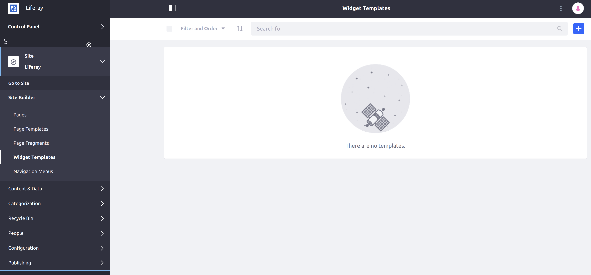
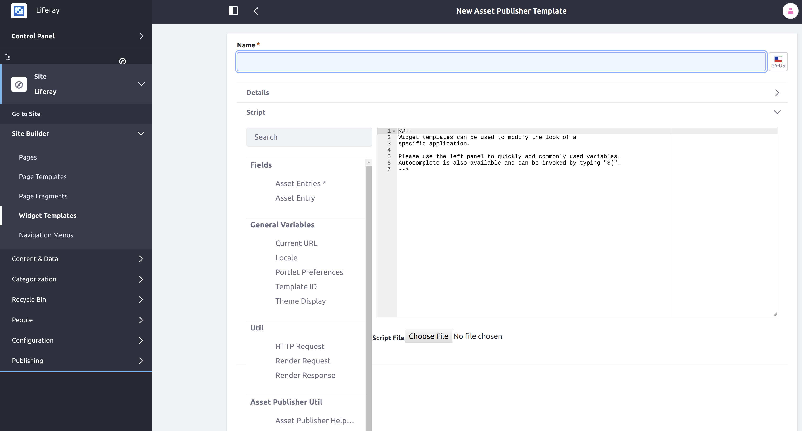
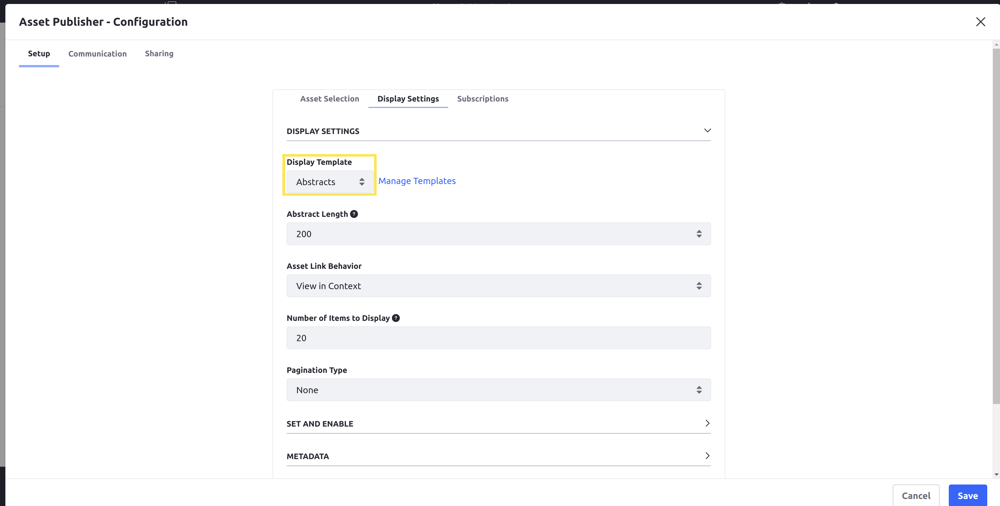

# Styling Widgets with Widget Templates

Widget templates are used to customize the appearance and functionality of various existing widgets. Creating a widget template allows you to use a script to adapt the widget appearance and functionality. You can create a widget template for many widgets available out-of-the-box with Liferay, such as the _Asset Publisher_ and _Media Gallery_ widgets.

## Creating a Widget Template

Follow these steps to create a widget template

1. From the Product Menu, click _Site Builder_ → _Widget Templates._

    

1. Click the _Add_ () button, then select which widget to create a widget template for (e.g., _Asset Publisher_).

    

1. Add a name for your widget template.

1. Under the _Script_ section, click into the body of the template editor.

1. Click one of the fields in the _Fields_ menu to insert that field into the editor. The value of the field will be displayed when your widget template is used.

    ```note::
       Clicking any of the fields in the menu will insert the field name wherever the cursor is. You can also begin typing a field name yourself (starting with "${") to show suggestions for auto-completion.
    ```

1. Click _Save_ to complete the template.

## Applying a Widget Template

Once you have a widget template ready for a widget on one of your pages, follow these steps:

1. Click the Actions () icon on the appropriate widget, then click _Configuration._

1. Find the Display Template drop-down menu, and select the name of the desired template.

    

    ```note::
       This drop-down menu is on the default tab, Setup, for most widgets. For the Asset Publisher widget, this setting is found under the Display Settings tab.
    ```

1. Click _Save._

    <!-- screenshot -->

The widget has been modified to use a custom appearance. By using more advanced widget template scripts, you can further enhance the capabilities of your widgets.
