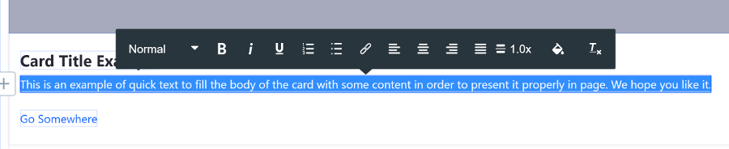
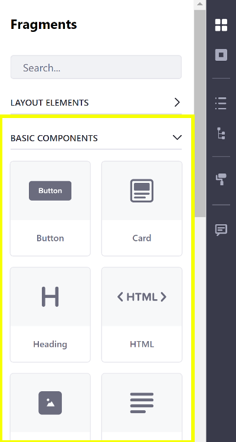

# Page Fragments

Page Fragments are chunks of HTML, CSS, and JavaScript that when combined together, build [Content Pages](../../creating-pages/building-and-managing-content-pages/content-pages-overview.md). Each Page Fragment adds functionality to the page. Several default Page Fragments ship with Liferay DXP, and you can use them to build basic page elements such as carousels and cards.

You may, however, require custom fragments. You can create your own Page Fragments using the built-in [Page Fragment editor](../../developer-guide/developing-page-fragments/reference/page-fragment-editor-interface-reference.md) or locally from your desktop with the [Fragments Toolkit](../../developer-guide/developing-page-fragments/developing-page-fragments-with-the-fragments-toolkit.md). For a deeper dive into creating a custom Page Fragment, see [Developing Page Fragments](../../developer-guide/developing-page-fragments/developing-fragments-intro.md).

You can [embed Liferay widgets](../../developer-guide/developing-page-fragments/reference/fragment-specific-tags-reference.md#including-widgets-within-a-fragment) and add fields containing text and images into page fragments. End users can add content to these page elements during the final Content Page publication process.

Page Fragments are organized into Collections. Collections group related Fragments together so you can manage them easily. Fragments are accessible through these Collections when [building a Content Page](../../creating-pages/building-and-managing-content-pages/building-content-pages.md). You can include resources in Page Fragment Collections and reference them from your Page Fragment's code without worrying about their availability. This is helpful when moving Page Fragments. See [Including Default Resources in Page Fragments](../../developer-guide/developing-page-fragments/including-default-resources-with-fragments.md) for more information.

