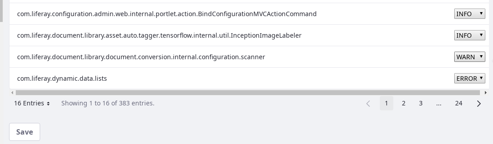

# Configuring Logging in Server Administration

In the Server Administration panel's Log Levels tab, you can and set logging levels for classes and packages in Liferay DXP's class hierarchy and add custom objects to be similarly managed using the Server Administration logging UI.re, changes to the log level near the top of the class hierarchy (such as at `com.liferay`) also change log levels for all the classes under that hierarchy. Modifications unnecessarily high in the hierarchy generate too many messages to be useful.

```tip::
   If your changes will produce more log messages, make them as specific as possible.
```

Each logging configuration is referred to as a Category.

## Adding a Class or Package to the Log Levels User Interface

To add a category,

1. Navigate to Control Panel &rarr; Configuration &rarr; Server Administration, and click the _Log Levels_ tab.

1. Open the Add Category form by clicking the Add button .

1. Fill out the Form:

   *Logger Name*: `my.class.filly.qualified.class.name.MyClass`
   *Log Level*: Choose the logging level you'd like to see: OFF, FATAL, ERROR, WARN, INFO, DEBUG, TRACE, or ALL.

1. Click _Save_.


For a description of the logging levels, refer to [Apache's Log4j `Level` class Javadoc](https://logging.apache.org/log4j/1.2/apidocs/org/apache/log4j/Level.html).
<!-- Didn't want to re-document, but this might be a case where we do it to make it more user-friendly? -->

## Changing the Log Level of an Existing Category

To change the log level of an existing logging configuration,

1. Navigate to Control Panel &rarr; Configuration &rarr; Server Administration, and click the _Log Levels_ tab.

1. Browse to or search for the category to configure.

1. Use the dropdown menu to change the level.

1. Click _Save_.


