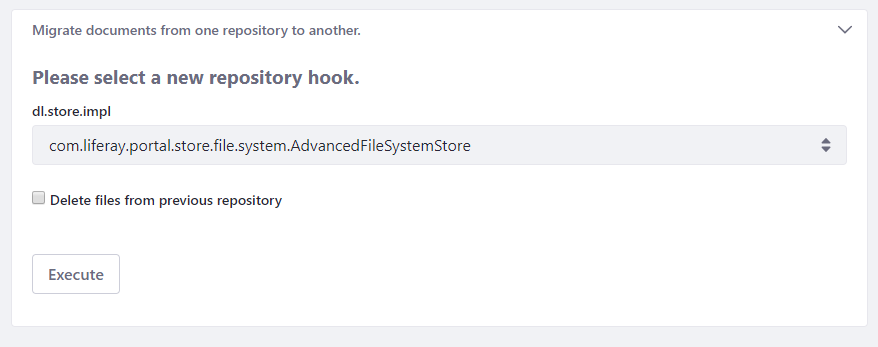

# File Store Migration

Files can be migrated from one file store type to another. Here are some migration scenarios:

* Migrating from Simple File System Store to Advanced File System Store for improved performance and scalability.
* Migrating from Simple, Advanced, or S3 to DBStore to avoid transaction rollback vulnerabilities.
* Migrating from DBStore to Advanced File System Store to accommodate files larger than 1 gigabyte.

The Data Migration utility in [Server Administration](./../using-the-server-administration-panel/introduction-to-the-server-administration-panel.md) facilitates the migration.

```warning::
   **Always** `back up <../../installation-and-upgrades/maintaining-a-liferay-dxp-installation/backing-up.md>`_ your file store and database before migrating. Testing the migration process on backup copies is advised.
```

## Migrating Files

Here are the migration steps:

1. Configure the new file store in *System Settings* &rarr; *File Storage*.
1. In *Server Administration* &rarr; *Data Migration*, select the repository hook (store implementation class) and click *Execute*.

    

1. Make sure the data migrated correctly.

1. Configure [`portal-ext.properties`](../../installation-and-upgrades/reference/portal-properties.md) to the target file store type, using one of these settings:

    ```properties
    dl.store.impl=com.liferay.portal.store.db.DBStore
    dl.store.impl=com.liferay.portal.store.file.system.AdvancedFileSystemStore
    dl.store.impl=com.liferay.portal.store.file.system.FileSystemStore
    dl.store.impl=com.liferay.portal.store.s3.S3Store
    ```

1. Restart DXP.

Your DXP instance is using the migrated files on the newly configured file store.

```warning::
   Make sure to save your new store configuration in System Settings. Otherwise, you can't use the new store and following exception occurs: `java.lang.IllegalStateException: Store is not available`
```

## Additional Information

* [Configuring File Storage](./configuring-file-storage.md)
* [Amazon S3 Store](./other-file-store-types/amazon-s3-store.md)
* [DBStore](./other-file-store-types/dbstore.md)
