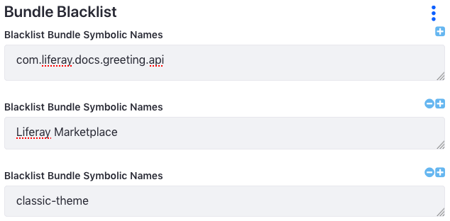

# Blacklisting Apps

The bundle blacklist is a convenient way to uninstall or reinstall multiple apps, OSGi bundles (modules), and WAR plugins at once. It saves you the trouble of managing app, module, and plugin installations individually with the [Application Manager](./managing-apps.md) or [Gogo shell](https://help.liferay.com/hc/en-us/articles/360029070351-Using-the-Felix-Gogo-Shell).

```important::
   The blacklist is an `OSGi configuration <https://help.liferay.com/hc/en-us/articles/360029131591-System-Settings#exporting-and-importing-configurations>`_ that DXP uses to uninstall apps. Using it will prevent any apps listed from being installed until they are removed.
```

You can set the list [in the Control Panel](#blacklisting-via-the-control-panel) or by [using an OSGi configuration](#blacklisting-via-a-configuration-file) (`.config`) file (by exporting it from the Control Panel).

## Blacklisting

DXP removes any installed app, module, or plugin on the blacklist. While they're blacklisted they can't be installed. The log reports each uninstallation.

```note::
   Blacklisting an LPKG uninstalls all of its internal modules.
```

### Blacklisting via the Control Panel

Follow these steps to blacklist an app, module, and plugin:

1. In the Control Panel, navigate to *Configuration* &rarr; *System Settings* &rarr; *Module Container*. The Bundle Blacklist screen appears.

1. In the Bundle Blacklist screen, add the bundle symbolic names (see [the table below](#blacklist-bundle-symbolic-names)) for the [module](https://help.liferay.com/hc/en-us/articles/360035467532-OSGi-and-Modularity#modules) JARs, LPKG files, or WARs to uninstall. Click the *Save* button when you're finished. DXP uninstalls the blacklisted modules immediately.

    

### Blacklisting via a Configuration File

The blacklist can also be exported from the Control Panel to an OSGi configuration (`.config`) file. Modifying the file and deploying it to DXP has these additional effects:

* Persists the changes across DXP server startups
* Propagates the changes from a local cluster node to all the other nodes.

Use these steps to blacklist using a configuration file:

1. To export the blacklist currently in use, click its Actions button () and then click *Export*. The blacklist config file then downloads (`com.liferay.portal.bundle.blacklist.internal.BundleBlacklistConfiguration.config`). Here are file contents from exporting the example blacklist:

    ```properties
    blacklistBundleSymbolicNames=["com.liferay.docs.greeting.api","Liferay\ Marketplace","classic-theme"]
    ```

1. Add the bundle symbolic names of any apps, modules, or plugins not already listed that you want to uninstall and prevent from installing in subsequent DXP server startups.

    ```warning::
       Configuration values can't contain extra spaces. Extra spaces can short-circuit lists or invalidate the configuration entry.
    ```

1. To deploy the configuration file, copy it into the folder `[Liferay Home]/osgi/configs`. The [Liferay Home](../../reference/liferay-home.md) folder is typically the app server's parent folder.

### Blacklist Bundle Symbolic Names

| Type       | Bundle Symbolic Name |
| ---------- | --------------|
| LPKG       | LPKG file name without the `.lpkg` extension |
| Bundle/Module JAR | `Bundle-SymbolicName` in `bnd.bnd` or `MANIFEST.MF` file |
| WAR        | Servlet context name in `liferay-plugin-package.properties` file or the WAR file name (minus `.war`), if there is no servlet context name property |

## Reinstalling Blacklisted Items

To reinstall blacklisted items, follow these steps:

1. Open the configuration file `com.liferay.portal.bundle.blacklist.internal.BundleBlacklistConfiguration.config`.

1. Remove the symbolic names of the LPKGs, module JARs, or WARs from the `blacklistBundleSymbolicNames` list and save the file.

To reinstall *all* the blacklisted items execute one of these options:

* Remove the configuration file.
* Uninstall the module `com.liferay.portal.bundle.blacklist` using the [Application Manager](./managing-apps.md) or [Felix Gogo Shell](https://help.liferay.com/hc/en-us/articles/360029070351-Using-the-Felix-Gogo-Shell).

```tip::
   To temporarily reinstall an item that's been blacklisted, you can remove its symbolic name from the Bundle Blacklist module in *System Settings* and click the *Update* button. If you're using a blacklist config file (in the `[Liferay Home]/osgi/configs` folder) and want the item to install on subsequent server startup, make sure to remove the item's symbolic name from the file.
```

The log reports each item installation.

Congratulations! Now you can manage multiple app, module, and plugin installations using a simple list.

## Additional Information

* [Managing Apps](./managing-apps.md)

* [Using the Felix Gogo shell](https://help.liferay.com/hc/en-us/articles/360029070351-Using-the-Felix-Gogo-Shell)

* [Blacklisting OSGi Components](./blacklisting-osgi-components.md)

* [Configuring Portlets, Themes, and Layout Templates](./configuring-portlets-themes-and-layout-templates.md)
