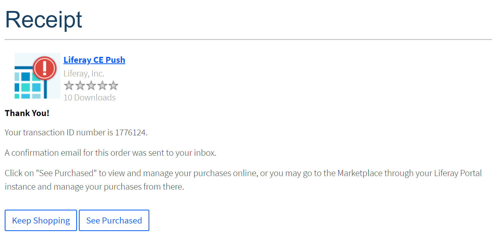
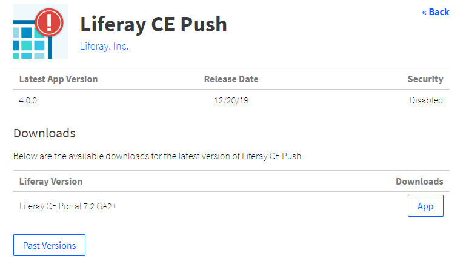

# Downloading Apps

When you purchase an app via the [Liferay Marketplace website](https://web.liferay.com/marketplace), you can download the app via its receipt or your Liferay.com account. Each Marketplace app is distributed as an LPKG package (`.lpkg` file). The LPKG contains Marketplace metadata and the files the app needs to run.

The quickest, most convenient way to download an app is via its receipt.

## Downloading via the Receipt

An app's receipt displays immediately on purchasing the app.



Here's how to download the app from its receipt:

1. In the receipt, click *See Purchased*. The *Purchased App* page for that app appears.

1. Click *App* to download the app.

The LPKG file downloads to your machine.

```note::
   The receipt Liferay emails you also links to the Purchased App page.
```

If you don't happen to download the app via the receipt, there's no need to worry. Your purchased apps are available to download via the Purchased Apps page on the Marketplace website and your Liferay.com account home.

## Downloading via the Purchased Apps Page

The *Purchased Apps* page lists your purchased apps by project. You can drill down to specific apps and download them.

Here are the steps for downloading an app in the Purchased Apps UI:

1. Navigate to the Purchased Apps page via the Marketplace website or Liferay.com.

    **Marketplace website:** Go to [https://web.liferay.com/marketplace](https://web.liferay.com/marketplace) and sign in. Click on your profile picture in the top right corner and select *Purchased Apps*.

    **Liferay.com:** Go to [liferay.com](https://www.liferay.com) and sign in. Click on your profile picture in the top right corner, select *Account Home* from the menu, and select *Apps* in the navigation panel on the left.

    

1. Select a project to view its registered apps.

    A *Liferay project* is a space where teammates share apps they have purchased or developed. If you have the necessary permissions, you can create new projects for your company.

1. Click the icon of the app you're downloading. A listing for the purchased app version appears.

    

1. If you're interested in an earlier version of the app, click *Past Versions*. (Optional)

1. When you've found the app version you want, click *App* to download it.

The app downloads as an LPKG file. You can [install the app](./app-installation-strategies.md) via this file.

## Next Steps

* [App Installation Strategies](./app-installation-strategies.md)
