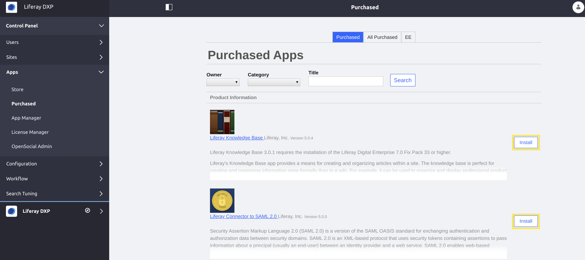

# Installing Apps

After downloading an app as an LPKG file from the [Marketplace website](https://web.liferay.com/marketplace),  the next step is to install it to a local DXP instance.

You can use either of the following methods to install a new app to your instance:

- [Install via the File System](#installing-apps-via-the-file-system)
- [Installing Apps via the UI](#installing-apps-via-the-ui)

```important::
   Installing an app to your instance requires a server restart. Test new apps in a sandbox environment, and then if necessary, plan the installation in advance for other servers.
```

## Installing Apps via the File System

Follow these steps to install an app via the file system with a server restart:

1. [Stop your DXP server](../../installation-and-upgrades/installing-liferay/running-liferay-dxp-for-the-first-time.md#shutdown).

1. Copy your app file (LPKG, module JAR, or plugin WAR) to your `[Liferay Home]/deploy` folder. The [Liferay Home](../../installation-and-upgrades/reference/liferay-home.md) folder is typically the app server's parent folder. DXP deploys apps from the `[Liferay Home]/deploy` folder.

1. [Start your DXP server](../../installation-and-upgrades/installing-liferay/running-liferay-dxp-for-the-first-time.md#startup).

The app file is copied from the `[Liferay Home]/deploy` folder to one an appropriate subfolder under `[Liferay Home]/osgi`:

- `marketplace`: Marketplace LPKG packages
- `modules`: OSGi module JAR files
- `war`: WAR files

DXP listens on those subfolders, processes the file (converting it to an OSGi bundle if it is a WAR or contains a WAR), and installs the OSGi bundle(s) to the OSGi container.

```note::
   Using a source control repository (such as Git or BitBucket) and an orchestration tool (such as `Jenkins <https://jenkins.io>`_) is recommended for promoting DXP environments through `DevOps <https://en.wikipedia.org/wiki/DevOps>`_ pipelines.

   You should commit your app file to the deploy folder within your DevOps pipeline for production-grade environments.
```

## Installing Apps via the UI

You can use DXP's app management UIs to install apps to a local server. Behind the scenes, DXP copies the app file to the appropriate subfolder in `[Liferay Home]/osgi`, converts it to an OSGi bundle (LPKGs and WARs need converting), and deploys the bundle to the OSGi container.

The sections below describe the interfaces you can  use to install apps via the UI.

### Marketplace via the Control Panel

The DXP Control Panel accesses the Marketplace. You browse the Marketplace the same way you would from the Marketplace website. Purchasing an app in the Control Panel downloads the app and installs it to the DXP instance automatically. See [Purchasing Apps on Liferay Marpletace](./purchasing-apps-on-liferay-marketplace.md) for more information.

``` note::
   If you are using the Marketplace screen to install your apps, the easiest way to uninstall them is through the Purchased Apps screen in the Control Panel.
```

### Purchased Apps Screen

The Purchased page in the Control Panel at *Apps* &rarr; *Purchased* lists apps that you've previously purchased. Apps that aren't installed have an *Install* button for installing the app on the DXP instance.



### Application Manager

In DXP's App Manager, you can upload and install Marketplace apps. See [Using the App Manager](./using-the-app-manager.md) for more information.
