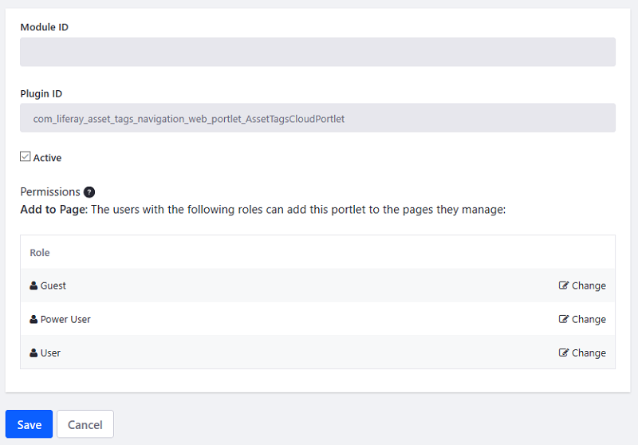

# Configuring Portlets, Themes,  and Layout Templates

The Components listing is the easiest way to configure [portlets](https://help.liferay.com/hc/en-us/articles/360029046351-Introduction-to-Portlets), [themes](https://help.liferay.com/hc/en-us/articles/360035581011-UI-Architecture#themes), and [layout templates](https://help.liferay.com/hc/en-us/articles/360028726612-Layout-Templates). In the Components UI, you can enable/disable them and configure permissions on them.

1. Access the Components UI in the Control Panel, by navigating to *Configuration* &rarr; *Components*. A table of installed portlets appears.

    

1. Select the tab of the component type to view: *Portlets*, *Themes*, or *Layout Templates*.

1. To configure a component, click its name or select *Edit* from its Actions button (). The component's configuration screen appears and displays the component's module ID and plugin ID, a checkbox for activating/deactivating the component, and user roles that can be configured for the component.

    

1. Activate or deactivate the component by checking or unchecking the *Active* checkbox, respectively.

1. To change a role's permission for the component (e.g., a role's *Add to Page* permission for a portlet), select the role's *Change* button in the permissions table. This takes you to the Control Panel's &rarr; *Users* &rarr; *Roles* screen, where you can change the role's permissions for the component.

Congratulations! You can use the Components listing to examine and manage installed portlets, themes, and layout templates.

## Additional Items

* [Maintaining Clustered Installations](../../installation-and-upgrades/maintaining-a-liferay-dxp-installation/maintaining-clustered-installations/maintaining-clustered-installations.md)
* [Blacklisting Apps](./blacklisting-apps.md)
