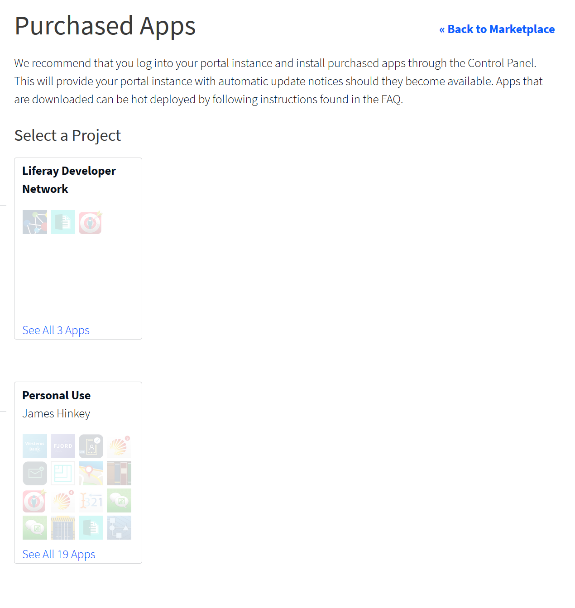

# Renewing Apps

To continue using a purchased app whose license has expired, you must renew your app subscription.

Here are the steps:

1. Go to [https://web.liferay.com/marketplace](https://web.liferay.com/marketplace). 

1. Click your profile picture in the upper right corner and select *Purchased Apps*. The Purchased Apps page appears and shows icons of your purchased apps organized by project.

    

1. Click your app's icon. The app's details appear.

1. Click *Manage Licenses*.

1. Select *Register New Server*.

1. Select the most recent *Order ID* (typically the order that has no registered servers).

1. Fill in your server details.

1. Click *Register*.

1. Click *Download*. The new app activation key for your server downloads.

1. Copy the activation key file to your `deploy/` folder in your [`[Liferay Home]`](../../reference/liferay-home.md).

Continue using the application on your server.
