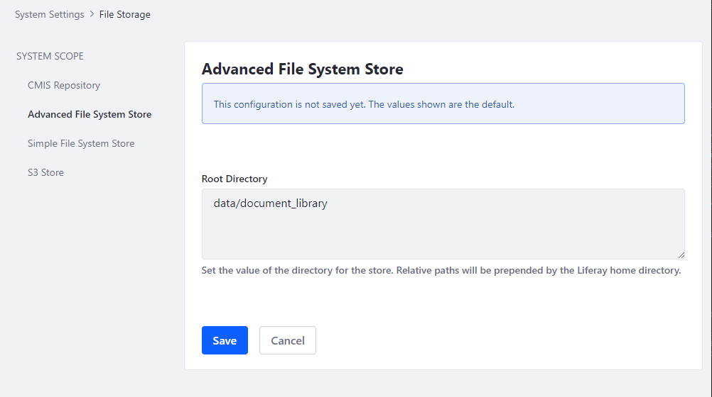

# File Storage

Widgets that store files (for example, [Documents and Media](../../../content-authoring-and-management/documents_and_media.html)) and that support file attachments (for example, [Knowledge Base](../../../collaboration-and-social/collaboration-and-social-overview.md)), use DXP's file store (a.k.a., Document Library). The files are saved to and retrieved from the file store. It can be hosted on the local machine, on a network mounted file system, in a database, or in the cloud. DXP has four file store types.

* [Simple File System Store](./simple-file-system-store.md) uses the file system (local or a mounted share) to store files. This is the *default* file store.

* [Advanced File System Store](./advanced-file-system-store.md) is similar to Simple File System Store but improves performance and scalability by nesting files into folders by version.

* [S3 Store (Amazon Simple Storage Service)](./using-amazon-s3-store.md) uses Amazon's cloud-based storage solution.

* [DBStore (Database Storage)](./dbstore.md) stores files to the DXP database as blobs. DBStore's file size limit is 1 gigabyte. To store files larger than 1 gigabyte, use the Simple File System Store or the Advanced File System Store.

```warning::
   There is a transaction rollback limitation when using a file system based store (Simple, Advanced, S3). If a database transaction rollback occurs in a Document Library, the transaction's file system changes are not reversed. Inconsistencies between Document Library files and those in the file system store can occur and may require manual synchronization. All stores except `DBStore <./dbstore.md>`_ are vulnerable to this limitation.
```

## Setting the Store Type

The store type is set via the [`dl.store.impl`](https://docs.liferay.com/ce/portal/7.3-latest/propertiesdoc/portal.properties.html#Document%20Library%20Service) property in a [`portal-ext.properties`](../../../installation-and-upgrades/reference/portal-properties.md) file, using one of these settings:

```properties
dl.store.impl=com.liferay.portal.store.db.DBStore
dl.store.impl=com.liferay.portal.store.file.system.AdvancedFileSystemStore
dl.store.impl=com.liferay.portal.store.file.system.FileSystemStore
dl.store.impl=com.liferay.portal.store.s3.S3Store
```

Switching to a new store type (Simple File System Store is the default) requires restarting DXP.

File store details are configured in the Control Panel at _Configuration_ &rarr; _System Settings_ &rarr; _File Storage_.



## File Storage in a Clustered Environment

All of the file stores can be used in a clustered environment. A Simple File System Store or Advanced File System Store must use a network mounted file system that all the nodes can access, and that supports concurrent requests and supports file locking. If either of these two store types is used without such a file system and multiple users attempt writing to the same file concurrently, data corruption can occur.

## Migrating Files Across File Stores

The Data Migration utility moves files from one store option to another. For example, it can be used to migrate files from a Simple File System Store (the default store) to an Advanced File System Store to leverage performance and scalability benefits. See [File Store Migration](./file-store-migration.md) for more information.