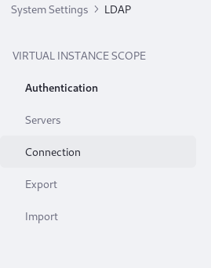
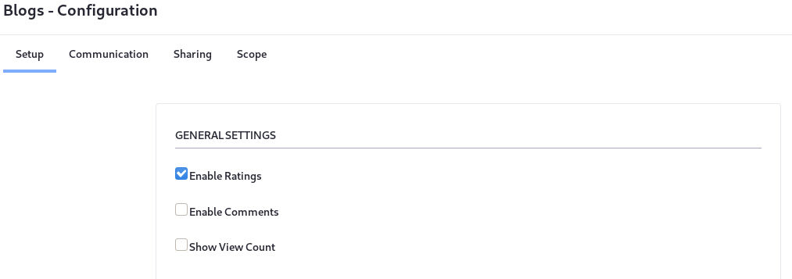

# System Settings and Configuration Scope

While browsing the categories of System Settings, you'll notice that clicking into a topic (for example, the Blogs category in the Content and Data category) reveals entries at different scopes. All the settings here act at the system scope. For scopes labeled other than System, these configurations act as defaults. In other words, they identify where the system-wide configuration is overridden. True system-scoped configurations (those under a category's _System Scope_ heading) are not overridden anywhere. There are four values that you'll see under Scope:


**System Scope:** Any System Settings configuration made for system scoped entries becomes the final value for the application in a system-wide fashion. It affects the whole system and isn't overridden anywhere else. 


**Virtual Instance Scope:** Configuration at the Virtual Instance level is overridden in Instance Settings.



**Site Scope:** Configuration at this scope is overridden in each site. 


**Widget Scope:** Configuration at this scope is overridden in each Widget Instance.


If a configuration changed in System Settings is also configurable at a different scope, the System Settings value acts as a default that can be overridden. Once a configuration change is made at a more granular scope, making a change at the system level doesn't do anything. 

For example, allowing comments is configurable for each Blogs Entry. Set the default behavior at Control Panel &rarr; Configuration &rarr; System Settings &rarr; Blogs (in the Content and Data category). In the Blogs Entry under Widget Scope, disable the *Enable Comments* checkbox. 

Now add a Blog Entry to a Site's Content & Data &rarr; Blogs application. Then go to a public page and add the Blogs Widget to the page. Click the Options button () for the widget and select *Configuration*. You'll see the same Enable Comments checkbox, and its default is now false (unchecked). Checking the box in the Widget Configuration screen breaks its link with the System Settings entry. Changing the System Settings configuration has no effect on this widget anymore.



```note::
   Instance Settings is similar to System Settings, but configures applications and services at the Virtual Instance scope. Like System Settings, the configuration entries in Instance Settings have a *Reset to Default Values* option. In Instance Settings, this removes the custom configuration you provided and makes the current value (whether default or custom) from the system scope act as the default at the virtual instance scope.
```
