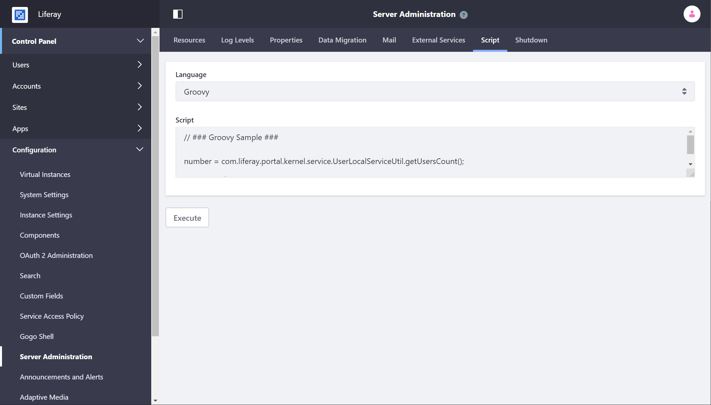

# Using the Script Engine

DXP provides a robust script engine for executing [Groovy](http://groovy-lang.org/) scripts to maintain your Liferay DXP instance. You can execute scripts to perform maintenance tasks involving data cleanup, user maintenance operations, bulk Liferay API invocations, or even system level operations.

## Navigating to the Script Engine

The Script Console is available in the Control Panel. To use the Script Engine, follow these steps:

1. Log in as an Admin user
1. Open the [Product Menu](../../getting-started/navigating-dxp.md) and navigate to the Control Panel and select *Configuration* &rarr; *Server Administration* &rarr; *Script*.

    

## Next Steps

* [Invoking Liferay Services](./invoking-liferay-services-from-scripts.md)
* [Running Scripts from the Script Console](./running-scripts-from-the-script-console.md)
* [Using the Script Engine with Workflow](../../process-automation/workflow/developer-guide/using-the-script-engine-in-workflow.md)
* [Script Examples](./script-examples.md)
