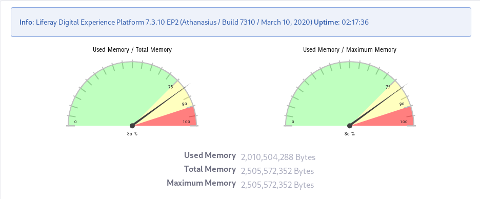

# Using the Server Administration Panel

Server Administration lets you manage and monitor Liferay DXP at the system-scoped level. In Server Administration, you're managing and monitoring very low-level details for Liferay DXP: memory usage, low-level properties, some third-party integrations, document repository migration, logging, scripting, and  mail server configuration.

Access Server Administration by clicking *Control Panel* &rarr; *Configuration* &rarr; *Server Administration*. 

Server Administration's functionality is segmented into tabs: 

| Server Admin Tab   | Description                     | Documentation Link       |
| ------------------ | ------------------------------- | ------------------------ |
| Resources          | Monitor the system and perform management tasks (run the garbage collector, clear the database cache, etc.) | [Managing System Resources in Server Administration](./managing-system-resources-in-server-administration.md) |
| Log Levels         | View and set logging levels. Modify log levels for Liferay DXP classes and packages. Add custom objects to the logging configuration. | [Configuring Logging in Server Administration](./configuringing-logging-in-server-administration.md) |
| Properties         | View System and Portal properties. System Properties shows the system properties for the JVM and Liferay DXP, and is used for debugging or checking the running configuration. Portal Properties shows the current portal property values. See the [portal properties reference documentation](https://docs.liferay.com/portal/7.3-latest/propertiesdoc/portal.properties.html) for more details. | [Portal Properties](./../installation-and-upgrades/reference/portal-properties.md) |
| Data Migration     | Migrate documents from one repository to another. For example, you can migrate your documents to a new repository on a different disk or in a new format. |  [Document Repository Overview](./../installation-and-upgrades/setting-up-liferay-dxp/configuring-the-document-library-repository/document-repository-overview.md) |
| Mail               | Instead of a [Portal Properties file](../installation-and-upgrades/setting-up-liferay-dxp/configuring-mail/alternative-email-configuration-methods.md#configuring-the-built-in-mail-session-using-portal-properties) configure a mail server from this tab. These settings override any mail server settings in your `portal-ext.properties` file. | [Connecting to a Mail Server](../installation-and-upgrades/setting-up-liferay-dxp/configuring-mail/connecting-to-a-mail-server.md) |
| External Services  | Configure external services for generating file previews for images, audio files, and video files. | [Configuring External Services in Server Administration](./configuring-external-services-in-server-administration.md) |
| Script             | Write Groovy scripts in a scripting console for executing migration or management code. | [Using the Script Engine](./using-the-script-engine/using-the-script-engine.md) |
| Shutdown           | Schedule a shutdown (in _x_ minutes from now) that warns logged-in users of the impending shutdown. | [Configuring a Shutdown Event in Server Administration](./configuring-a-shutdown-event-in-server-administration.md) |

<!--
In addition to a system-defined message, Liferay DXP displays the message you define at the top of users' pages once you save the configuration until the expiration happens. When time expires, all pages display a message saying the portal has been shut down. The server must then be restarted to restore access. 

The Shutdown configuration looks like this:

Logged in Users see this:

-->
<!-- 
| Log Levels | View and set logging levels. Modify log levels for Liferay DXP classes and packages. Add custom objects. Changes to the log level near the top of the class hierarchy (such as at `com.liferay`) also change log levels for all the classes under that hierarchy.  Modifications unnecessarily high in the hierarchy generate too many messages to be useful. 

| Properties         | View System and Portal properties. System Properties shows the system properties for the JVMand Liferay DXP. You can use this information for debugging purposes or to check the currently running configuration. The Portal Properties tab shows an exhaustive list of the current portal property values. For explanations of these properties, see the [portal properties reference documentation](@platform-ref@/7.2-latest/propertiesdoc/portal.properties.html). 

| Data Migration     | Migrate documents from one repository to another. For example, you can migrate your documents to a new repository on a different disk or in a [new format](/docs/7-2/deploy/-/knowledge_base/d/document-repository-configuration). Here are the steps:

1. Create a backup copy of the Document Library repository and
   [@product@ database](/docs/7-2/deploy/-/knowledge_base/d/backing-up-a-liferay-installation). 
2. Configure the new file store in *System Settings* &rarr; *Platform: File 
   Storage*. 
3. In this tab (*Server Administration* &rarr; *Data Migration*), select the 
   repository hook for the file store you configured and click *Execute*. 
4. Make sure the data migrated correctly. 
5. [Configure the new
   repository](/docs/7-2/deploy/-/knowledge_base/d/document-repository-configuration)
   as the default. 
6. If you used a `portal-ext.properties` file to configure the repository, 
    restart the server. 

| Mail | Instead of using a `portal-ext.properties` file to configure a mail server, you can configure a mail server from this tab. If your [message boards receive mail](/docs/7-2/user/-/knowledge_base/u/user-subscriptions-and-mailing-lists), you can connect a POP mail server. If @product@ sends mail (useful for sending notifications to users), you can connect to an SMTP server. Note that if you configure mail server settings here in System Settings, these settings override any mail server settings in your `portal-ext.properties` file. 

| External Services  | Configure external services for generating file previews. For more information, see [the article on External Services](/docs/7-2/user/-/knowledge_base/u/server-administration-external-services).

| Shutdown           | Schedule a shutdown that notifies logged-in users of the impending shutdown. You can define the number of minutes until the shutdown and a message to display. @product@ displays the message at the top of users' pages for the duration of time you specified. When the time expires, all pages display a message saying the portal has been shut down. The server must then be restarted to restore access. 
-->
