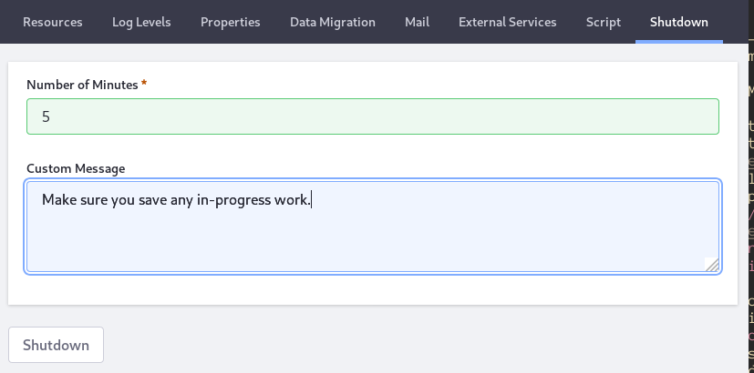

# Using the Server Administration Panel

Server Administration is a system-scoped administration panel holding a variety of low-level Liferay DXP configurations. In Server Administration you can manage and monitor system memory usage, low-level properties, some third-party integrations, document repository migration, logging, scripting, mail server configuration, and portal shutdown.

You can access Server Administration by clicking *Control Panel* &rarr; *Configuration* &rarr; *Server Administration*.

Server Administration's functionality is segmented into tabs:

| Server Admin Tab   | Description                     | Documentation Link       |
| ------------------ | ------------------------------- | ------------------------ |
| Resources          | Monitor the system and perform management tasks (run the garbage collector, clear the database cache, etc.) | [Managing System Resources](./managing-system-resources.md) |
| Log Levels         | View and set logging levels. Modify log levels for Liferay DXP classes and packages. Add custom objects to the logging configuration. | [Configuring Logging](./configuring-logging.md) |
| Properties         | View System and Portal properties. System Properties shows the system properties for the JVM and Liferay DXP and is used when debugging or checking the running configuration. Portal Properties shows the current portal property values. See the [portal properties reference documentation](https://docs.liferay.com/portal/7.3-latest/propertiesdoc/portal.properties.html) for more details. | [Portal Properties](./../../installation-and-upgrades/reference/portal-properties.md) |
| Data Migration     | Migrate documents from one repository to another. For example, you can migrate your documents to a new repository on a different disk or to a new format. |  [File Storage Migration](./../file-storage/file-store-migration.md) |
| Mail               | Instead of a [Portal Properties file](../../installation-and-upgrades/setting-up-liferay-dxp/configuring-mail/alternative-email-configuration-methods.md#configuring-the-built-in-mail-session-using-portal-properties), you can configure a mail server from this tab. These settings override mail server settings in your `portal-ext.properties` file. | [Connecting to a Mail Server](../../installation-and-upgrades/setting-up-liferay-dxp/configuring-mail/connecting-to-a-mail-server.md) |
| External Services  | Configure external services for generating file previews for images, audio files, and video files. | [Configuring External Services](./configuring-external-services.md) |
| Script             | Write Groovy scripts in a scripting console for executing migration or management code. | [Using the Script Engine](./../using-the-script-engine/using-the-script-engine.md) |
| Shutdown           | Schedule a shutdown (in _x_ minutes from now) that warns logged-in users of the impending shutdown. | [Configuring a Shutdown Event](./configuring-a-shutdown-event.md) |
