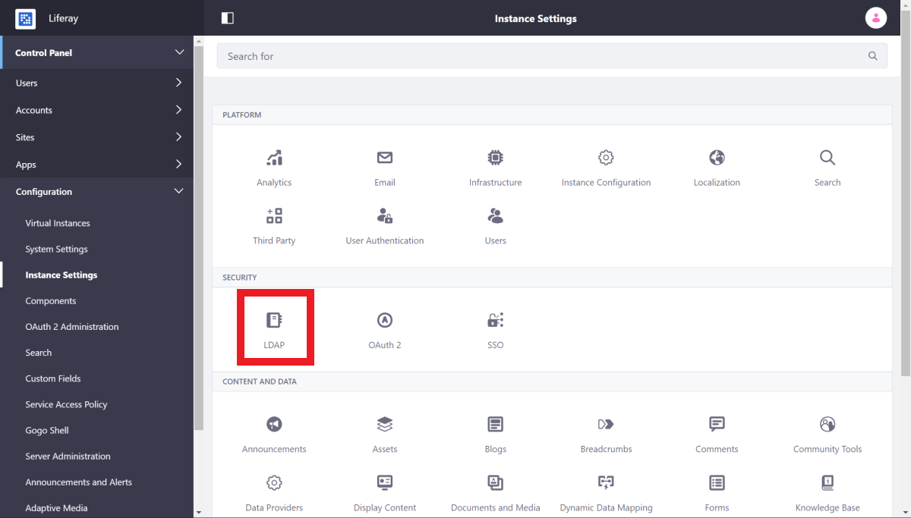

# Connecting to an LDAP Directory

Lightweight Directory Access Protocol (LDAP) servers are common user stores for Liferay DXP. You can configure LDAP at the system scope in System Settings or at the instance scope in Instance settings. Users can be imported from or exported to LDAP.

## Adding a New LDAP Server Connection

To access LDAP configuration settings at the Instance level,

1. Navigate to *Control Panel &rarr; Configuration* &rarr; *Instance Settings*

    

1. Click *LDAP* &rarr; and click *Servers*
1. Click the *Add* button to add an LDAP server connection.
1. Enter configuration values for your LDAP server. See the [configuration reference](#ldap-server-configuration-reference) for details.

You may, however, need to customize the rest of the configuration, as it represents "best guesses" as to correct defaults. The default attribute mappings usually provide enough data to synchronize back to the Liferay database when a user attempts to log in. To test the connection to your LDAP server, click the *Test LDAP Connection* button.

If you have more than one LDAP server, you can arrange the servers by order of preference using the up/down arrows. Regardless of how many LDAP servers you add, each server has the same configuration options.

### Using the System Settings Scope

Alternatively, you can define an LDAP server connection at the System Settings scope through the System Settings menu or with the usage of OSGi `.config` files.

```tip::
   The LDAP server configuration screen in *Instance Settings* has utilities to assist with configuring an LDAP connection. You can use this utility to validate your settings first, before entering them at the System Settings scope.
```

The easiest way to do use `.config` files is to use the GUI and export the configuration. Then you can use the resulting `.config` file anywhere you need it (such as other nodes in a cluster).

```note::
    To use `config` files for LDAP server configuration, you must specify the Virtual Instance ID (in the source, the variable name is `companyId`) in the exported configuration file, because servers are defined at the instance scope, not the system scope. To do this, specify the virtual instance ID somewhere in the file like this:
    ::
      companyId=1234

    You can find your Virtual Instance ID in *Control Panel* -> *Configuration* -> *Virtual Instances*.
```

## LDAP Server Configuration Reference

**Server Name:** Enter a name for your LDAP server.

**Default Values:** Several common directory servers appear here. If you use one of these, select it to populate the rest of the form with default values for that directory.

These settings cover the connection to LDAP.

**Base Provider URL:** The link to the LDAP server. Make sure the Liferay server can communicate with the LDAP server. If there is a firewall between the two systems, make sure the appropriate ports are opened.

**Base DN:** The Base Distinguished Name for your LDAP directory, usually modeled after your organization. It may look like this: `dc=companynamehere,dc=com`.

**Principal:** The default LDAP administrator user ID is populated here. If your administrator ID differs, use that credential instead. You need an administrative credential because Liferay uses this ID to synchronize user accounts to and from LDAP.

**Credentials:** Enter the password for the LDAP administrative user.

## Checkpoint

Before proceeding to fine tune Liferay's LDAP connections, ensure the following steps have been taken:

1. The LDAP connection is enabled. Depending on your needs, LDAP authentication may be required so that only users who have been bound may log in.

1. *Export/Import*: for users in a clustered environment, Enable Import/Export on Startup should be disabled so that there are no massive imports on every node upon start up.

1. When adding the LDAP server, the *Server Name*, *Default Values*, *Connection* values are correct. It is always a good idea to click the *Test LDAP Connection* before saving.

## Using SSL to Connect to an LDAP Server

If you run your LDAP directory in SSL mode to encrypt credential information on the network, you must perform extra steps to share the encryption key and certificate between the two systems.

For example, if your LDAP directory is Microsoft Active Directory on Windows Server 2003, you'd share the certificate like this:

1. Click *Start* &rarr; *Administrative Tools* &rarr; *Certificate Authority*.

1. Highlight the machine that is the certificate authority, right-click on it, and click *Properties*.

1. From the General menu, click *View Certificate*.

1. Select the Details view, and click *Copy To File*. Use the resulting wizard to save the certificate as a file.

1. Import the certificate into the *cacerts keystore* like this:

    ```bash
    keytool -import -trustcacerts -keystore /some/path/java-8-jdk/jre/lib/security/cacerts -storepass changeit -noprompt -alias MyRootCA -file /some/path/MyRootCA.cer
    ```

    The `keytool` utility ships as part of the Java SDK.

1. Go back to the LDAP page in the Control Panel.

1. Modify the LDAP URL in the Base DN field to the secure version by changing the protocol to `ldaps` and the port to `636` like this:

    ```
    ldaps://myLdapServerHostname:636
    ```

Save the changes. Communication to LDAP is now encrypted.

To tune or configure how Liferay DXP matches users in LDAP for syncing, please see [configuring import and export](./configuring-user-import-and-export.md).
