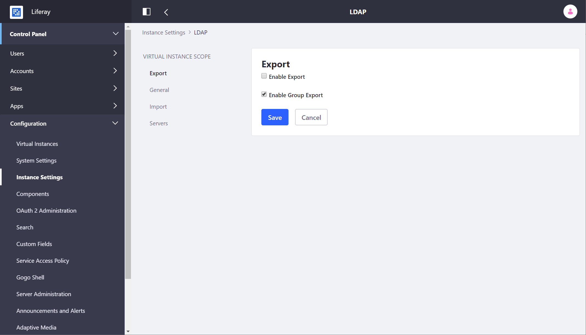
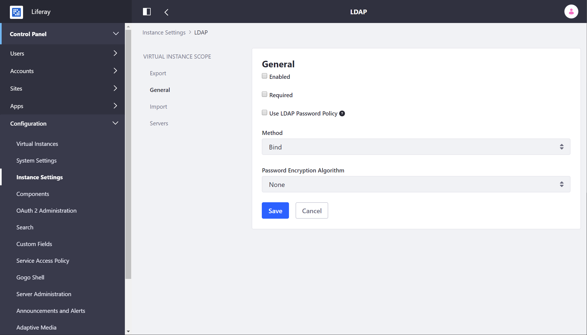
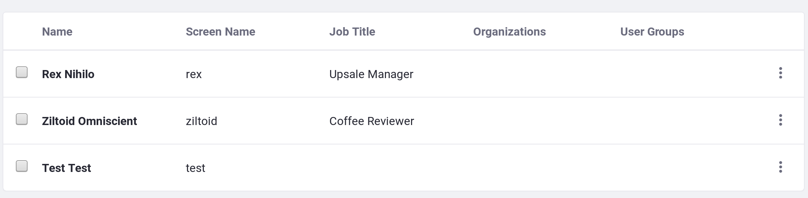
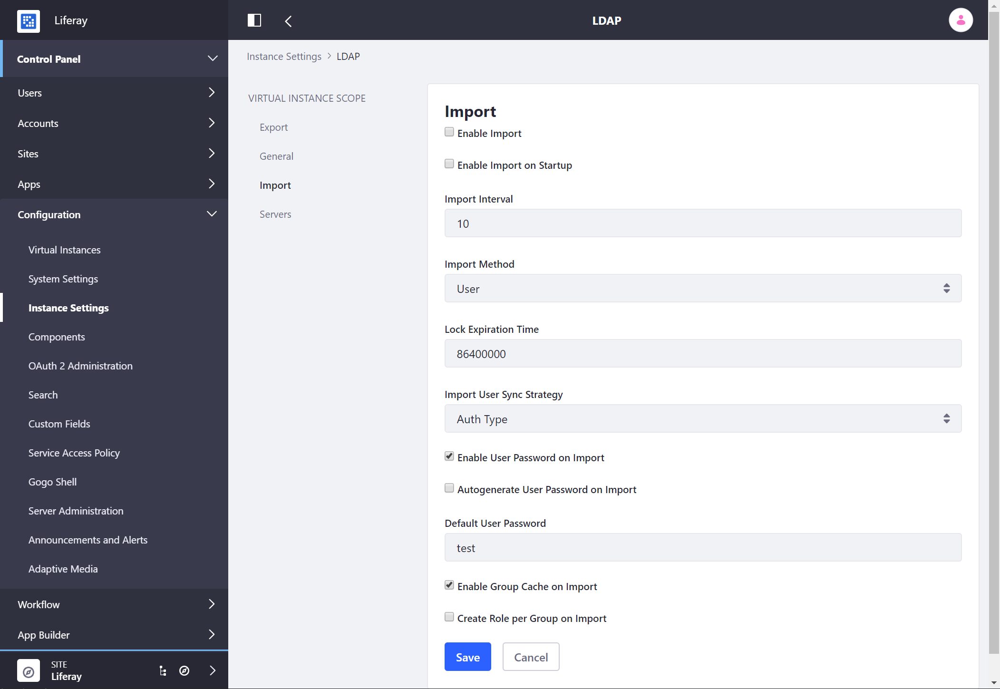
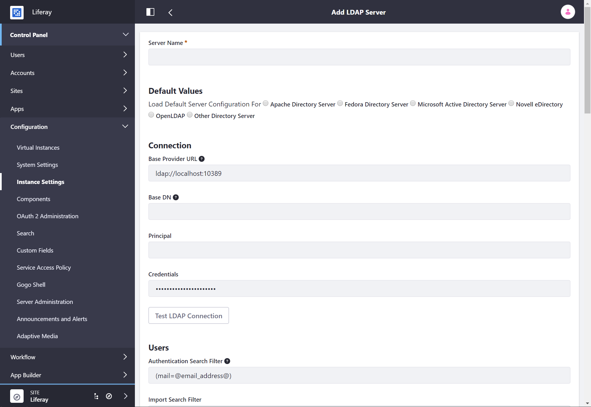

# LDAP Configuration Reference

To access LDAP configuration settings, navigate to *Control Panel &rarr; Configuration* &rarr; *Instance Settings* &rarr; *Security* &rarr; *LDAP*. There are four categories on the left: Export, General, Import, and Servers.

## Export

**Enable Export:** Check this box to export user accounts to LDAP. A listener tracks changes made to the `User` object and pushes updates to the LDAP server whenever a `User` object is modified. Note that by default on every login, fields such as `lastLoginDate` are updated. When export is enabled, this causes a user export every time the user logs in. You can prevent updates to users' `lastLoginDate` fields from triggering LDAP user exports by setting the following property in your `portal-ext.properties` file:

```properties
users.update.last.login=false
```

**Enable Group Export:** Export groups to LDAP.



## General

**Enabled:** Check this box to enable LDAP Authentication.

**Required:** Check this box if LDAP authentication is required. Users can't log in unless they can bind to the LDAP directory successfully. Uncheck this box if users with Liferay accounts but no LDAP accounts can log in.

**Use LDAP Password Policy:** Liferay uses its own password policy by default. This can be configured on the Control Panel's Password Policies page. Check the *Use LDAP Password Policy* box if you want to use the password policies defined by your LDAP directory. Once this is enabled, the Password Policies tab states that you are not using a local password policy. You must now use your LDAP directory's mechanism for setting password policies. Liferay cannot enforce these policies; the best it can do is pass through the messages returned by your LDAP server. It does this by parsing the messages in the LDAP controls the server returns. Liferay's default configuration parses messages returned by the Fedora Directory Server. If you use a different LDAP server, you must customize the messages in *System Settings* &rarr; *Security* &rarr; *LDAP* &rarr; *Connection*.

**Method:** Choose *Bind* (the default) or *Password Compare*. Bind does a standard LDAP bind; Password Compare attempts to compare Liferay and LDAP passwords using the encryption algorithm specified in the field below. Password Compare is rarely used.

**Password Encryption Algorithm:** Choose the password encryption algorithm your LDAP server uses to encrypt passwords so they can be compared if using the Password Compare bind method. This is rarely used.



## Import

You can import user data from LDAP directories using the following options:

**Enable Import:** Check this box to do a mass import from your LDAP directories. Otherwise, Users are imported as they log in.



**Enable Import on Startup:** Check this box to do the mass import when Liferay starts. Note: this box only appears if you check **Enable Import**, described above. Definitely leave this unchecked if you have a Liferay cluster, or all your nodes will do a mass import when each of them starts up.

**Import Interval:** When mass importing users, import users every X minutes.

**Import Method:** Set either User or Group. If you set this to User, Liferay imports all users from the location specified in the server connection. If you set this to Group, Liferay searches all the groups and imports the users in each group. If you have users who do not belong to any groups, they are not imported.

**Lock Expiration Time:** Set the account lock expiration time for LDAP User import. The default is one day.

**Import User Sync Strategy:** Set the strategy used to sync user accounts. Options are Auth Type (i.e., the way the user authenticates, like with screen name) and UUID (requires a UUID attribute in LDAP).

**Enable User Password on Import:** Assign a default password (see below) when users are imported, so they can be synced between the two systems.

**Autogenerate User Password on Import:** Create a random password on user import.

**Default User Password:** Enter the default password users are assigned when they first log in via LDAP.

**Enable Group Cache on Import:** Cache the imported groups so import isn't slowed by database access.

**Create Role per Group on Import:** For every LDAP group, create a corresponding Liferay Role.



## Servers

**LDAP Servers:** Liferay supports connections to multiple LDAP servers. Use the *Add* button to add LDAP servers.

**Server Name:** Enter a name for your LDAP server.

**Default Values:** Several common directory servers appear here. If you use one of these, select it to populate the rest of the form with default values for that directory.

These settings cover the connection to LDAP.

**Base Provider URL:** The link to the LDAP server. Make sure the Liferay server can communicate with the LDAP server. If there is a firewall between the two systems, make sure the appropriate ports are opened.

**Base DN:** The Base Distinguished Name for your LDAP directory, usually modeled after your organization. It may look like this: `dc=companynamehere,dc=com`.

**Principal:** The default LDAP administrator user ID is populated here. If your administrator ID differs, use that credential instead. You need an administrative credential because Liferay uses this ID to synchronize user accounts to and from LDAP.

**Credentials:** Enter the password for the LDAP administrative user.



Once you've finished configuring LDAP, click the *Save* button.

### LDAP Options Available in System Settings

Although most LDAP configuration can be done from Instance Settings, there are several parameters only available in System Settings. There are also settings duplicated from the ones in Instance Settings. These change the *default* settings for new virtual instances (see note below).

```note::
   When you make a change in System Settings, it affects the current virtual instance. If after changing a setting you create a new virtual instance, that virtual instance inherits the settings of the one it was created from as defaults. For example, say you have virtual instances named A, B, and C. From A, you modify *Error password history keywords*. This change appears only in A, not in B or C. Then from A, you create virtual instance D. The change to *Error password history keywords* appears in D (not B or C), since D defaults to A's settings because you created it from A.
```

If you must change any of these options, navigate to *Control Panel* &rarr; *Configuration* &rarr; *System Settings*. Go to the *Security* section and find the entries with LDAP in the title. The only new settings here are in the *Connection* entry.

Use the *Connection* entry to manage error properties like *Error password age keywords* where you can set a list of phrases from error messages which can possibly be returned by the LDAP server. When a user binds to LDAP, the server returns *controls* with its response of success or failure. These controls contain a message describing the error or the information that is returned with the response. Though the controls are the same across LDAP servers, the messages can be different. The properties described here contain snippets of words from those messages and work with Red Hat's Fedora Directory Server. If you are not using that server, the word snippets may not work with your LDAP server. If they don't, you can replace the values of these properties with phrases from your server's error messages. This enables Liferay to recognize them.
