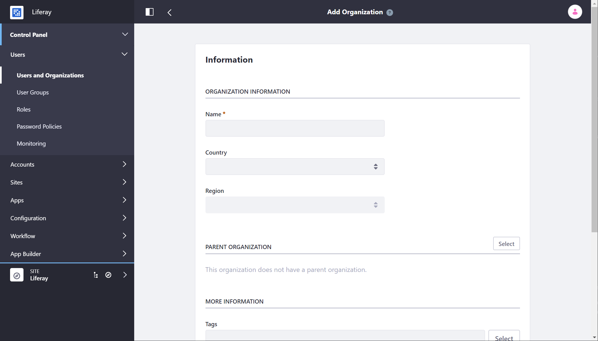

# Creating and Managing Organizations

If you're not sure what Organizations are or whether you need them, start [here](./understanding-organizations.md). This article gets right to the practical stuff: how to manage Organizations.

## Adding Organizations

1. Click *Users and Organizations* from Control Panel &rarr; Users.
1. Go to the *Organizations* tab and click the Add button (). Fill out the Name field at a minimum.

    

1. If you're creating a child Organization, use the Parent Organization *Select* button to select an Organization in the system to be the direct parent. Click the *Remove* button to remove the currently configured parent.
1. Click *Save* when finished filling out the Add Organization form.

Once you submit the form, you see a success message, and a new form appears where you can enter additional information about the Organization. Organizations can have associated multiple email addresses, postal addresses, web sites, and phone numbers. You can use the Services link to indicate the operating hours of the Organization, if any.

```tip::
   After creating an Organization, assign a user to the Organization Owner Role. The Organization Owner can do everything that an Organization Administrator can, within the context of the assigned organization. In addition, Organization Owners can do these things:

   - Appoint other Users to be Organization Administrators
   - Appoint other Users to be Organization Owners
   - Remove the memberships of other Organization Administrators or Owners
```

Organization Administrators can't make these Role assignments and can't manage the memberships of other Organization Administrators or Owners.

## Editing Organizations

1. Go to the Users and Organizations section of the Control Panel

1. Click the *Organizations* tab. All active Organizations are listed.

1. Click the *Actions* button next to an Organization. This shows a list of actions you can perform on this Organization:

**Edit:** Specify details about the Organization, including addresses, phone numbers, and email addresses. You can also create a Site for the Organization. 

**Manage Site:** Create and manage the public and private pages of the Organization's Site. This only appears after a Site has been created for the Organization. 

**Assign Organization Roles:** Assign Organization-scoped Roles to Users. By default, Organizations are created with three Roles: Organization Administrator, Organization User and Organization Owner. You can assign one or more of these Roles to Users in the Organization. All members of the Organization automatically get the Organization User Role so this Role is hidden when you click Assign Organization Roles. 

**Assign Users:** Search and select Users to be assigned to this Organization as members. 

**Add Organization:** Add a child Organization to this Organization. This is how you create hierarchies of Organizations with parent-child relationships. 

**Delete:** Removes this Organization. Make sure the Organization has no Users in it first. You'll be prompted for confirmation that you want to delete the Organization. If there are Users in the Organization or if there are sub-Organizations, you must remove the Users and delete the sub-Organizations before deleting the parent Organization. 

If you click the Organization name you can view both a list of Users who are members of this Organization and a list of all the sub-Organizations of this Organization.
