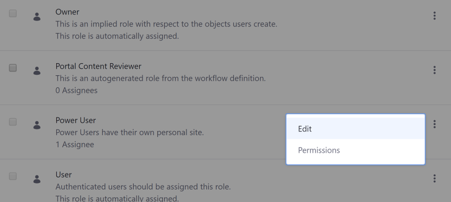
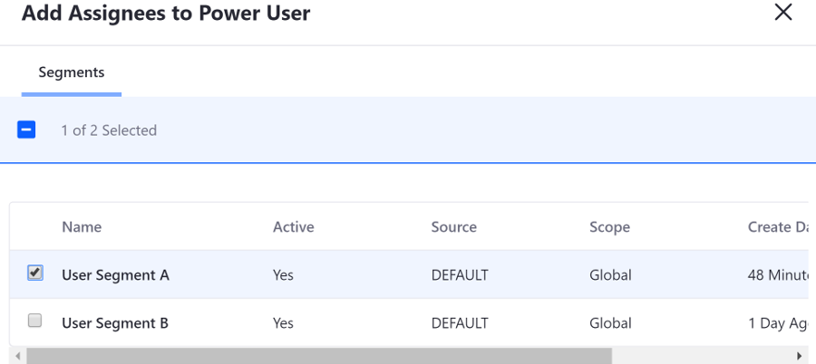
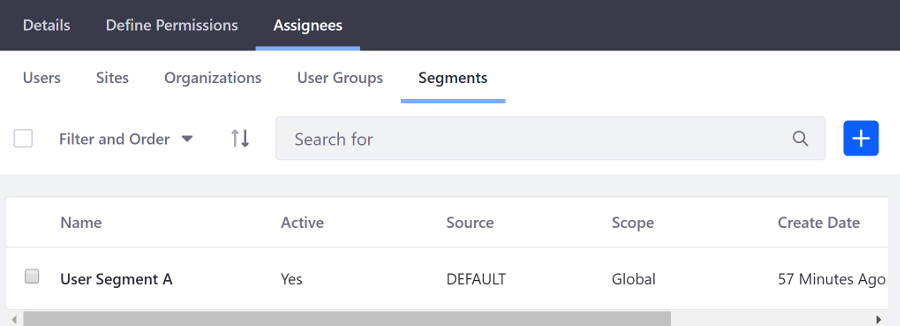
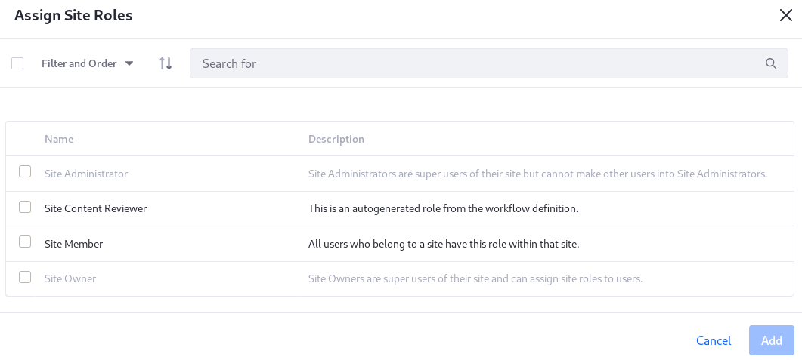

# Assigning Roles to User Segments

> Available: Liferay DXP 7.2 SP2+

User Segments are dynamically assigned User collections. If a [Segment can be well-defined with the available criteria](../../../site-building/personalizing-site-experience/segmentation/creating-and-managing-user-segments.md), the administrative overhead of User management can be greatly reduced. On top of this, [personalized experiences](../../../site-building/personalizing-site-experience/introduction-to-personalizing-site-experience.md) can be defined for User Segments, ensuring that the Users see the most relevant content in your Site.

## Assigning a Regular Role to a User Segment

To assign Regular Roles to a User Segment,

1. Open the Product Menu and go to *Control Panel* &rarr; *Users* &rarr; *Roles*.

1. Open the Actions Menu () next to the Role and select *Edit*.

    

1. Select the *Assignees* &rarr; *Segments* tab, and click the () to select a User Segment.

    

1. Check the box next to an existing User Segment and click *Add* to assign the Role to it. If the User Segment doesn't exist, you can click the () to create a new User Segment.

    

The selected User Segment(s) appear(s) in the list of assignees for the Role.

## Assigning a Site Role to a User Segment

[Site Roles](../understanding-roles-and-permissions.md) can be assigned to Segments, with two exceptions: Site Administrator and Site Owner. The other out of the box Site Roles and any you create can be assigned to Segments.

1. Open the Product Menu and go to *People* &rarr; *Segments* in the Site Menu.

1. Open the Segment's Actions menu () and click _Assign Site Roles_.

1. Assign Site Roles to the Segment, then click _Add_.

   

## Related Information

* [Creating User Segments](../../../../site-building/personalizing-site-experience/segmentation/creating-and-managing-user-segments.md)
