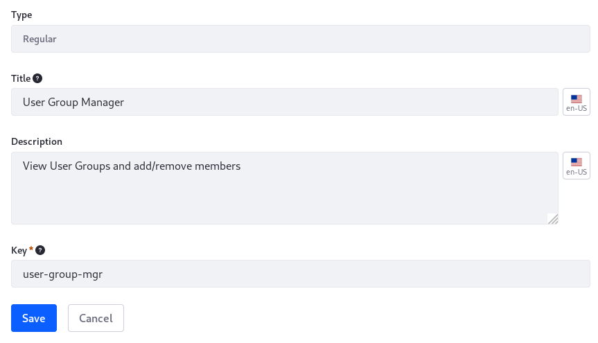
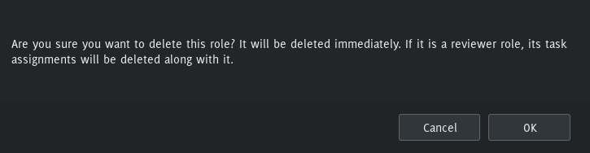
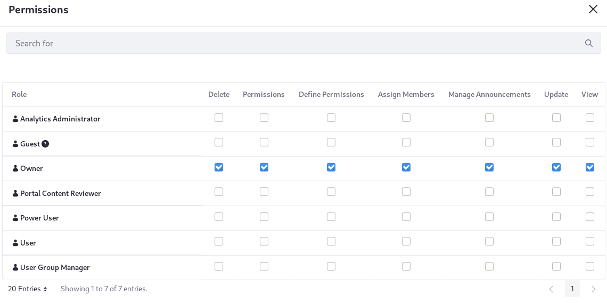

# Creating and Managing Roles

Once you [understand](./understanding-roles-and-permissions.md) Roles and permissions, its time to create the Roles you need to empower your Users to work within your Liferay DXP solution.

Role creation and management is conducted in Control Panel &rarr; Users &rarr; Roles.

## Creating Roles

First, [determine the scope](./understanding-roles-and-permissions.md) of the Role you must create. Roles can be scoped globally (Regular Roles), to a specific Site (Site Roles), or to an Organization (Organization Roles).

1. Click the tab for the proper Role scope, then click the *Add* () button. 

1. Enter a title and description. The title field is required but the description is optional. 

1. Enter a Key, if desired. It's a required field, but one is created automatically based on the Title if you don't specify it manually.

   The Key can be used to refer to the Role programmatically.

1. Click *Save*.



Now the Role is present in the database and ready for further configuration. Next, you can [assign Role Users](./assigning-users-to-roles.md) or [define Role permissions](./defining-role-permissions.md).

## Updating Roles

The Role's fields can be updated with one exception: the Scope field. You can't change a Role's scope; you must create a new Role at the desired scope and delete the existing one.

To update a Role, click into its Actions menu () and select _Edit_. The Role creation form is displayed again, ready to be edited and saved.

## Deleting Roles

To delete a Role, click into its Actions menu () and select _Delete_. After you confirm the deletion, the Role is deleted immediately, along with any [workflow task assignments](../../process-automation/workflow/user-guide/reviewing-assets.md) associated to the Role.



## Role Management Permissions

The _Permissions_ entry in a Role's Actions menu () is for defining who can manage the Role. This functionality is distinct from [Defining Role Permissions](./defining-role-permissions.md), which lists the permissions that the Role's assignees are granted.



By default, every Role, at every scope, can be managed by the _Owner_ Regular Role and the _Administrator_ Regular Role. The Administrator Role doesn't appear in the permissions matrix because its permissions cannot be modified. If you're using the default User in a testing installation, you have this permission at the global scope and can carry out all actions, as well as assign Users and define permissions for a Role.

```warning::
   Be careful about granting these permissions. This is administrative functionality that's best left to a few trusted Users.
```

## Deleting Asset Containers Deletes their Assets

A Web Content Folder contains Web Content articles. The Web Content Folder is an asset container, and the Web Content Article is an asset. It's possible to give a Role permission to delete an asset container without giving the Role permission to delete individual assets. In that case, beware: if a Role assignee deletes an asset container with individual assets in it, the individual assets themselves are deleted as well.

| Asset Container | Asset |
| --------------------------- | ------- |
| Web Content Folder          | Web Content Article |
| Knowledge Base Folder       | Knowledge Base Article |
| Message Boards Category     | Message Boards Thread |
| Wiki Node                   | Wiki Page |
| Documents and Media Folder  | Document |
| Form                        | Form Record |
| Dynamic Data List           | Dynamic Data List Records |
| App Builder Object          | App Builder App |

Besides Web Content Folders, examples of asset containers include Bookmarks Folders, Message Boards Categories, Wiki Nodes, and Documents and Media Folders.
