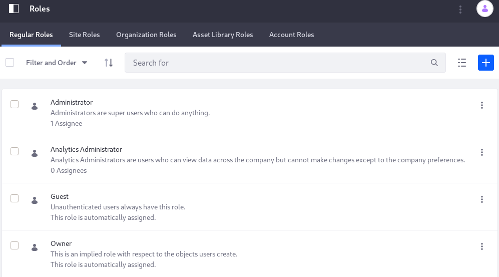

# Default Roles Reference

All roles available in a Liferay DXP installation can be viewed in the Roles administrative application, organized by scope. Navigate there using Control Panel &rarr; Users &rarr; Roles. Roles that are available out of the box are described in detail below.



## Regular Roles

**Guest:** The Guest Role is assigned to unauthenticated visitors and has the lowest-level permissions. 

**User:** The User Role is assigned to authenticated Users and grants basic permissions (mostly *Add to Page* permissions for their own Sites).

**Power User:** The Power User Role grants more permissions than the User Role. It's an distinguishes regular Users from more privileged Users. For example, you can define it so that only Power Users have personal Sites.

**Administrator:** The administrator Role grants permission to manage the entire installation, including global settings and individual Sites, Organizations, and Users. The Administrator's permissions are hard-coded and cannot be overridden.

## Site Roles

**Site Member:** The Site Member Role grants basic privileges within a Site, such as permission to visit the Site's private pages.

**Site Administrator:** The Site Administrator Role grants permission to manage *almost* all aspects of a Site including Site content, Site memberships, and Site settings. Site Administrators cannot delete the membership of or remove Roles from other Site Administrators or Site Owners. They also *cannot* assign other Users as Site Administrators or Site Owners.

**Site Owner:** The Site Owner Role is the same as the Site Administrator Role except that it grants permission to manage *all* aspects of a Site, including permission to delete the membership of or remove Roles from Site Administrators or other Site Owners. They *can* assign other Users as Site Administrators or Site Owners.

## Organization Roles

**Organization User:** The Organization User Role grants basic privileges within an Organization. If the Organization has an attached Site, the Organization User Role implicitly grants the Site member Role within the attached Site.

**Organization Administrator:** The Organization Administrator Role grants permission to manage *almost* all aspects of an Organization including the Organization's Users and the Organization's Site (if it exists). Organization Administrators cannot delete the membership of or remove Roles from other Organization Administrators or Organization Owners. They also *cannot* assign other Users as Organization Administrators or Organization Owners.

**Organization Owner:** The Organization Owner Role is the same as the Organization Administrator Role except that it grants permission to manage *all* aspects of an Organization, including permission to delete the membership of or remove Roles from Organization Administrators or other Organization Owners. They *can* assign other Users as Organization Administrators or Organization Owners.

**Account Manager:** The Account Manager Role is a unique Organization Role that allows any User with the Role and membership in an Organization to administer _all_ accounts associated to the Organization. It grants permission to manage *all* aspects of the Accounts it has access to, including permission to delete the membership of or remove Roles from Account Administrators. Account Managers *can* assign other Users as Account Administrators or Account Managers.

## Asset Library Roles

**Asset Library Member:** The Asset Library Member Role grants basic privileges within an Asset Library, such as permission to view Asset Library content.

**Asset Library Administrator:** The Asset Library Administrator Role grants permission to manage *almost* all aspects of a Asset Library including Asset Library content, Asset Library memberships, and Asset Library settings. Asset Library Administrators cannot delete the membership of or remove Roles from other Asset Library Administrators or Asset Library Owners. They also *cannot* assign other Users as Asset Library Administrators or Asset Library Owners.

**Asset Library Owner:** The Asset Library Owner Role is the same as the Asset Library Administrator Role except that it grants permission to manage *all* aspects of a Asset Library, including permission to delete the membership of or remove Roles from Asset Library Administrators or other Asset Library Owners. They *can* assign other Users as Asset Library Administrators or Asset Library Owners.


## Account Roles

**Account Member:** The Account Member Role grants basic privileges within a Account, such as permission to visit the Account's private pages.

**Account Administrator:** Account Administrators are super users of their account. They have permissions to manage *almost* all aspects of a Account including Account content, Account memberships, and Account settings. Account Administrators cannot delete the membership of or remove Roles from other Account Administrators or Account Owners. They also *cannot* assign other Users as Account Administrators or Account Owners.

```note::
   It's easy to overlook the differences between owner type Roles and administrator type Roles. Administrators cannot remove the administrator or owner Role from any other administrator or owner, and they cannot appoint other Users as administrators or owners.

   In contrast, owners can do those things.
```
