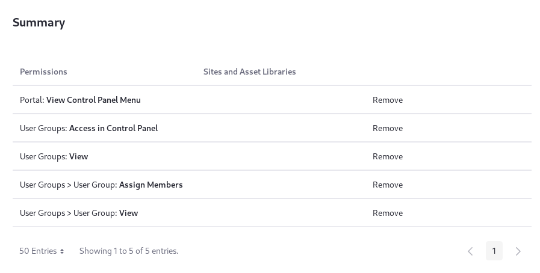
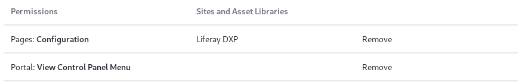

# Defining Role Permissions

Roles collect permissions, so when Users are given a Role, they receive all the permissions defined by the Role. 

If you create a Role with permission to access something in the Control Panel, keep in mind that the *View Control Panel Menu* permission is automatically granted.

To determine the permissions to carry out an action within Liferay DXP, iteration is necessary. Add one or two permissions, then test the Role to ensure the behavior you see is what you expected. As you create more Roles, you'll better understand how to combine permissions to accomplish a given task. 

```tip::
   Assigning a User to the Role and then `Impersonating the User <./../users/adding-and-managing-users.md#impersonating-users>`__ is a good way to see what permissions the User has inherited from the Role.
``` 

To define permissions for any Role in Liferay DXP,

1. Go to the Control Panel and then click on *Users* &rarr; *Roles*.

1. Click on the Regular, Site, Organization, Account, or Asset Library Role, or [create a new one](./creating-and-managing-roles.md).

1. From the Role Editor screen, click the _Define Permissions_ tab.

1. Assemble the permissions for the Role and click _Save_.


Of course, the bulk of the work is in choosing the permissions for the Role. Use the Search bar to find the permissions you need. 

```note::
   The Roles application in the Control Panel is the main, but not the only place where permissions are configured. You can configure a Role's permissions on a resource at a more granular level. For example, you can configure permissions on a particular widget from its Permissions menu. Permissions granted or removed in the Control Panel override permissions defined at the more granular level.
```
## Defining a User Group Manager

The permissions for a User Group Manager Role must be defined so that assigned [Role Users](./assigning-users-to-roles.md) can act on all User Groups in a Virtual Instance:

- Add Users to any User Group.
- Remove Users from any User Group.

Once a Regular Role with the title _User Group Manager_ is created, go to its Define Permissions screen, then

1. Drill down in the menu on the left to *Control Panel* &rarr; *Users* &rarr; *User Groups*.

   Alternatively, filter the permissions menu by entering _user groups_ in the search bar.

   

1. Under the *General Permissions* heading, flag *Access in Control Panel* and *View*. This lets user group managers access the User Groups Control Panel portlet and view existing User Groups.

1. Since you want to enable User Group managers to view User Groups and assign members to them, also check the *Assign Members* and *View* permissions under the *Resource Permissions* &rarr; *User Group* heading.

1. Click *Save*.



Now the User Group Manager Role has all the permissions necessary for adding Users to User Groups. User Group managers can view User Groups, assign members, and access User Groups in the Control Panel. The permission to view Users in the Control Panel was necessary because you must view Users to assign them as members of a Role. Without this permission, User Group managers see an empty list if they try to add Users to a Role.

## Permissions Overview

There are three categories of permissions:

**Control Panel:** Portal Administrators can access the entire Control Panel. Control Panel permissions affect whether and how the Control Panel appears to different Role Users. For example, you can fine-tune whether a Role grants view access to various applications in the Control Panel, or get more granular and only grant access to an application's Configuration actions.

**Site and Asset Library Administration:** Site Administrators can access the site administration tools belonging to the Site Administration category. The permissions in the Site and Asset Library Administration &rarr; Applications categories govern the content that can be created by applications such as the Wiki and Message Boards. If you pick one of the applications from this list, you see options for defining permissions on its content. For example, if you pick Message Boards, you see permissions for creating categories and threads or deleting and moving topics.

Site application permissions affect the application as a whole, throughout the scope of the Role (e.g., all Sites in the Virtual Instance for Regular Roles). For example, granting Message Boards application permissions to add the Message Boards widget to a page for an Organization Role means that Organization Users with this Role can take the action on any page in any Site owned by the [Organization](../organizations/understanding-organizations.md).

**User:** By default, Users inherit the User Role, and can manage their User accounts via the permissions belonging to the User category. These permissions can be used to define a new Role for Users, to provide fewer permissions on the Users' accounts than the default User Role. You can then use the [Default Associations](./assigning-users-to-roles.md#default-user-associations) configuration to replace the original User Role with your more restrictive Role (perhaps named _Restricted User_ or _Custom User_ to differentiate it).

Don't limit yourself to just one category: when defining a custom Role you can mix and match permissions from all of these categories.

```tip::
   You can change the scope of a permission: click the *Change* link in the _Scope_ column of the permissions table, then choose a new scope. Click *Save* to see a list of all permissions currently granted to the Role along with their scope. From the Summary view, you can add more permissions or go back to the Role Application default view by clicking on the *Back* (<) icon.
```



You may find that a certain permission grants more or less access than what you expected---always test your permissions configurations! 

## Delegating Social Activities Configuration

There's a permission that allows Site administrators to delegate to other Users responsibility for configuring social activities. To add this permission to a Role, click *Actions* next to the desired Role and select *Define Permissions*. Find the *Site Administration* &rarr; *Configuration* &rarr; *Social Activity* permissions category. Flag all of the permissions and then click *Save*:

- Access in Site Administration
- Configuration
- Permissions
- Preferences
- View

Once these permissions are granted, Role assignees can manage the site's Social Activities.

Roles group various permissions in whatever combinations you want. This gives you as much flexibility as possible to build the Site you have designed.
