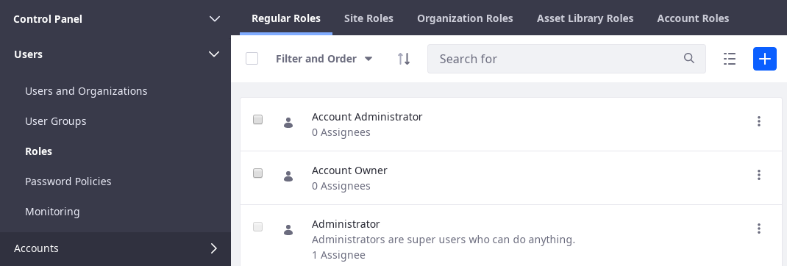
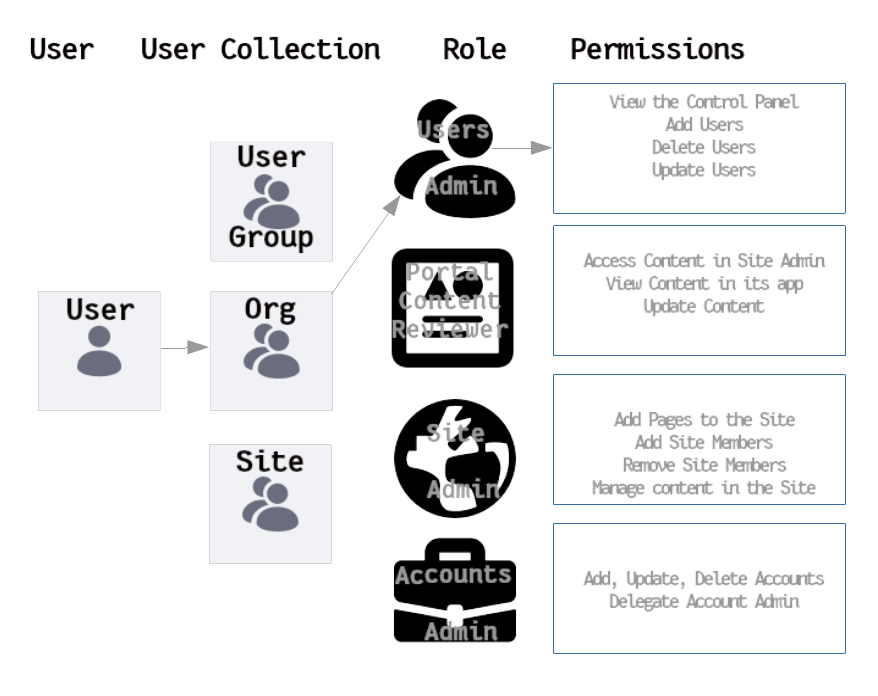
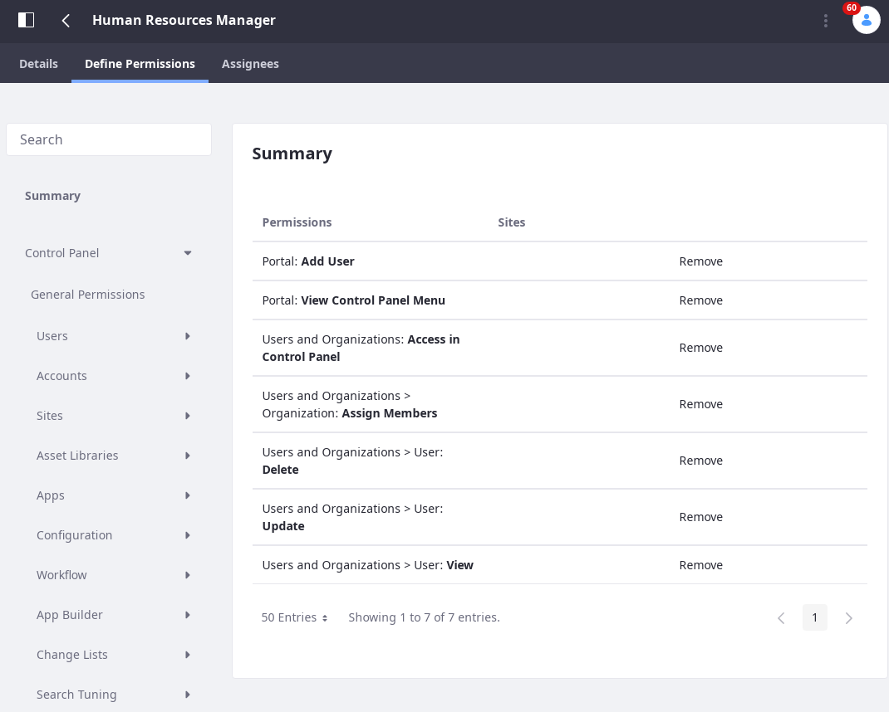
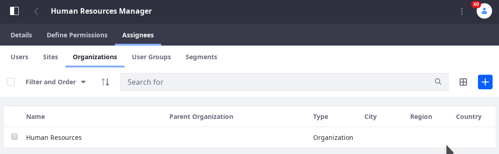

# Understanding Roles and Permissions

To get things done in Liferay DXP, [Users](./../users/understanding-users.md) must have the proper permissions. Roles are the vehicle for granting those permissions, and most Role administration work is done in Control Panel &rarr; Users &rarr; Roles.



```note:: Some permissions cannot be handled from the control panel. Asset-level permissions (for instance, permission to edit an individual blog post, or view a folder in the Documents and Media library) are managed from the individual asset. See `the Widget Permissions<./../../site-building>`__ article for details.

   `Site Teams<./../../site-building/building-sites/creating-teams-for-sites.md>`__ have a dedicated permissions management User Interface, as well.
```

To get started immediately creating Roles and assigning Users, see the articles in this section:

- [Role Creation and Management](./role-creation-and-management.md)
- [Defining Role Permissions](./defining-roles-and-permissions.md)
- [Assigning Users to Roles](./assigning-users-to-roles.md)

The conceptual diagram below shows how a User assigned to an Organization (Human Resources) inherits the Role that was assigned to the Organization (HR Manager), with all its permissions. Only one fully-wired Role assignment is displayed here (for the User who becomes a Human Resources Manager), but you can see how drawing new arrows would link the User with permissions via other User collections and Role assignments.



A step-by-step definition of the Role creation process (using the HR Manager example) could look like this:

1. Determine the function needed: _Manage Users in Liferay DXP._
1. Determine the scope: _Throughout the Virtual Instance (globally)._
1. Create the Role, assigning the permissions that power the function: _HR Manager Role._
1. Create the User collection: _Human Resources Department = Organization._
1. Assign the Role to the User Collection: _Human Resources Department &rarr; HR Manager Role._
1. Assign Users to the User Collection: _Jane Slaughter &rarr; Human Resources Department._

Maximize permission management efficiency by assigning User collections to Roles (as opposed to individual Users). There are several User collections that can be assigned Roles:

- [Organizations](./../organizations/understanding-organizations.md) hold Users of a shared hierarchical level.
- [User Groups](./../user-groups/creating-and-managing-user-groups.md) hold Users that only share the need to perform the same function.
- [Sites](./../../site-building/building-sites/adding-members-to-sites.md) hold Users that might need to perform actions scoped only to that Site. <!-- Don't really understand this one -->
- [Segments](./../../site-building/personalizing-site-experience/segmentation/creating-and-managing-user-segments.md)]

In addition, individual [Users](./../users/understanding-users.md) can be directly assigned to Roles. It's just less efficient than using collections of Users, as mentioned above.

## Defining Roles and Assigning Users

The remaining articles in this section provide the detailed instructions on [Role Creation and Management](./role-creation-and-management.md), [Defining Role Permissions](defining-role-permissions.md), and [Assigning Users to Roles](./assigning-user-to-roles.md). Conceptually, it's good to understand how Liferay DXP structures the User Interface for managing Roles and permissions.

| Permission Scope | Role Type Name | Where are its permissions defined?      | Where is it assigned to Users? |
| ---------------- | --------- | --------------------------------------- | -------- |
| Global           | Regular   | Control Panel &rarr; Users &rarr; Roles | Control Panel &rarr; Users &rarr; Roles |
| A single Organization | Organization | Control Panel &rarr; Users &rarr; Roles | Control Panel &rarr; Users &rarr; Users and Organizations (Organizations) |
| A single Site    | Site   | Control Panel &rarr; Users &rarr; Roles | Site Administration &rarr; People &rarr; Memberships (User/Organizations/User Groups |
| A single Account | Account   | Control Panel &rarr; Users &rarr; Roles | Control Panel &rarr; Accounts &rarr; Accounts (Select Account) &rarr; Roles |
| A single Asset Library | Asset Library | Control Panel &rarr; Users &rarr; Roles | Site/Library Administration of Asset Library &rarr; People &rarr; Memberships (User/Organization/User Group) |

Role _Definition_ involves the creation of the Role and declaring the permissions it provides. Regular Roles, Site Roles, and Organization Roles, Asset Library Roles, and Account Roles are all defined in Control Panel &rarr; Users &rarr; Roles.



Role _Assignment_ is the association of the Role with Liferay DXP Users. Assignment of Regular Roles happens in Control Panel &rarr; User and Organizations &rarr; Roles. The other scopes have different assignment UI locations.



## Default Roles in Liferay DXP

In the Roles Application appears a list of all the Roles in Liferay, by scope. 

These are some of the pre-configured regular Roles:

**Guest:** The Guest role is assigned to unauthenticated users and grants the lowest-level permissions. 
**User:** The User role is assigned to authenticated Users and grants basic permissions (mostly *Add to Page* permissions for their own Sites).
**Power User:** The Power User Role grants more permissions than the User Role. It's an extension point for distinguishing regular Users from more privileged Users. For example, you can set things up so that only Power Users have personal sites.
**Administrator:** The administrator Role grants permission manage the entire portal, including global portal settings and individual Sites, Organizations, and Users.

These are some of the pre-configured site roles:

**Site Member:** The Site Member Role grants basic privileges within a Site, such as permission to visit the Site's private pages.
**Site Administrator:** The Site Administrator Role grants permission to manage *almost* all aspects of a Site including site content, site memberships, and site settings. Site Administrators cannot delete the membership of or remove roles from other Site Administrators or Site Owners. They also *cannot* assign other Users as Site Administrators or Site Owners.
**Site Owner:** The Site Owner Role is the same as the Site Administrator Role except that it grants permission to manage *all* aspects of a Site, including permission to delete the membership of or remove Roles from Site Administrators or other Site Owners. They *can* assign other users as Site Administrators or Site Owners.

These are some of the pre-configured organization roles:

**Organization User:** The Organization User role grants basic privileges within an Organization. If the Organization has an attached Site, the Organization User Role implicitly grants the Site member Role within the attached Site.
**Organization Administrator:** The Organization Administrator Role grants permission to manage *almost* all aspects of an Organization including the Organization's Users and the Organization's Site (if it exists). Organization Administrators cannot delete the membership of or remove Roles from other Organization Administrators or Organization Owners. They also *cannot* assign other Users as Organization Administrators or Organization Owners.
**Organization Owner:** The Organization Owner Role is the same as the Organization Administrator Role except that it grants permission to manage *all* aspects of an Organization, including permission to delete the membership of or remove Roles from Organization Administrators or other Organization Owners. They *can* assign other Users as Organization Administrators or Organization Owners.

```note::
   It's easy to overlook the differences between owner type roles and administrator type roles for Sites and Organizations. Site and Organization administrators cannot remove the administrator or owner Role from any other administrator or owner, and they cannot appoint other Users as site or organization administrators or owners.

In contrast, site and organization owners can do those things.
```

<!-- Preserving this for inclusion in a Creating and Managing Roles article
## Deleting Asset Containers Deletes their Assets

A Web Content Folder contains Web Content articles. The Web Content Folder is an asset container, and the Web Content Article is an asset. It's possible to give a Role permission to delete an asset container without giving the Role permission to delete individual assets. In that case, beware: if a Role assignee deletes an asset container with individual assets in it, the individual assets themselves are deleted as well.

| Asset Container | Asset |
| --------------- | ------- |

Besides Web Content Folders, examples of asset containers include Bookmarks Folders, Message Boards Categories, Wiki Nodes, and Documents and Media Folders.
-->
